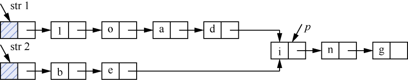
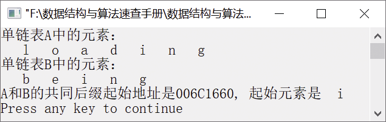

### 1.2.4　找出单链表表示的两个单词共同后缀起始地址


**问题描述**


假定采用带头节点的单链表保存单词，当两个单词有相同的后缀时，则可共享相同的后缀存储空间。例如，“loading”和“being”的存储映像如图1.29所示。


<center class="my_markdown"><b class="my_markdown">图1.29　“loading”和“being”的存储映像</b></center>

设str1和str2分别指向两个单词所在单链表的头节点，链表节点结构为
，请设计一个时间上尽可能高效的算法，找出由str1和str2所指的两个链表共同后缀的起始位置（图1.29中字符i所在节点的位置p）。


**【分析】**

该题为某年全国计算机考研题目。令指针p和q分别指向str1和str2，扫描两个链表，当p和q指向同一个地址时，即找到共同后缀的起始位置。

设str1和str2指向的链表长度分别为m和n。将两个链表以表尾对齐，令指针p和q分别指向str1和str2的头节点，若m
n，则指针p先扫描，使p指向链表的第（m−n+1）个节点；若m＜n，则让q先扫描str2，使q指向链表中的第（n−m+1）个节点，即令指针p和q所指向的节点到表尾的长度相等。反复让指针p和q同步向后移动，当p和q指向同一个位置时停止，即为共同后缀的起始地址。

第1章\实例1-10


```c
/********************************************
*实例说明：找出单链表表示的两个单词的共同后缀起始地址
*********************************************/
#include<stdio.h>                
#include<malloc.h>
#include<stdlib.h>
typedef char DataType;
#include"LinkList.h"            /*包含单链表基本操作实现文件*/
ListNode *FindAddr(LinkList A, LinkList B);    /*函数声明：查找单链表A和B的共同后缀起始地址*/
void CreateList(LinkList *A, LinkList *B, DataType a[], DataType b[], int n, int m);
void DispList(LinkList L);
void main()
{
    DataType a[]={'l','o','a','d','i','n','g'};
    DataType b[]={'b','e'};
    LinkList A,B;                    /*声明单链表A和B*/
    ListNode *p;
    int n=sizeof(a)/sizeof(a[0]);
    int m=sizeof(b)/sizeof(b[0]);
    CreateList(&A,&B,a,b,n,m);/*创建单链表A和B*/
    printf("单链表A中的元素：\n");
    DispList(A);
    printf("\n单链表B中的元素：\n");
    DispList(B);
    p=FindAddr(A,B);                    /*求单链表A和B的共同后缀起始地址*/
    printf("\nA和B的共同后缀起始地址是%p, 起始元素是%2c\n",p,p->data);
}
ListNode *FindAddr(LinkList A, LinkList B)
/*求单链表A和B的共同后缀起始地址*/
{
    int m,n;
    ListNode *p,*q;
    m=ListLength(A);
    n=ListLength(B);
    for(p=A;m>n;m--)
        p=p->next;
    for(q=B;m<n;n--)
        q=q->next;
    while(p->next!=NULL && p->next!=q->next)
    {
        p=p->next;
        q=q->next;
    }
    return p->next;
}
void CreateList(LinkList *A, LinkList *B, DataType a[], DataType b[], int n, int m)
/*创建具有共同后缀的单链表A和B*/
{
    int i;
    ListNode *p,*q;
    InitList(A);                    /*初始化单链表A*/
    InitList(B);                    /*初始化单链表B*/
    for(i=1;i<=n;i++)    /*利用数组元素创建单链表A*/
    {
        if(InsertList(*A,i,a[i-1])==0)
        {
            printf("插入位置不合法!");
            return;
        }
    }
    q=*A;
    while(q->next!=NULL && q->data!='i')
        q=q->next;
    if(q->next==NULL)
    {
        printf("error!");
        exit(-1);
    }
    for(i=1;i<=m;i++)    /*利用数组元素创建单链表B*/
    {
        if(InsertList(*B,i,b[i-1])==0)
        {
            printf("插入位置不合法!");
            return;
        }
    }
    /*令单链表A和B共享共同后缀*/
    p=*B;
    while(p->next!=NULL)
        p=p->next;
    p->next=q;
}
void DispList(LinkList L)
/*输出单链表L*/
{
    LinkList p=L->next;
    while(p)
    {
        printf("%4c",p->data);
        p=p->next;
    }
}
```

运行结果如图1.30所示。


<center class="my_markdown"><b class="my_markdown">图1.30　运行结果</b></center>

