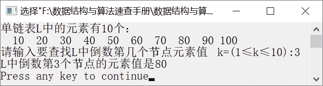

### 1.2.5　找出单链表中倒数第k个位置上的节点


**问题描述**


已知一个带头节点的单链表，节点结构为
，假设该链表只给出了头指针list，在不改变链表的前提下，请设计一个尽可能高效的算法，查找链表中倒数第k个位置上的节点（k为正整数）。若查找成功，输出该节点的data域的元素值，并返回1；否则，返回0。


**【分析】**

该题为某年计算机考研全国统考试题。定义两个指针变量p和q，初始时均指向首节点（头节点的下一个节点）。先让p沿着链表向后移动，并用计数器count进行计数，当p指向第k个节点时，即k==count，使q从第一个节点开始与p指针向后同步移动。当p指向最后一个节点时，q指向的节点就是倒数第k个节点。具体算法步骤如下。

（1）令p和q均指向链表的首节点，令count=0。

（2）若p为NULL，则转向步骤（5）。

（3）若count==k，则令q指向下一个节点；否则，使count=count+1。

（4）令p指向下一个节点，转向步骤（2）。

（5）若count==k，则查找成功，输出该节点的data域的元素值，并返回1；否则，表示查找失败，返回0。


第1章\实例1-11.c

```c
/********************************************
*实例说明：找出单链表中倒数第k个位置上的节点
*********************************************/
#include<stdio.h>                
#include<malloc.h>
#include<stdlib.h>
typedef int DataType;
#include"LinkList.h"        
int Search_K_Reverse(LinkList L, int k, DataType *e);
void DispList(LinkList L);
void main()
{
    DataType a[]={10,20,30,40,50,60,70,80,90,100},e;
    LinkList L;                    /*声明单链表L*/
    int n=sizeof(a)/sizeof(a[0]),flag,i,k;
    InitList(&L);                    /*初始化单链表L*/
    /*将数组a中元素插入单链表L中*/
    for(i=1;i<=sizeof(a)/sizeof(a[0]);i++)
    {
        if(InsertList(L,i,a[i-1])==0)
        {
            printf("位置不合法");
            return;
        }
    }
    printf("单链表L中的元素有%d个：\n",ListLength(L));
    DispList(L);
    printf("\n请输入要查找L中倒数第几个节点元素值 k=(1≤k≤%d):",n);
    scanf("%d",&k);
    flag=Search_K_Reverse(L,k,&e);              
    if(flag==1)
        printf("L中倒数第%d个节点的元素值是%2d\n",k,e);
    else
        printf("L中不存在倒数第%d个元素\n",k,e);
}
int Search_K_Reverse(LinkList L, int k, DataType *e)
{
    int count=0;
    ListNode *p,*q;
    p=q=L->next;
    while(p!=NULL)
    {
        if(count<k)
            count++;
        else
            q=q->next;
        p=p->next;
    }
    if(count<k)
        return 0;
    else
    {
        *e=q->data;
        return 1;
    }
}
void DispList(LinkList L)
/*输出单链表L*/
{
    LinkList p=L->next;
    while(p)
    {
        printf("%4d",p->data);
        p=p->next;
    }
}
```

运行结果如图1.31所示。


<center class="my_markdown"><b class="my_markdown">图1.31　运行结果</b></center>

