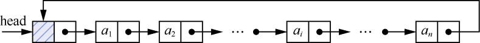
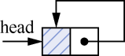

### 1.3　循环单链表及其应用

**【定义】**

**循环单链表** （circular linked list）是一种首尾相连的单链表。将单链表的最后一个节点的指针域由空指针改为指向头节点或第一个节点，整个单链表就形成一个环，我们称这样的单链表为循环单链表。

与单链表类似，循环单链表也可分为带头节点的循环单链表和不带头节点的循环单链表两种。对于不带头节点的循环单链表，当单链表非空时，最后一个节点的指针域指向头节点，如图1.32所示。对于带头节点的循环单链表，当单链表为空链表时，头节点的指针域指向头节点本身，如图1.33所示。

<b class="my_markdown">图1.32　非空的循环单链表</b>

<b class="my_markdown">图1.33　空的循环单链表</b>

