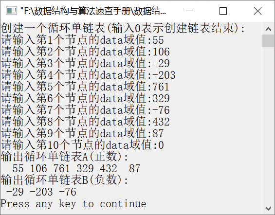

### 1.3.1　分解一个循环单链表为两个循环单链表


**问题描述**


已知一个带头节点的循环单链表中的数据元素含有正数和负数，试实现一个算法，创建两个循环单链表，使一个循环单链表中只含正数，另一个循环单链表只含负数。例如，创建一个循环单链表(55,106,−29,−203,761,329,−76,432,87），分解后变成两个循环单链表，一个只含有正数，一个只含有负数，即(55,106,761,329,432,87)和(−29,−203,−76)。


**【分析】**

初始时，先创建两个空的单链表ha和hb，然后依次查看指针p指向的节点的元素值，如果值为正数，则将其插入ha中；否则，将其插入hb中。最后，使最后一个节点的指针域指向头节点，构成循环单链表。


第1章\实例1-12.c

```c
/********************************************
*实例说明：将一个循环单链表分解成两个循环单链表
*********************************************/
#include<stdio.h>
#include<malloc.h>
#include<stdlib.h>
/*单链表类型定义*/
typedef int DataType;
typedef struct Node
{
    DataType data;
    struct Node *next;
}ListNode,*LinkList;
/*函数声明*/
LinkList CreateCycList();             /*创建一个循环单链表*/
void Split(LinkList ha,LinkList hb);
/*按ha中元素值的正负将ha分成两个循环单链表ha和hb*/
void DispCycList(LinkList head);      /*输出循环单链表*/
void main()
{
    LinkList ha,hb=NULL;
    ListNode *s,*p;
    ha=CreateCycList();
    p=ha; 
    while(p->next!=ha)                /*找ha的最后一个节点，p指向该节点*/
        p=p->next;
    /*为ha添加哨兵节点*/
    s=(ListNode*)malloc(sizeof(ListNode));
    s->next=ha;
    ha=s;
    p->next=ha;
    /*创建一个空的循环单链表hb*/
    s=(ListNode*)malloc(sizeof(ListNode));
    s->next=hb;
    hb=s;
    Split(ha,hb);
    printf("输出循环单链表A(正数):\n");
    DispCycList(ha);
    printf("输出循环单链表B(负数):\n");
    DispCycList(hb);        
}
void Split(LinkList ha,LinkList hb)
/*将一个循环单链表ha分解成两个循环单链表，其中ha中的元素为正数，hb中的元素为负数*/
{
    ListNode *ra,*rb,*p=ha->next;
    int v;
    ra=ha;
    ra->next=NULL;
    rb=hb;
    rb->next=NULL;
    while(p!=ha)
    {
        v=p->data;
        if(v>0)                /*若元素值大于0，插入ha中*/
        {
            ra->next=p;
            ra=p;
        }
        else                   /*若元素值小于0，插入hb中*/
        {
            rb->next=p;
            rb=p;
        }
        p=p->next;
    }
    ra->next=ha;               /*构成循环单链表ha*/
    rb->next=hb;               /*构成循环单链表hb*/
}
LinkList CreateCycList()
/*创建循环单链表*/
{
    ListNode *h=NULL,*s,*t=NULL;
    DataType e;
    int i=1;
    printf("创建一个循环单链表(输入0表示创建链表结束):\n");
    while(1)
    {
        printf("请输入第%d个节点的data域值:",i);
        scanf("%d",&e);
        if(e==0)
            break;
        if(i==1)
        {
            h=(ListNode*)malloc(sizeof(ListNode));
            h->data=e;
            h->next=NULL;
            t=h;
        }
        else
        {
            s=(ListNode*)malloc(sizeof(ListNode));
            s->data=e;
            s->next=NULL;
            t->next=s;
            t=s;
        }
        i++;
    }
    if(t!=NULL)
        t->next=h;
    return h;
}
void DispCycList(LinkList h)
/*输出循环单链表*/
{
    ListNode *p=h->next;
    if(p==NULL)
    {
        printf("链表为空!\n");
        return;
    }
    while(p->next!=h)
    {
        printf("%4d",p->data);
        p=p->next;
    }
    printf("%4d",p->data);
    printf("\n");
}
```

运行结果如图1.34所示。


<center class="my_markdown"><b class="my_markdown">图1.34　运行结果</b></center>


单链表与循环单链表的操作有何不同？


从以上算法容易看出，循环单链表的创建与单链表的创建基本一样，只是最后增加了两条语句，

```c
if(t!=NULL)
    t->next=h;
```

使最后一个节点的指针指向第一个节点，构成一个循环单链表。


