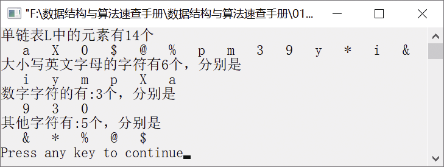

### 1.3.2　构造3个循环单链表


**问题描述**


已知L为指向单链表中头节点的指针，每个节点的数据域都存放一个字符，该字符可能是英文字母字符、数字字符或其他字符。实现算法，根据该单链表构造3个带头节点的循环单链表——ha、hb、hc，使得每个循环单链表只含有同一类字符。


**【分析】**

该题是东北大学考研题目的变形，为了便于编写程序，这里为单链表增加了一个头节点。这个题目考查单链表的基本操作（单链表和循环单链表的操作基本相同）。首先为3个循环单链表建立头节点并初始化。若要将一个单链表分解成3个循环单链表，可按照每个字符的ASCII码进行分类。若遇到A～Z和a～z的字符，将其插入ha中；若遇到0～9的字符，将其插入hb中；若遇到剩下的字符，将其插入hc中。


第1章\实例1-13.cpp

```c
/********************************************
*实例说明：将一个单链表分解成3个循环单链表
*********************************************/
#include<stdio.h>
#include<malloc.h>
#include<stdlib.h>
#include<iostream.h>
#include<iomanip.h>
/*宏定义和单链表类型定义*/
typedef char DataType;
#include"LinkList.h"
LinkList CreateList(DataType a[],int n);/*根据给定的数组创建单链表*/
void Decompose(LinkList L,LinkList *ha,LinkList *hb,LinkList *hc);
/*分解单链表为3个循环单链表*/
void DispList(LinkList L);
void DispCycList(LinkList head);
int CycListLength(LinkList head);
void main()
{
    LinkList h,ha,hb,hc;
    int n;
    DataType a[]={'a','X','0','$','@','%','p','m','3','9','y','*','i','&'};
    n=sizeof(a)/sizeof(a[0]);
    h=CreateList(a,n);
    Decompose(h,&ha,&hb,&hc);
    cout<<"大小写英文字母的字符有"<<CycListLength(ha)<<"个，分别是"<<endl;
    DispCycList(ha);
    cout<<"数字字符的有:"<<CycListLength(hb)<<"个，分别是"<<endl;
    DispCycList(hb);
    cout<<"其他字符有:"<<CycListLength(hc)<<"个，分别是"<<endl;
    DispCycList(hc);
}
LinkList CreateList(DataType a[],int n)
//根据数组中的元素创建单链表
{
    LinkList L;        
    int i;
    InitList(&L);        //初始化单链表L
    for(i=1;i<=n;i++)    //将数组a中的元素插入单链表L中
    {
        if(InsertList(L,i,a[i-1])==0)
        {
            printf("插入位置不合法!");
            return NULL;
        }
    }
    DispList(L);
    return L;
}
void Decompose(LinkList L,LinkList *ha,LinkList *hb,LinkList *hc)
/*将带头节点的单链表L分解为3个带头节点的循环单链表ha、hb和hc，其中ha仅含英文字母字符，hb仅含数字字符，hc仅含其他字符*/
{
    ListNode *p,*q;
    p=L->next;
    *ha=(LinkList)malloc(sizeof(ListNode));
    *hb=(LinkList)malloc(sizeof(ListNode));
    *hc=(LinkList)malloc(sizeof(ListNode));
    (*ha)->next=(*ha);
    (*hb)->next=(*hb);
    (*hc)->next=(*hc);
    while(p)
    {
        if((p->data>='A' && p->data<='Z')||(p->data>='a' && p->data<'z'))
        {
            q=p;
            p=p->next;
            q->next=(*ha)->next;
            (*ha)->next=q;
        }
        else if(p->data>='0' && p->data<='9')
        {
            q=p;
            p=p->next;
            q->next=(*hb)->next;
            (*hb)->next=q;
        }
        else
        {
            q=p;
            p=p->next;
            q->next=(*hc)->next;
            (*hc)->next=q;
        }
    }
}
void DispList(LinkList L)
//输出单链表中的元素
{
    int i;
    LinkList p;
    cout<<"单链表L中的元素有"<<ListLength(L)<<"个"<<endl;
    for(i=1;i<=ListLength(L);i++)      /*输出单链表L中的每个元素*/
    {
        p=Get(L,i);                    /*返回单链表L中的每个节点的指针*/
        if(p)
            cout<<setw(4)<<p->data;    /*输出单链表L中的每个元素*/
    }
    cout<<endl;
}
void DispCycList(LinkList h)
//输出循环单链表中的元素
{
    ListNode *p=h->next;
    if(p==NULL)
    {
        cout<<"链表为空!"<<endl;
        return;
    }
    while(p->next!=h)
    {
        cout<<setw(4)<<p->data;
        p=p->next;
    }
    cout<<setw(4)<<p->data;
    cout<<endl;
}
int CycListLength(LinkList head)
//求循环单链表的长度
{
    ListNode *p;
    int count=0;
    p=head;
    while(p->next!=head)
    {
        p=p->next;
        count++;
    }
    return count;
}
```

运行结果如图1.35所示。


<center class="my_markdown"><b class="my_markdown">图1.35　运行结果</b></center>


求循环单链表长度和求单链表长度的判断条件分别是什么？它们有何区别？


在输出循环单链表的长度时，要注意循环单链表和单链表的判断条件不同，单链表的判断条件是while(p−>next!=NULL)，而循环单链表的判断条件是while(p−>next!=head)。否则，就会出现死循环，不显示这一部分的输出结果。


