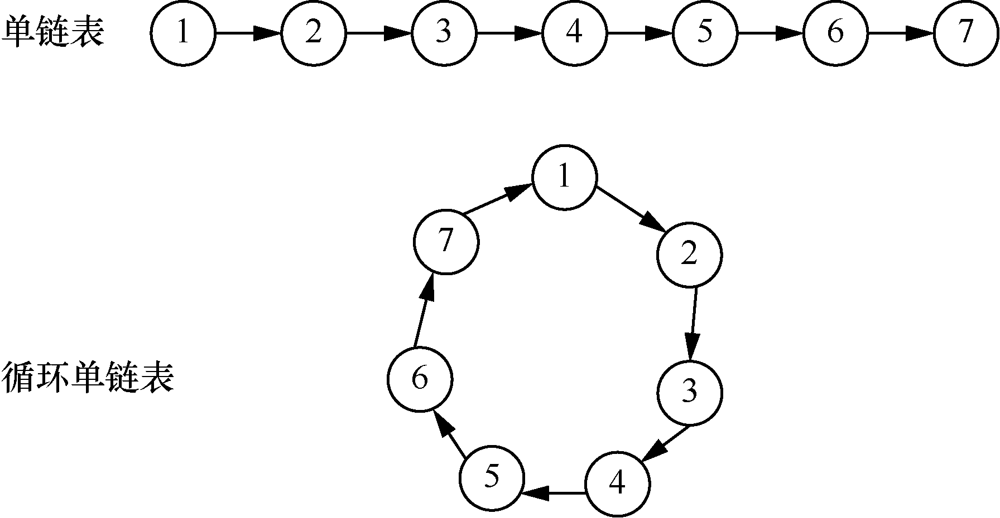
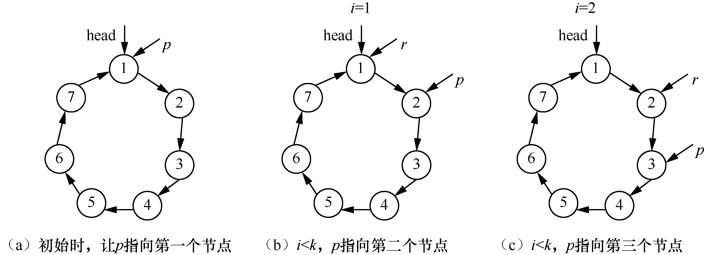
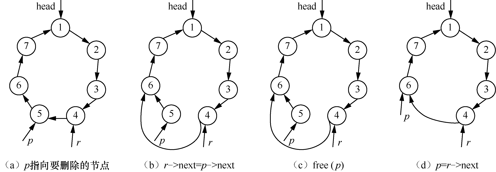
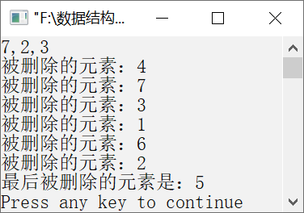

### 1.3.3　约瑟夫问题


**问题描述**


约瑟夫问题是一个很有意思的游戏。所谓约瑟夫问题，就是有n个人，编号分别是1，2，3，…，n。他们围坐在一张圆桌周围，从编号为k的人开始报数，数到m的人出列。然后下一个人又从1开始报数，数到m的人出列。以此类推，直到坐在圆桌周围的人都出列。例如，若n=7，k=2，m=3，则出列的人的顺序依次是4、7、3、1、6、2、5。


要解决这个问题，需要先创建一个循环单链表，循环单链表就像一群小孩子手拉手围成一个大圆圈。将单链表的最后一个节点和第一个节点首尾相连就构成了循环单链表，如图1.36所示。


<center class="my_markdown"><b class="my_markdown">图1.36　循环单链表</b></center>

在图1.36中，将最后一个节点与第一个节点相连构成一个循环单链表。

**【分析】**

要解决约瑟夫问题，就要将循环单链表中的节点依次从循环单链表中删除。可以将这个问题分为以下两个小问题。

#### 1．寻找开始报数的人──从循环单链表的第一个节点出发找到第k个节点

首先需要找到开始报数的人，也就是循环单链表的第k个节点。需要从循环单链表的头指针出发，依次计数，直到k。这需要定义一个指针p，让p指向head。通过for循环实现计数，p指向的节点就是第k个节点。代码如下。

```c
p=head;                        /*使p指向第一个节点*/
for(i=1;i<k;i++)               /*通过循环令p指向开始报数的人*/
{
    r=p;
    p=p->next;
}
```

如果k=3，则指针p和r的变化情况如图1.37（a）～（c）所示。


<center class="my_markdown"><b class="my_markdown">图1.37　在寻找第k个节点时指针p和r的变化情况</b></center>

当i=2时，不再执行循环，p指向的节点就是开始报数的节点，r指向前一个节点。

#### 2．报数为m的人出列──删除计数为m的节点

从p指向的节点开始计数，使用循环进行计数。代码如下。

```c
for(i=1;i<m;i++)                /*找到报数为m的人*/
{
    r=p;
    p=p->next;
}
```

最后p指向要删除的节点，r指向前一个节点。如果m=2，则要删除的节点是编号为5的节点。删除p指向的节点的过程如图1.38（a）～（d）所示。


<center class="my_markdown"><b class="my_markdown">图1.38　删除p指向的节点的过程</b></center>

删除p指向的节点的代码如下。

```c
r->next=p->next;            /*将报数为m的人即p指向的节点脱链*/
free(p);                    /*释放p指向的节点的空间*/
```

删除节点之后，需要将p指向下一个节点以便下一次报数。代码如下。

```c
p=r->next;                     /*令p指向下一次开始报数的人*/
```


第1章\实例1-14.c

```c
/********************************************
*实例说明：约瑟夫问题
*********************************************/
#include<stdio.h>
#include<stdlib.h>
void Josephus(int n,int k,int m);        /*函数声明*/
typedef struct node{
    int data;
    struct node *next;
}ListNode,*LinkList;                     /*定义节点类型*/
void main()
{
    int n,k,m;
    printf("请依次输入总人数、开始报数的序号及出列人所报的数:\n");
    scanf("%d,%d,%d",&n,&k,&m);         /*输入总人数、第一个开始报数的人、出列的人所报的数*/
    Josephus(n,k,m);                    /*调用函数*/
}
void Josephus(int n,int k,int m)
/*n表示总人数，k表示第一个报数的人，报数为m的人出列*/
{
    LinkList p,r,head=NULL;             /*定义指向节点的指针，其中头指针head初始时为NULL*/
    int i;
/*------------------------建立循环链表------------------------*/
    for(i=1;i<=n;i++)
    {
        p=(LinkList)malloc(sizeof(ListNode));        /*生成新节点*/
        p->data=i;                                   /*为节点元素赋值*/
        if(head==NULL)                               
            head=p;                                  
        else                                         
            r->next=p;                               
        r=p;                                         
    }
    p->next=head;                                    /*使链表循环起来*/
/*------------------------寻找开始报数的人------------------------*/
    p=head;                                          /*使p指向第一个节点*/
    for(i=1;i<k;i++)                                 /*通过循环令p指向开始报数的人*/
    {
        r=p;
        p=p->next;
    }
/*------------------------删除报数为m的人------------------------*/
    while(p->next!=p)                                /*如果链表中的节点多于1个*/
    {
        for(i=1;i<m;i++)                             /*找到报数为m的人*/
        {
            r=p;
            p=p->next;
        }
        r->next=p->next;                           /*使报数为m的人（即p指向的节点）脱链*/
        printf("被删除的元素：%d\n",p->data);        /*输出出列的人的序号*/
        free(p);                                   /*释放p指向的节点的空间*/
        p=r->next;                                 /*令p指向下一次开始报数的人*/
    }
    printf("最后被删除的元素是%d\n",p->data);         /*输出最后一个出列的人的序号*/
```

运行结果如图1.39所示。


<center class="my_markdown"><b class="my_markdown">图1.39　运行结果</b></center>

