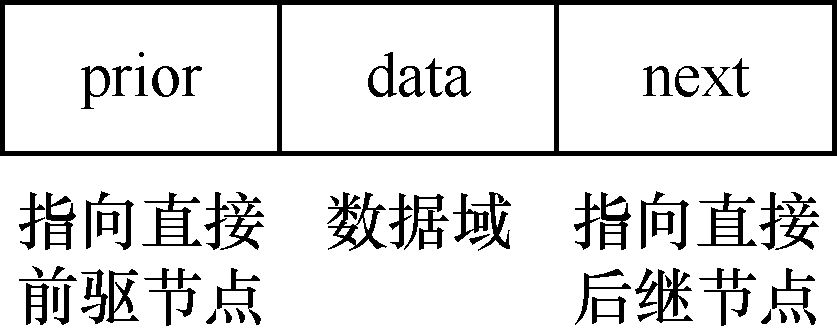
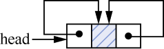
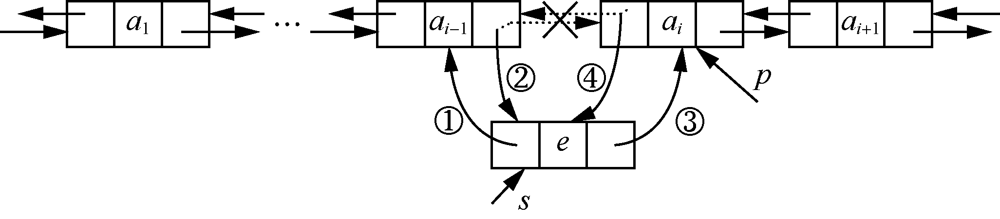
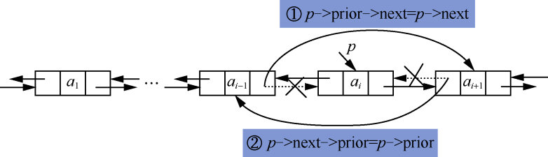

### 1.4　双向链表及其应用

**【定义】**

**双向链表** （double linked list）就是链表中的每个节点都有两个指针域：一个指向直接前驱节点，另一个指向直接后继节点。双向链表的每个节点都有3个域——data域、prior域和next域。双向链表的节点结构如图1.40所示。


<center class="my_markdown"><b class="my_markdown">图1.40　双向链表的节点结构</b></center>

其中，data域为数据域，存放数据元素；prior域为前驱节点指针域，指向直接前驱节点；next域为后继节点指针域，指向直接后继节点。

双向链表和循环链表结合就构成了双向循环链表（double circular linked list）。一个带头节点的双向循环链表如图1.41所示。带头节点的双向循环链表为空的情况如图1.42所示，带头节点的双向循环链表为空的判断条件是head−>prior==head或head−>next==head。


<center class="my_markdown"><b class="my_markdown">图1.41　带头节点的双向循环链表</b></center>


<center class="my_markdown"><b class="my_markdown">图1.42　带头节点的空的双向循环链表</b></center>

在带头节点的双向循环链表中，若双向循环链表为空，则有p=p−>prior−>next=p−>next−>prior。双向循环链表中，既可以根据节点的前驱节点指针域向前查找，也可以根据后继节点指针域向后查找，因此给节点的查找带来了很大便利。

**【存储结构】**

```c
typedef struct Node
{
    DataType data;
    struct Node *prior;
    struct Node *next;
}DListNode,*DLinkList;
```

**【基本运算】**

双向链表中的大多数操作和单链表的操作相同，如求链表的长度、查找链表的第i个节点等。因为双向链表中节点有两个指针域，所以插入和删除操作比单链表要稍微复杂一些，需要同时修改两个指针域的指针指向。

#### 1．插入操作（在第i个位置插入元素值为e的节点）

（1）找到第i个节点，用p指向该节点。

（2）申请一个新节点，由s指向该节点，将e放入数据域。

（3）修改p和s指向的节点的指针域：修改s的prior域，使其指向p的直接前驱节点，即s−>prior=p−>prior；修改p的直接前驱节点的next域，使其指向s指向的节点，即p−>prior−>next=s；修改s的next域，使其指向p指向的节点，即s−>next=p；修改p的prior域，使其指向s指向的节点，即p−>prior=s。修改指针的顺序如图1.43中的①～④所示。


<center class="my_markdown"><b class="my_markdown">图1.43　修改指针的顺序</b></center>

插入操作算法实现如下所示。

```c
int InsertDList(DListLink head,int i,DataType e)
{
    DListNode *p,*s;
    int j;
    p=head->next;
    j=0;
    while(p!=head&&j<i)
    {
        p=p->next;
        j++;
     }
    if(j!=i)
    {
        printf("插入位置不正确");
        return 0;
    }
    s=(DListNode*)malloc(sizeof(DListNode));
    if(!s)
        return -1;
    s->data=e;
    s->prior=p->prior;
    p->prior->next=s;
    s->next =p;
    p->prior=s;
    return 1;
}
```

#### 2．删除操作（删除第i个节点）

（1）找到第i个节点，用p指向该节点。

（2）使p指向的节点与双向链表断开，这需要修改p指向的节点的直接前驱节点和直接后继节点的指针域。首先修改p的直接前驱节点的next域，使其指向p的直接后继节点，即p−>prior−> next=p−>next；其次修改p的直接后继节点的prior域，使其指向p的直接前驱节点，即p−>next−> prior=p−>prior，如图1.44所示。


<center class="my_markdown"><b class="my_markdown">图1.44　双向链表的删除节点操作过程</b></center>

删除操作算法实现如下所示。

```c
int DeleteDList(DListLink head,int i,DataType *e)
{
    DListNode *p;
    int j;
    p=head->next;
    j=0;
    while(p!=head&&j<i)
    {
        p=p->next;
        j++;
    }
    if(j!=i)
    {
        printf("删除位置不正确");
        return 0;
     }
     p->prior->next=p->next;
     p->next->prior =p->prior;
     free(p);
     return 1;
}
```

