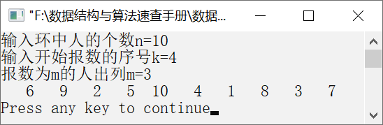

### 1.4.2　约瑟夫问题（双向链表）


**问题描述**


有n个小朋友，编号分别为1，2，…，n，将小朋友按编号围成一个圆圈，他们按顺时针方向从编号为k的人由1开始报数，报数为m的人出列，在他之后的一个人重新从1开始报数，数到m的人出列，照这样重复下去，直到所有的人都出列。实现一个算法，输入n、k和m，按照出列顺序输出编号。


**【分析】**

解决约瑟夫问题可以分为3个步骤。第1步，创建一个具有n个节点的不带头节点的双向循环链表（模拟编号为1～n的圆圈可以利用循环单链表实现，这里采用双向循环链表实现），编号从1到n，代表n个小朋友。第2步，找到第k个节点，即第一个开始报数的人。第3步，编号为k的人从1开始报数，并开始计数，报到m的人出列即将该节点删除。继续从下一个节点开始报数，直到最后一个节点被删除。


第1章\实例1-16.c

```c
/********************************************
*实例说明：约瑟夫问题（双向链表）
*********************************************/
#include<stdio.h>
#include<malloc.h>
#include<stdlib.h>
/*双向链表类型定义*/
typedef int DataType;
typedef struct Node
{
    DataType data;
    struct Node *prior;
    struct Node *next;
}DListNode,*DLinkList;
/*函数声明*/
DLinkList CreateDCList(int n);
/*创建一个长度为n的双向循环链表的函数声明*/
void Josephus(DLinkList head,int n,int m,int k);
/*在长度为n的双向循环链表中，报数为m的出列*/
int InitDList(DLinkList *head);
void main()
{
    DLinkList h;
    int n,k,m;
    printf("输入环中人的个数n=");
    scanf("%d",&n);
    printf("输入开始报数的序号k=");
    scanf("%d",&k);
    printf("报数为m的人出列m=");
    scanf("%d",&m);
    h=CreateDCList(n);
    Josephus(h,n,m,k);
}
void Josephus(DLinkList head,int n,int m,int k)
/*在长度为n的双向循环链表中，从第k个人开始报数，数到m的人出列*/
{
    DListNode *p,*q;
    int i;
    p=head;
    for(i=1;i<k;i++)            /*从第k个人开始报数*/
    {
          q=p;
          p=p->next;
    }
    while(p->next!=p)
    {
          for(i=1;i<m;i++)        /*数到m的人出列*/
          {
             q=p;
             p=p->next;
          }
          q->next=p->next;        /*将p指向的节点删除，即报数为m的人出列*/
          p->next->prior=q;
          printf("%4d",p->data);  /*输出被删除的节点*/
          free(p);
          p=q->next;              /*p指向下一个节点，重新开始报数*/
    }
    printf("%4d\n",p->data);
}
DLinkList CreateDCList(int n)
/*创建双向循环链表*/
{
    DLinkList head=NULL;
    DListNode *s,*q;
    int i;
    for(i=1;i<=n;i++)
    {
          s=(DListNode*)malloc(sizeof(DListNode));
          s->data=i;
          s->next=NULL;
          /*将新生成的节点插入双向循环链表*/
          if(head==NULL)
          {
             head=s;
             s->prior=head;        
             s->next=head;
          }
          else
          {
             s->next=q->next;
             q->next=s;
             s->prior=q;
             head->prior=s;            
          }
          q=s;        /*q始终指向双向循环链表的最后一个节点*/
    }
    return head;
}
int InitDList(DLinkList *head)
/*初始化双向循环链表*/
{
    *head=(DLinkList)malloc(sizeof(DListNode));
    if(!head)
        return -1;
    /*使头节点的prior指针和next指针指向自己*/
    (*head)->next=*head;
    (*head)->prior=*head;
    return 1;
}
```

运行结果如图1.46所示。


<center class="my_markdown"><b class="my_markdown">图1.46　运行结果</b></center>

