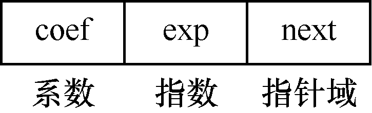
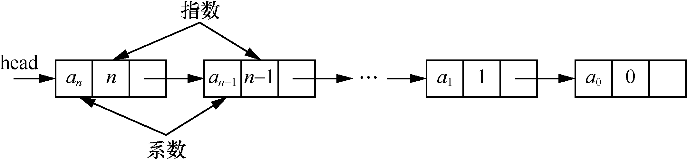
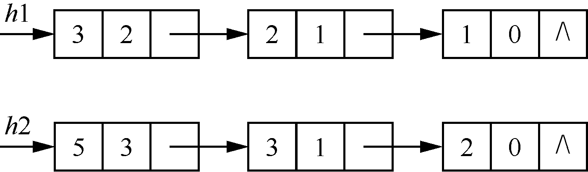
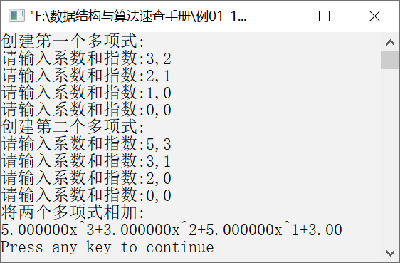

### 1.5.1　将两个一元多项式相加


**问题描述**


要求用链表表示一元多项式，并实现算法求两个多项式的和。例如，输入两个多项式3x<sup class="my_markdown">2</sup>+2x+1和5x<sup>3</sup>+3x+2，输出结果为5x<sup>3</sup>+3x<sup class="my_markdown">2</sup>+5x+3。


**【分析】**

假设一元多项式表示为

P<sub class="my_markdown">n</sub>(x)=a<sub class="my_markdown">n</sub>x<sup class="my_markdown">n</sup>+a<sub class="my_markdown">n</sub><sub>−1</sub>x<sup class="my_markdown">n</sup><sup>−1</sup>+…+a<sub>1</sub>x+a<sub>0</sub>

一元多项式的每一项都由系数和指数构成，因此要表示一元多项式，需要定义一个结构体。结构体由coef和exp两个部分构成，分别表示系数和指数。代码如下。

```c
struct node
{
    float coef;        /*系数*/
    int exp;           /*指数*/
};
```

如果用结构体数组表示一元多项式的每一项，则需要n+1个数组元素存放一元多项式（假设n为最高次幂）。当指数不连续且指数之间跨度非常大的时候（例如，一元多项式2x<sup class="my_markdown">500</sup>+1），则需要数组的长度为501，这显然会浪费很多内存空间。

为了有效利用内存空间，可以使用链表表示一元多项式，一元多项式的每一项都使用节点表示，节点由3个部分构成，分别是系数、指数和指针域。节点的结构如图1.47所示。


<center class="my_markdown"><b class="my_markdown">图1.47　节点的结构</b></center>

节点用C语言描述如下。

```c
struct node
{
    float coef;            /*系数*/
    int exp;               /*指数*/
    struct node *next;     /*指针域*/
};
```

为了操作上的方便，将链表的节点按照指数从高到低进行排列，即降幂排列。由最高次幂为n的一元多项式构成的链表如图1.48所示。


<center class="my_markdown"><b class="my_markdown">图1.48　由最高次幂为n的一元多项式的构成的链表</b></center>

两个一元多项式p(x)=3x<sup class="my_markdown">2</sup>+2x+1和q(x)=5x<sup>3</sup>+3x+2的链表表示如图1.49所示。


<center class="my_markdown"><b class="my_markdown">图1.49　两个一元多项式的链表表示</b></center>

如果要将两个一元多项式相加，则需要比较两个一元多项式的指数项。当两个一元多项式的两项中指数相同时，才将系数相加。如果两个一元多项式的指数不等，则求和后的一元多项式中该项的系数是其中一个多项式的系数。代码如下。

```c
if(s1->exp==s2->exp)        /*如果两个指数相等，则将系数相加*/
{
    c=s1->coef+s2->coef;
    e=s1->exp;
    s1=s1->next;
    s2=s2->next;
}
else if(s1->exp>s2->exp)     /*如果s1的指数大于s2的指数，则将s1的指数作为结果*/
{
    c=s1->coef;
    e=s1->exp;
    s1=s1->next;
}
else                         /*如果s1的指数小于或等于s2的指数，则将s2的指数作为结果*/
{
    c=s2->coef;
    e=s2->exp;
    s2=s2->next;
}
```

其中，s1和s2分别指向两个表示一元多项式的链表。因为链表的节点是按照指数从大到小排列的，所以在指数不等时，将指数大的作为结果，指数小的还要继续进行比较。例如，如果当前s1指向系数为3、指数为2的节点，即(3,2)，s2指向节点(3,1)，因为s1−>exp>s2−>exp，所以将s1指向的节点作为结果。在s1指向(2,1)时，还要与s2指向的(3,1)相加，得到(5,1)。

如果相加后系数不为0，则需要生成一个节点存放到链表中。代码如下。

```c
if(c!=0)
{
    p=(ListNode*)malloc(sizeof(ListNode));
    p->coef=c;
    p->exp=e;
    p->next=NULL;
    if(s==NULL)
        s=p;
    else
        r->next=p;
    r=p;
}
```

如果一个链表已经到达末尾，而另一个链表还有节点，则需要将剩下的节点插入新链表中，代码如下。

```c
while(s1!=NULL)
{
    c=s1->coef;
    e=s1->exp;
    s1=s1->next;
    if(c!=0)
    {
        p=(ListNode*)malloc(sizeof(ListNode));
        p->coef=c;
        p->exp=e;
        p->next=NULL;
        if(s==NULL)
            s=p;
        else
            r->next=p;
        r=p;
    }
}
while(s2!=NULL)
{
    c=s2->coef;
    e=s2->exp;
    s2=s2->next;
    if(c!=0)
    {
        p=(ListNode*)malloc(sizeof(ListNode));
        p->coef=c;
        p->exp=e;
        p->next=NULL;
        if(s==NULL)
            s=p;
        else
            r->next=p;
        r=p;
    }
}
```

最后，s指向的链表就是两个多项式的和的链表。


第1章\实例1-17.c

```c
/********************************************
*实例说明：求两个一元多项式的和
*********************************************/
//创建多项式。依次输入多项式的系数和指数。当输入0、0时，即系数和指数都为0时，输入结束
  #include<stdio.h>
  #include<stdlib.h>
  struct node
  {
     int exp;
      float coef;
      struct node *next;
  };
  typedef struct node ListNode;
  ListNode *CreatePoly()
  /*创建多项式链表*/
  {
     ListNode *h=NULL,*p,*q=NULL;
     int e;
     float c;
     printf("请输入系数和指数:");
     scanf("%f,%d",&c,&e);
     while(e!=0||c!=0)
     {
         p=(ListNode*)malloc(sizeof(ListNode));
         p->coef=c;
         p->exp=e;
         p->next=NULL;
         if(h==NULL)
             h=p;
         else
             q->next=p;
         q=p;
         printf("请输入系数和指数:");
            scanf("%f,%d",&c,&e);
     }
     return h;
  }
//输出多项式。为了避免在指数为0时输出指数，指定当指数为0,则只输出系数
  void DispPoly(ListNode *h)
  /*输出多项式*/
  {
     ListNode *p;
     p=h;
     while(p!=NULL)
     {
         if(p->exp==0)
             printf("%.2f",p->coef);
         else
             printf("%fx^%d",p->coef,p->exp);
         p=p->next;
         if(p!=NULL)
             printf("+");
     }
     printf("\n");
  }
//求两个多项式的和
  ListNode *AddPoly(ListNode *h1,ListNode *h2)
  /*将两个多项式相加*/
  {
      ListNode *p,*r=NULL,*s1,*s2,*s=NULL;
      float c;
      int e;
      s1=h1;
      s2=h2;
      while(s1!=NULL&&s2!=NULL)
      {
          if(s1->exp==s2->exp)
          {
              c=s1->coef+s2->coef;
              e=s1->exp;
              s1=s1->next;
              s2=s2->next;
          }
          else if(s1->exp>s2->exp)
          {
              c=s1->coef;
              e=s1->exp;
              s1=s1->next;
          }
          else
          {
              c=s2->coef;
              e=s2->exp;
              s2=s2->next;
          }
          if(c!=0)
          {
              p=(ListNode*)malloc(sizeof(ListNode));
              p->coef=c;
              p->exp=e;
              p->next=NULL;
              if(s==NULL)
                  s=p;
              else
                  r->next=p;
              r=p;
          }
      }
      while(s1!=NULL)
      {
          c=s1->coef;
          e=s1->exp;
          s1=s1->next;
          if(c!=0)
          {
              p=(ListNode*)malloc(sizeof(ListNode));
              p->coef=c;
              p->exp=e;
              p->next=NULL;
              if(s==NULL)
                  s=p;
              else
                  r->next=p;
              r=p;
          }
      }
      while(s2!=NULL)
      {
          c=s2->coef;
          e=s2->exp;
          s2=s2->next;
          if(c!=0)
          {
              p=(ListNode*)malloc(sizeof(ListNode));
              p->coef=c;
              p->exp=e;
              p->next=NULL;
              if(s==NULL)
                  s=p;
              else
                  r->next=p;
              r=p;
          }
      }
      return s;
  }
//在使用完链表后，需要释放链表所占用的内存空间
  void DeletePoly(ListNode *h)
  /*释放链表所占用的内存空间*/
  {
      ListNode *p,*r=h;
      while(r!=NULL)
      {
          p=r->next;
          free(r);
          r=p;
      }
  }
//测试部分
  void main()
  {
      ListNode *head1,*head2,*head;
      printf("创建第一个多项式:\n");
      head1=CreatePoly();
      printf("创建第二个多项式:\n");
      head2=CreatePoly();
      printf("将两个多项式相加:\n");
      head=AddPoly(head1,head2);
      DispPoly(head);
      DeletePoly(head);    
}
```

运行结果如图1.50所示。


<center class="my_markdown"><b class="my_markdown">图1.50　运行结果</b></center>

