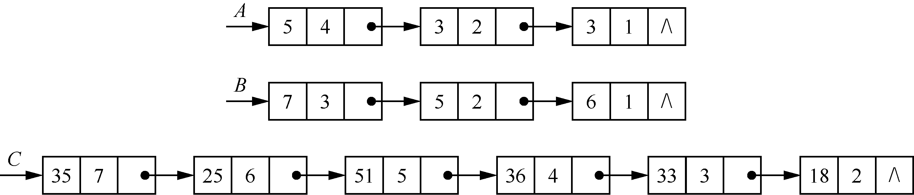
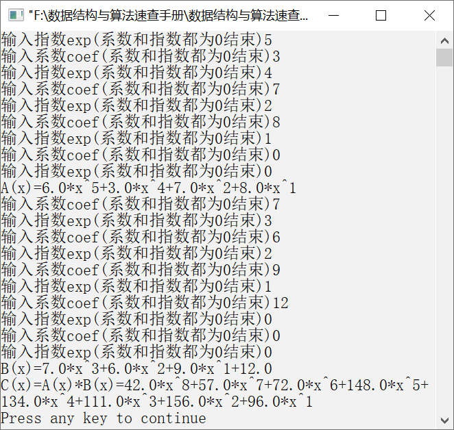

### 1.5.2　将两个一元多项式相乘


**问题描述**


将两个一元多项式相乘，要求用链表实现。例如，分别输入两个一元多项式5x<sup class="my_markdown">4</sup>+3x<sup>2</sup>+3x和7x<sup>3</sup>+5x<sup>2</sup>+6x，输出结果为35x<sup>7</sup>+25x<sup>6</sup>+51x<sup>5</sup>+36x<sup class="my_markdown">4</sup>+33x<sup>3</sup>+18x<sup>2</sup>。


**【分析】**

两个一元多项式的相乘运算，需要将一个一元多项式的每一项的指数与另一个一元多项式的每一项的指数相加，并将其系数相乘。假设有两个多项式A<sub class="my_markdown">n</sub>(x)=a<sub class="my_markdown">n</sub>x<sup class="my_markdown">n</sup>+a<sub class="my_markdown">n</sub><sub>−1</sub>x<sup class="my_markdown">n</sup><sup>−1</sup>+…+a<sub>1</sub>x+a<sub>0</sub>和B<sub class="my_markdown">m</sub>(x)=b<sub class="my_markdown">m</sub>x<sup class="my_markdown">m</sup>+b<sub class="my_markdown">m</sub><sub>−1</sub>x<sup class="my_markdown">m</sup><sup>−1</sup>+…+b<sub>1</sub>x+b<sub>0</sub>，要将这两个多项式相乘，就是将多项式A<sub class="my_markdown">n</sub>(x)中的每一项与B<sub class="my_markdown">m</sub>(x)相乘，相乘的结果用线性表表示为((a<sub class="my_markdown">n</sub> ×b<sub class="my_markdown">m</sub>,n+m),(a<sub class="my_markdown">n</sub><sub>−1</sub> ×b<sub class="my_markdown">m</sub>,n+m−1),…,(a<sub>1</sub>,1),(a<sub>0</sub>,0))。

例如，两个多项式A(x)和B(x)相乘后得到C(x)。

A(x)=5x<sup class="my_markdown">4</sup>+3x<sup>2</sup>+3x

B(x)=7x<sup class="my_markdown">3</sup>+5x<sup>2</sup>+6x

C(x)=35x<sup class="my_markdown">7</sup>+25x<sup>6</sup>+51x<sup>5</sup>+36x<sup>4</sup>+33x<sup>3</sup>+18x<sup>2</sup>

以上一元多项式可以表示成链式存储结构，如图1.51所示。


<center class="my_markdown"><b class="my_markdown">图1.51　多项式的链表表示</b></center>

算法思想如下。设A、B与C分别是一元多项式A(x)、B(x)和C(x)对应链表的头指针，要计算A(x)和B(x)的乘积，先计算出A(x)和B(x)的最高指数和，即4+3=7，则A(x)和B(x)的乘积C(x)的指数范围为0～7。然后将A(x)的各项按照指数降序排列，将B(x)的各项按照指数升序排列。分别设置两个指针pa和pb，pa用来指向表示A(x)的链表，pb用来指向表示B(x)的链表，从两个链表的第一个节点开始计算指数和，并将其与k比较（k为指数和的范围，从7到0递减），使链表的指数和呈递减排列。若指数和小于k，则pb=pb−>next；若指数和等于k，则求出两个一元多项式系数的乘积，并将其存入新节点中；若和大于k，则pa=pa−>next。这样就可以得到一元多项式A(x)和B(x)的乘积C(x)。算法结束后将表示B(x)的链表逆置，将其恢复原样。


第1章\实例1-18.c

```c
/********************************************
*实例说明：求两个一元多项式的乘积
*********************************************/
1  #include<stdio.h>
2  #include<stdlib.h>
3  #include<malloc.h>
4  /*一元多项式节点类型定义*/
5  typedef struct polyn
6  {
7       float coef;                  /*存放一元多项式的系数*/
8       int expn;                    /*存放一元多项式的指数*/
9       struct polyn *next;
10 }PolyNode, *PLinkList;
11 PLinkList CreatePolyn()
12 /*创建一元多项式，使一元多项式各项呈指数递减排列*/
13 {
14     PolyNode *p,*q,*s;
15     PolyNode *head=NULL;
16     int expn2;
17     float coef2;
18     head=(PLinkList)malloc(sizeof(PolyNode));
19     /*动态生成一个头节点*/
20     if(!head)
21         return NULL;
22         head->coef=0;
23         head->expn=0;
24         head->next=NULL;
25         do
26         {
27            printf("输入系数coef(系数和指数都为0结束)");
28            scanf("%f",&coef2);
29            printf("输入指数exp(系数和指数都为0结束)");
30            scanf("%d",&expn2);
31            if((long)coef2==0&&expn2==0)
32                break;
33            s=(PolyNode*)malloc(sizeof(PolyNode));
34            if(!s)
35                return NULL;
36            s->expn=expn2;
37            s->coef=coef2;
38            q=head->next;        /*q指向链表的第一个节点，即表尾*/
39            p=head;              /*p指向q的前驱节点*/
40            while(q&&expn2<q->expn)
41            /*将新输入的指数与q指向的节点的指数比较*/
42            {
43               p=q;
44               q=q->next;
45            }
46            if(q==NULL||expn2>q->expn)
47            /*q指向要插入节点的位置，p指向要插入节点的前驱节点*/
48            {
49               p->next=s;        /*将s节点插入链表中*/
50               s->next=q;
51            }
52            else
53               q->coef+=coef2; /*若指数与链表中节点的指数相同，则将系数相加*/
54         } while(1);
55         return head;
56 }
57 PolyNode *MultiplyPolyn(PLinkList A,PLinkList B)
58 /*多项式的乘积*/
59 {
60         PolyNode *pa,*pb,*pc,*u,*head;
61         int k,maxExp;
62         float coef;
63         head=(PLinkList)malloc(sizeof(PolyNode));      /*动态生成头节点*/
64         if(!head)
65            return NULL;
66         head->coef=0.0;
67         head->expn=0;
68         head->next=NULL;
69         if(A->next!=NULL&&B->next!=NULL)
70            maxExp=A->next->expn+B->next->expn;/*maxExp为两个链表指数的和的最大值*/
71         else
72            return head;
73         pc=head;
74         B=Reverse(B);          
75         for(k=maxExp;k>=0;k--)
76         {
77            pa=A->next;
78            while(pa!=NULL&&pa->expn>k)/*寻找pa的开始位置*/
79               pa=pa->next;
80               pb=B->next;
81            while(pb!=NULL&&pa!=NULL&&pa->expn+pb->expn<k) /*如果和小于k，使pb指向下一个节点*/
82               pb=pb->next;
83            coef=0.0;
84            while(pa!=NULL&&pb!=NULL)
85            {
86              if(pa->expn+pb->expn==k)     /*如果在链表中找到对应的节点，即和等于k，求相应的系数*/
87             {
88                 coef+=pa->coef*pb->coef;
89                 pa=pa->next;
90                 pb=pb->next;
91              }
92              else if(pa->expn+pb->expn>k) /*如果和大于k，则使pa指向下一个节点*/
93                 pa=pa->next;
94              else
95                 pb=pb->next;              /*如果和小于k，则使pb指向下一个节点*/
96            }
97            if(coef!=0.0)                   
98            /*如果系数不为0，则生成新节点，将系数和指数分别赋值给新节点，并将新节点插入链表中*/
99           {
100               u=(PolyNode*)malloc(sizeof(PolyNode));
101               u->coef=coef;
102               u->expn=k;
103               u->next=pc->next;
104               pc->next=u;
105               pc=u;
106           }
107        }
108        B=Reverse(B);       /*完成一元多项式相乘后，将B（x）的各项呈指数递减形式排列*/
109        return head;
110 }
111 void OutPut(PLinkList head)
112 /*输出一元多项式*/
113 {
114     PolyNode *p=head->next;
115     while(p)
116     {
117       printf("%1.1f",p->coef);
118       if(p->expn)
119          printf("*x^%d",p->expn);
120       if(p->next&&p->next->coef>0)
121          printf("+");
122       p=p->next;
123     }
124 }
125 PolyNode *Reverse(PLinkList head)
126 /*将生成的链表逆置，使一元多项式呈指数递增形式排列*/
127 {
128     PolyNode *q,*r,*p=NULL;
129     q=head->next;
130     while(q)
131     {
132        r=q->next;      
133        q->next=p;      
134        p=q;            
135        q=r;            
136     }
137     head->next=p;       /*将头节点的指针指向已经逆置后的链表*/
138     return head;
139 }
140 void main()
141 {
142     PLinkList A,B,C;
143     A=CreatePolyn();
144     printf("A(x)=");
145     OutPut(A);
146     printf("\n");
147     B=CreatePolyn();
148     printf("B(x)=");
149     OutPut(B);
150     printf("\n");
151     C=MultiplyPolyn(A,B);
152     printf("C(x)=A(x)*B(x)=");
153     OutPut(C);                /*输出结果*/
154     printf("\n");
155 }
```

运行结果如图1.52所示。


<center class="my_markdown"><b class="my_markdown">图1.52　运行结果</b></center>

**【说明】**

在第5～9行中，定义一元多项式的节点，包括两个域——系数域和指数域。

在第18～24行中，动态生成头节点，初始时链表为空。

在第27～31行中，输入系数和指数，当系数和指数都输入为0时，输入结束。

在第38～45行中，从链表的第一个节点开始寻找新节点的插入位置。

在第46～51行中，将q指向的新节点插入链表的相应位置，插入后使链表中每个节点按照指数从大到小排列，即降幂排列。

在第66～72行中，以两个一元多项式的指数的最大值之和作为一元多项式相乘后的最高指数项，若一元多项式中有一个为空，则相乘后结果为空，直接返回一个空链表。

在第73行中，初始时，pc指向的是一个空链表，将pb指向的链表逆置，使其指数按降序排列。

在第77～82行中，分别在pa和pb指向的链表中寻找可能开始的位置，保证两个链表中节点的指数相加为k。

在第87～92行中，若指数之和为k，则将两个节点的系数相乘。

在第93～94行中，若指数之和大于k，则需要从pa指向的节点的下一个节点开始查找。

在第95～96行中，若指数之和小于k，则需要从pb指向的节点的下一个节点开始查找。

在第98～107行中，若两个系数相乘后不为0，则创建一个新节点，并将系数和指数存入其中，把该节点插入pc所指向的链表中。

在第109行中，将pb指向的链表逆置，恢复原样。


