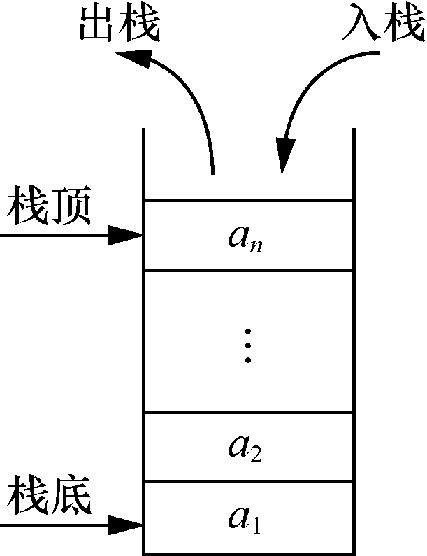

### 2.1　顺序栈及其应用

**【定义】**

栈也称为堆栈，它是限定仅在表尾进行插入和删除操作的线性表。对于栈来说，表尾（允许操作的一端）称为栈顶（top），另一端称为栈底（bottom）。栈顶是动态变化的，它由一个称为栈顶（top）指针的变量指示。当表中没有元素时，称为空栈。

栈的插入操作称为入栈或进栈，删除操作称为出栈或退栈。

在栈S=(a<sub class="my_markdown">1</sub>,a<sub>2</sub>,…,a<sub class="my_markdown">n</sub>)中，a<sub class="my_markdown">1</sub>称为栈底元素，a<sub class="my_markdown">n</sub>称为栈顶元素，由栈顶指针top指示。栈中的元素按照a<sub class="my_markdown">1</sub>，a<sub>2</sub>，…，a<sub class="my_markdown">n</sub>的顺序入栈，当前的栈顶元素为a<sub class="my_markdown">n</sub>，如图2.1所示。


<center class="my_markdown"><b class="my_markdown">图2.1　栈</b></center>

按照存储方式，可以将栈分为顺序栈和链栈。采用顺序存储结构的栈称为顺序栈。与顺序表一样，可利用数组存储顺序栈中的元素，同时增加一个栈顶指针top，指向栈顶元素。当top=0时表示空栈。

当栈中元素已经有StackSize个时，称为栈满。如果继续进行入栈操作则会产生溢出，称为上溢。对空栈进行出栈操作，称为下溢。

**【特点】**

栈是一种后进先出（Last In First Out，LIFO）的线性表。最先入栈的元素一定位于栈底，最后入栈的元素一定位于栈顶。每次删除的元素是栈顶元素，也就是最后入栈的元素。

**【存储结构】**

栈的存储结构的C语言描述如下。

```c
#define StackSize 100
typedef struct
{
    DataType stack[StackSize];
    int top;
}SeqStack;
```

其中，DataType为数据元素的数据类型，stack是用于存储栈中的数据元素的数组，top为栈顶指针。

**【基本运算】**

顺序栈的基本运算如下（以下算法的实现保存在文件SeqStack.h中）。

（1）初始化栈。

```c
void InitStack(SeqStack *S)
/*初始化栈*/
{
    S->top=0;                /*把栈顶指针置为0*/
}
```

（2）判断栈是否为空。

```c
int StackEmpty(SeqStack S)
/*判断栈是否为空*/
{
    if(S.top==0)              /*如果栈顶指针top为0*/
        return 1;             /*返回1*/
    else                      /*否则*/
        return 0;             /*返回0*/
}
```

（3）取栈顶元素。

```c
int GetTop(SeqStack S, DataType *e)
/*取栈顶元素，将栈顶元素值返回给e*/
{
     if(S.top<=0)               /*如果栈为空*/
     {
       printf("栈已经空!\n");
       return 0;
     }
     else                       /*否则*/
     {
        *e=S.stack[S.top-1];    /*取栈顶元素*/
         return 1;
     }
}
```

（4）将元素e入栈。

```c
int PushStack(SeqStack *S,DataType e)
/*将元素e入栈*/
{
    if(S->top>=StackSize)        /*如果栈已满*/
    {
        printf("栈已满，不能将元素入栈！\n");
        return 0;
    }
    else                         /*否则*/
    {
        S->stack[S->top]=e;      /*元素e入栈*/
        S->top++;                /*修改栈顶指针*/
        return 1;
    }
}
```

（5）将栈顶元素出栈。

```c
int PopStack(SeqStack *S,DataType *e)
/*将栈顶元素出栈，并将其赋给e*/
{
    if(S->top==0)               /*如果栈为空*/
    {
        printf("栈中已经没有元素，不能进行出栈操作!\n");
        return 0;
    }
   else                         /*否则*/
   {
        S->top--;               /*先修改栈顶指针，即出栈*/
        *e=S->stack[S->top];    /*将出栈元素赋给e*/
        return 1;
   }
}
```

（6）求栈的长度。

```c
int StackLength(SeqStack S)
/*求栈的长度*/
{
    return S.top;
}
```

（7）清空栈。

```c
void ClearStack(SeqStack *S)
/*清空栈*/
{
     S->top=0;                    /*将栈顶指针置为0*/
}
```

以上顺序栈存储结构的定义和基本运算保存在SeqStack.h文件中，在使用时可通过#include
"SeqStack.h"调用这些基本运算。

