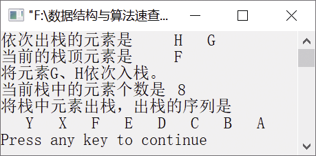

### 2.1.1　将元素分别入栈和出栈


**问题描述**


利用顺序栈的基本运算，将元素A、B、C、D、E、F、G、H依次入栈，再将栈顶元素即H和G出栈，然后把X和Y入栈，最后将元素全部出栈，并依次输出出栈元素。


**【分析】**

主要考查栈的基本运算的算法思想，通过这个简单实例应学会如何通过栈的基本运算实现具体的功能。


第2章\实例2-01.c

```c
/********************************************
*实例说明：入栈和出栈
*********************************************/
#include<stdio.h>
#include<stdlib.h>
/*类型定义*/
typedef char DataType;
#include "SeqStack.h"              /*包含栈的基本运算实现*/
void main()
{
    SeqStack S;                    /*定义一个栈*/
    int i;
    DataType a[]={'A','B','C','D','E','F','G','H'};
    DataType e;
    InitStack(&S);                       /*初始化栈*/
    for(i=0;i<sizeof(a)/sizeof(a[0]);i++)/*将数组a中的元素依次入栈*/
    {
        if(PushStack(&S,a[i])==0)
        {
            printf("栈已满，不能入栈！");
            return;
        }
    }
    printf("依次出栈的元素是");
    if(PopStack(&S,&e)==1)            /*元素H出栈*/
        printf("%4c",e);
    if(PopStack(&S,&e)==1)            /*元素G出栈*/
        printf("%4c",e);
    printf("\n");
    printf("当前的栈顶元素是");
    if(GetTop(S,&e)==0)               /*取栈顶元素*/
    {
        printf("栈已空！");
        return;
    }
    else
        printf("%4c\n",e);
    printf("将元素G、H依次入栈。\n");
    if(PushStack(&S,'G')==0)          /*元素G入栈*/
    {
        printf("栈已满，不能入栈！");
        return;
    }
    if(PushStack(&S,'H')==0)          /*元素H入栈*/
    {
        printf("栈已满，不能入栈！");
        return;
    }
    printf("当前栈中的元素个数是%d\n",StackLength(S)); /*输出栈中元素个数*/
    printf("将栈中元素出栈，出栈的序列是\n");
    while(!StackEmpty(S))             /*如果栈不空，将所有元素出栈*/
    {
        PopStack(&S,&e);
        printf("%4c",e);
    }
    printf("\n");
}
```

运行结果如图2.2所示。


<center class="my_markdown"><b class="my_markdown">图2.2　运行结果</b></center>


如何调用顺序栈的头文件？


因为顺序栈的存储结构定义中含有数据类型DataType和表示顺序表长度的宏名ListSize，所以在调用头文件SeqStack.h时，需要在#include"SeqStack.h"前先给宏名赋值、进行数据类型定义，其语句次序如下。

```c
#define ListSize 200
typedef int DataType;
#include"SeqStack.h"
```


