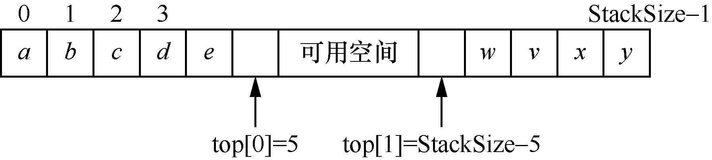
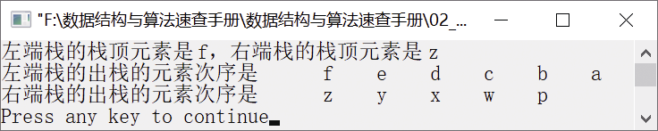

### 2.1.2　共享栈的入栈和出栈操作


**问题描述**


有两个栈S<sub class="my_markdown">1</sub>和S<sub>2</sub>都采用顺序结构存储，并且共享一个存储区。为了尽可能多地利用存储空间，减小溢出的可能性，采用栈底固定、栈顶迎面增长的方式实现共享栈，试设计S<sub class="my_markdown">1</sub>和S<sub>2</sub>有关入栈和出栈的算法。


**【分析】**

该题是哈尔滨工业大学的考研试题，主要考查共享栈的算法设计。

在使用顺序栈时，定义的存储空间过大，可能造成有些栈的空闲空间并没有被有效利用。为了使栈的存储空间能被充分利用，可以让多个栈共享一个足够大的连续存储空间，通过移动栈顶指针，从而使多个栈的存储空间互相补充，存储空间得到有效利用，这就是共享栈的设计思想。

最常见的是两个栈的共享。栈的共享原理是利用栈底固定、栈顶迎面增长的方式实现的。这可通过两个栈共享一个一维数组实现。两个栈的栈底设置在数组的两端。当有元素入栈时，栈顶位置从栈的两端迎面增长；当两个栈的栈顶相遇时，栈满。

用一维数组表示的共享栈如图2.3所示。


<center class="my_markdown"><b class="my_markdown">图2.3　共享栈</b></center>

**【存储结构】**

栈的存储结构的C语言描述如下。

```c
typedef struct
{
    DataType stack[StackSize];
    int top[2];
}SSeqStack;
```

其中，top[0]和top[1]分别是指向两个栈顶的指针。


第2章\实例2-02.c

```c
/********************************************
*实例说明：共享栈的基本操作
*********************************************/
#include<stdio.h>
#include<stdlib.h>
#define StackSize 100
typedef char DataType;
#define CHAR1 "左端栈的栈顶元素是%c，右端栈的栈顶元素是%c\n"
#define CHAR2 "%5c"
#include "SSeqStack.h"          /*包含共享栈的基本类型定义和基本操作实现*/
void main()
{
    SSeqStack S;                /*定义一个共享栈*/
    int i;
    DataType a[]={'a','b','c','d','e','f'};
    DataType b[]={'p','w','x','y','z'};
    DataType e1,e2;
    InitStack(&S);              /*初始化共享栈*/
    for(i=0;i<sizeof(a)/sizeof(a[0]);i++)   
    {
        if(PushStack(&S,a[i],1)==0)
        {
            printf("栈已满，不能入栈!");
            return;
        }
    }
    for(i=0;i<sizeof(b)/sizeof(b[0]);i++)  
    {
        if(PushStack(&S,b[i],2)==0)
        {
            printf("栈已满，不能入栈!");
            return;
        }
    }    
    if(GetTop(S,&e1,1)==0)
    {
        printf("栈已空");
        return;
    }
    if(GetTop(S,&e2,2)==0)
    {
        printf("栈已空");
        return;
    }
    printf(CHAR1,e1,e2);
    printf("左端栈的出栈的元素次序是");
    while(!StackEmpty(S,1))     /*将左端栈元素出栈*/
    {
        PopStack(&S,&e1,1);
        printf(CHAR2,e1);    
    }
    printf("\n");
    printf("右端栈的出栈的元素次序是");
    while(!StackEmpty(S,2))     /*将右端栈元素出栈*/
    {
        PopStack(&S,&e2,2);
        printf(CHAR2,e2);
    }
    printf("\n");    
}
```

其中，共享栈的基本运算实现在文件SSeqStack.h中，其代码如下。

```c
typedef struct
{
    DataType stack[StackSize];
    int top[2];
}SSeqStack;
void InitStack(SSeqStack *S)
/*共享栈的初始化*/
{
    S->top[0]=0;
    S->top[1]=StackSize-1;
}
int GetTop(SSeqStack S, DataType *e,int flag)
/*取栈顶元素*/
{
    switch(flag)
    {
       case 1:                            /*flag为1，表示要取左端栈的顶部元素*/
           if(S.top[0]==0)
               return 0;
           *e=S.stack[S.top[0]-1];
           break;
       case 2:                            /*flag为2，表示要取右端栈的顶部元素*/
           if(S.top[1]==StackSize-1)
               return 0;
           *e=S.stack[S.top[1]+1];
           break;
       default:
       return 0;
    }
    return 1;
}
int PushStack(SSeqStack *S,DataType e,int flag)
/*将元素e入共享栈*/
{
    if(S->top[0]==S->top[1])          /*如果共享栈已满*/
        return 0;                     /*返回0，入栈失败*/
    switch(flag)
    {
        case 1:                     
            S->stack[S->top[0]]=e;  
            S->top[0]++;            
            break;
        case 2:                     
            S->stack[S->top[1]]=e;  
            S->top[1]--;            
            break;
        default:
        return 0;
    }
    return 1;                       /*返回1，入栈成功*/
}
int PopStack(SSeqStack *S,DataType *e,int flag)
{
    switch(flag)                     /*在执行出栈操作之前，判断哪个栈中要进行出栈操作*/
    {
        case 1:                     
            if(S->top[0]==0)        
              return 0;             
          S->top[0]--;              
          *e=S->stack[S->top[0]];   
          break;
      case 2:                       
          if(S->top[1]==StackSize-1)
              return 0;             
          S->top[1]++;              
          *e=S->stack[S->top[1]];   
          break;
      default:
      return 0;
    }
    return 1;                         /*返回1，出栈操作成功*/
}
int StackEmpty(SSeqStack S,int flag)
/*判断栈是否为空*/
{
    switch(flag)
    {
        case 1:                       /*flag为1，表示判断左端的栈是否为空*/
            if(S.top[0]==0)
                return 1;
            break;
        case 2:                       /*flag为2，表示判断右端的栈是否为空*/
            if(S.top[1]==StackSize-1)
                return 1;
            break;
       default:
       printf("输入的flag参数错误!");
       return -1;
    }
    return 0;
}
```

运行结果如图2.4所示。


<center class="my_markdown"><b class="my_markdown">图2.4　运行结果</b></center>

在设计共享栈时，要注意两个栈的栈顶指针变化和栈满、栈空判断条件。

