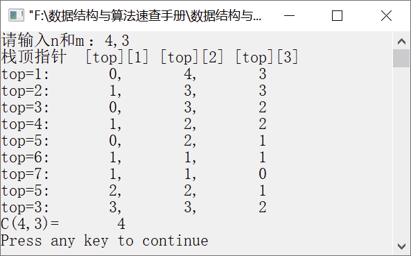

### 2.1.3　求C (n,m)的值


**问题描述**


试利用栈的后进先出思想，实现递归算法，求C(4,3)的值，并给出栈的变化过程。


**【分析】**

组合数C(n,m)的递归算法设计思想如下。

C(n,m)=C(n−1,m)+C(n−1,m−1)，当n>m，n
0，m
0时。

已知条件是：当n
0时，有C(n,0)=1，C(n,n)=1。

利用递归计算C(n,m)的值很容易实现，为了模拟递归的运算过程，可利用一个栈"stack"。定义一个二维数组stack[MAXSIZE][3]来模拟栈，其中stack[top][1]用来存放当前层组合数的值，stack[top][2]存放当前层 n 的值，stack[top][3]存放当前层 m 的值，即表示 C(n,m)的值存放在stack[top][1]中。

假设要计算C(4,3)的值。首先初始化stack，将0、4、3分别入编号为1、2、3的栈，然后分以下3种情况讨论。

（1）若编号为1的栈顶元素值为0，则需要对C(4,3)分解，将(0,4−1,3)入栈，也就是计算C(4,3−1)的值。

（2）若编号为1的栈顶元素值大于0且次栈顶元素值为0，表示已得到C(4,3−1)的值，需要求C(4−1,3−1)的值，将(0,4,4−1,3−1)入栈。

（3）若编号为1的栈顶元素和次栈顶元素值都大于0，则退栈两次，计算新的编号为1的栈顶元素值，也就是计算C(4,3)=C(4,3−1)+C(4−1,3−1)。


第2章\实例2-03.c

```c
/********************************************
*实例说明：利用栈的后进先出思想求C(n,m)的值
*********************************************/
#include<stdio.h>
#define MAXSIZE 100
int Comb(int n,int m);
void main()
{
    int n,m;
    printf("请输入n和m:");
    scanf("%d,%d",&n,&m);
    printf("栈顶指针  [top][1] [top][2] [top][3]\n");
    printf("C(%d,%d)=%8d\n",n,m,Comb(n,m));
}
int Comb(int n,int m)
//计算C(n,m)的值
{
    int s1,s2,tag=0;                //tag是为了避免重复输出
    int stack[MAXSIZE][3],top=1;    //定义栈并初始化栈
    if (n<m || n<0 || m<0)
    {
        printf("n，m值不正确!" );
        return -1;
    }
    stack[top][1]=0;                //栈顶编号为1的栈的初始化，初值0入栈
    stack[top][2]=n;                //栈顶编号为2的栈的初始化，初值n入栈
    stack[top][3]=m;                //栈顶编号为3的栈的初始化，初值m入栈
    do
    {
        printf("top=%d:%8d,%8d,%8d\n",
        top,stack[top][1],stack[top][2],stack[top][3]);
        if (stack[top][1]==0)
        //若编号为1的栈顶元素值为0，则表示要对C(n,m)分解，将(0,n-1,m)入栈，计算C(n,m-1)的值
        {
            top++;
            stack[top][1]=0;
            stack[top][2]=stack[top-1][2]-1;
            stack[top][3]=stack[top-1][3];
            if (stack[top][3]==0 || stack[top][2]==stack[top][3])
            //若编号为3的栈顶元素值为0或编号为2的栈顶元素值等于编号为3的栈顶元素值，则给编号为1的
            //栈顶元素赋初值1
            {
                stack[top][1]=1;    
            }
            tag=1;
        }
        if (top>=2 && stack[top][1]>0 && stack[top-1][1]==0)
        {
            printf("top=%d:%8d,%8d,%8d\n",top,stack[top][1],stack[top][2],stack[top][3]);
            top++;
            stack[top][1]=0;
            stack[top][2]=stack[top-2][2]-1;
            stack[top][3]=stack[top-2][3]-1;
            if (stack[top][3]==0 || stack[top][2]==stack[top][3])
                stack[top][1]=1;
                tag=1;
        }
        if (top>2 && stack[top][1]>0 && stack[top-1][1]>0)
        {
            if(tag)
            {
                printf("top=%d:%8d,%8d,%8d\n",top,stack[top][1],stack[top][2],stack[top][3]);
                tag=0;
            }    
            s1=stack[top][1];
            s2=stack[top-1][1];
            top=top-2;
            stack[top][1]=s1+s2;
        }
    } while (top>1);//若栈中只有一个元素时，则完成计算，退出循环
    return(stack[1][1]);
}
```

运行结果如图2.5所示。


<center class="my_markdown"><b class="my_markdown">图2.5　运行结果</b></center>

本算法中有3条输出语句，在计算C(n,m−1)、C(n−1,m−1)和C(n,m)的值的过程中，有可能会重复输出栈顶元素，可设置一个标志tag，避免重复输出。

