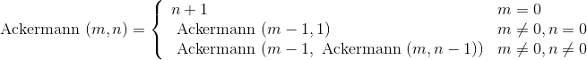
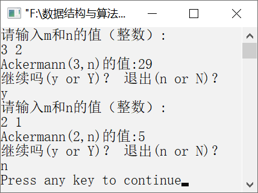

### 2.1.4　求Ackermann(m,n)的值


**问题描述**


试利用栈的后进先出思想，实现非递归算法，求Ackermann(3,2)的值，并给出栈的变化过程。Ackermann的递归定义如下。



**【分析】**

与计算C(n,m)的方法类似，为了模拟递归的运算过程，可利用一个栈“st”。定义一个结构体数组st[MAXN]来模拟栈，其中st [top].m和st[top].n分别存放m和n的值，st [top].f存放当前层求出的Ackermann的值，增加一个tag表示是否已经求出当前层的Ackermann的值。

首先初始化栈，令top=−1，然后根据输入的m、n值，将m和n存放到st[0].m和st[0].n中，且令st[0].top=0，表示未求出当前层的Ackermann的值。然后当栈不为空时，分以下两种情况讨论。

（1）若未计算出当前栈顶的Ackermann的值，则分3种情况进行处理：若m=0，则直接计算出Ackermann的值，并将tag置为1，表示已经求出当前的Ackermann的值；若m≠0且n=0，则令m−1、n为1，分别赋给st[0].m和st[0].n，并且将tag置为0，表示未求出Ackermann的值，将以上数据入栈；若m≠0且n≠0，则将m和n−1分别赋给st[0].m和st[0].n，表示未求出Ackermann的值，将以上数据入栈。

（2）若已计算出栈顶的Ackermann的值，则分两种情况进行处理：若n=0，则用栈顶元素的值更新top−1的值，设置tag为1，并将栈顶元素出栈；若m≠0且n≠0，则用m−1和栈顶的f值更新top−1的值，设置tag为0，并将栈顶元素出栈。

若栈中只有一个元素，并且tag为1，则表明已求出Ackermann的值，将栈中的st[top].f值返回。


第2章\实例2-04.cpp

```c
/********************************************
*实例说明：利用栈的后进先出思想求Ackermann(m,n)的值
*********************************************/
#include<iostream.h>
#define MAXN 100
typedef struct
{
    int m,n;        
    int f;          
    int tag;        
}Stack;
Stack st[MAXN];
int Ackermann(int m,int n)
//Ackermann(m,n)的非递归算法
{
    int top=-1;    //栈指针初始化为-1，表示栈空
    top++;         //初值入栈
    st[top].m=m;
    st[top].n=n;
    st[top].tag=0;
    while(top > -1)                //栈不空时循环求解
    {
        if (st[top].tag==0)        //未计算出栈顶元素的f值
        {
            if (st[top].m==0)      // Ackermann(m,n)=n+1，直接求解出Ackermann的值
            {
                st[top].f=st[top].n+1;
                st[top].tag=1;     //表示已求出当前层的f值
            }
            else if (st[top].n==0)  //Ackermann(m,n)=Ackermann(m-1,1)，入栈
            {
                top++;
                st[top].m=st[top-1].m-1;
                st[top].n=1;
                st[top].tag=0;     //表示未求出Ackermann的值
            }
            else                   //Ackermann(m,n)=Ackermann(m-1,Ackermann(m,n-1))，入栈
            {
                top++;
                st[top].m=st[top-1].m;
                st[top].n=st[top-1].n-1;
                st[top].tag=0;          
            }
        }
        else if (st[top].tag==1)         //若已计算出当前栈顶元素值
        {
            if (top>0 && st[top-1].n==0) //若n=0，则更新f值，并将原栈顶元素出栈
            {
                st[top-1].f=st[top].f;
                st[top-1].tag=1;
                top--;
            }
            else if (top > 0)           //若n≠0且m≠0，则更新f值，并将原栈顶元素出栈
            {
                st[top-1].m=st[top-1].m-1;
                st[top-1].n=st[top].f;
                st[top-1].tag=0;
                top--;
            }
        }
        if(top==0 && st[top].tag==1)    //若栈中只有一个元素，且已求出f值
            break; //退出循环
    }
    return st[top].f;
}
void main()
{
    int s,m,n;
    char flag;
    while(1)
    {
        cout<<"请输入m和n的值（整数）:"<<endl;
        cin>>m>>n;
        s=Ackermann(m,n);
        cout<<"Ackermann("<<m<<",n)的值:"<<s<<endl;
        cout<<"继续吗(y or Y)？退出(n or N)？"<<endl;
        cin>>flag;
        if(flag=='y' || flag=='Y')
            continue;
        else if(flag='n' || flag=='N')
            break;
    }
}
```

运行结果如图2.6所示。


<center class="my_markdown"><b class="my_markdown">图2.6　运行结果</b></center>

**【注意】**

求Ackermann的值时，分入栈和出栈两个过程，在将临时数据入栈时，需要设置标志tag表明是否已求出当前层的Ackermann的值。入栈阶段在更新st[top].m和st[top].n的值时需要与出栈阶段的变量更新相互对应。

