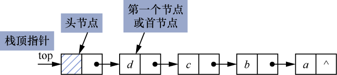
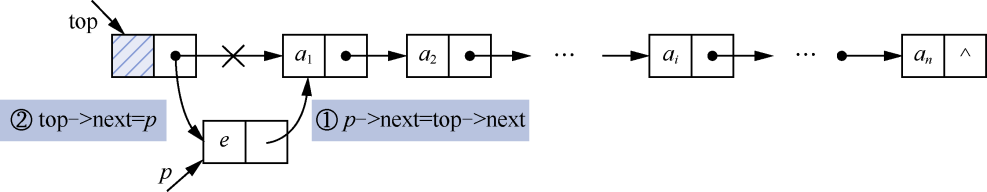
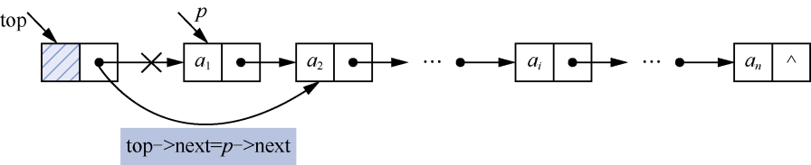

### 2.2　链栈及其应用

**【定义】**

采用链式存储结构的栈称为链栈或链式栈。链栈是由若干个节点构成的，而节点又由数据域和指针域组成。在链栈中，节点的数据域存储栈中的元素值，指针域表示节点之间的关系。

插入和删除元素的一端称为栈顶，栈顶由栈顶指针top指示。因为插入和删除操作都在栈顶指针的位置进行，所以为了操作上的方便，通常在链栈的第一个节点之前设置一个头节点。栈顶指针top指向头节点，头节点的指针指向链栈的第一个节点，如图2.7所示。


<center class="my_markdown"><b class="my_markdown">图2.7　一个带头节点的链栈</b></center>

最先入栈的元素在链栈的尾端，最后入栈的元素在链栈的顶部。链栈的操作都在链栈的顶部位置进行，因此链栈的基本操作的时间复杂度都为O(1)。

由于链栈采用链式存储结构，不必事先估计链栈的最大容量，只要系统有可用的空间，就可随时为节点申请空间，因此在插入节点时不必考虑链栈空间是否已满的问题。使用完节点后，应释放其空间。

**【特点】**

最先入栈的元素一定是栈底元素，最后入栈的元素一定是栈顶元素。每次删除的元素都是栈顶元素，也就是最后入栈的元素。因此，链栈是一种后进先出的线性表。

**【存储结构】**

链栈的存储结构的C语言描述如下。

```c
typedef struct node
{
    DataType data;
    struct node *next;
}LStackNode,*LinkStack;
```

**【基本运算】**

（1）初始化链栈。

```c
void InitStack(LinkStack *top)
/*链栈的初始化*/
{
    if((*top=(LinkStack)malloc(sizeof(LStackNode)))==NULL)   /*为头节点分配存储空间*/
        exit(-1);
    (*top)->next=NULL;        /*将链栈的头节点指针域置为空*/
}
```

（2）判断链栈是否为空。

```c
int StackEmpty(LinkStack top)
/*判断链栈是否为空*/
{
    if(top->next==NULL)         /*如果头节点的指针域为空*/
        return 1;               /*返回1*/
    else                        /*否则*/
        return 0;               /*返回0*/
}
```

（3）将元素e入栈。先动态生成一个节点，用p指向该节点，将元素e赋给*p节点的数据域，然后将新节点插入链栈的第一个节点之前。要把新节点插入链栈中，令p−>next=top−>next，top−>next=p，如图2.8所示。


<center class="my_markdown"><b class="my_markdown">图2.8　入栈操作</b></center>


**注意：**  在插入新节点时，插入节点的语句顺序不能颠倒。


将元素e入栈的算法实现如下。

```c
int PushStack(LinkStack top, DataType e)
/*将元素e入栈，入栈成功返回1*/
{
    LStackNode *p;        /*定义指针p，指向新生成的节点*/
    if((p=(LStackNode*)malloc(sizeof(LStackNode)))==NULL) /*生成新节点*/
    {
        printf("内存分配失败!");
        exit(-1);
    }
    p->data=e;           
    p->next=top->next;   
    top->next=p;         
    return 1;
}
```

（4）将栈顶元素出栈。进行出栈操作前，先判断链栈是否为空。如果链栈为空，则返回0，表示出栈操作失败；否则，将栈顶元素出栈，并将栈顶元素值赋给e，最后释放节点空间，返回1，表示出栈操作成功。出栈操作如图2.9所示。


<center class="my_markdown"><b class="my_markdown">图2.9　出栈操作</b></center>

```c
int PopStack(LinkStack top,DataType *e)
/*将栈顶元素出栈*/
{
    LStackNode *p;
    p=top->next;
    if(!p)                     /*判断链栈是否为空*/
    {
        printf("栈已空");
        return 0;
    }
    top->next=p->next;          /*将栈顶节点与链栈断开，即出栈*/
    *e=p->data;                 /*将出栈元素赋值给e*/
    free(p);                    /*释放p指向的节点的空间*/
    return 1;
}
```

（5）取栈顶元素。

```c
int GetTop(LinkStack top,DataType *e)
/*取栈顶元素*/
{
    LStackNode *p;
    p=top->next;                /*指针p指向栈顶节点*/
    if(!p)                      /*如果链栈为空*/
    {
        printf("栈已空");
        return 0;
    }
    *e=p->data;                 /*将p指向的节点的元素值赋给e*/
    return 1;
}
```

（6）求链栈的长度。

```c
int StackLength(LinkStack top)
/*求链栈的长度*/
{
    LStackNode *p;
    int count=0;              
    p=top;                    
    while(p->next!=NULL)      
    {
        p=p->next;            
        count++;              
    }
    return count;              /*返回链栈的长度*/
}
```

（7）销毁链栈。

```c
void DestroyStack(LinkStack top)
/*销毁链栈*/
{
    LStackNode *p,*q;
    p=top;
    while(!p)                   /*如果链栈还有节点*/
    {
        q=p;                    /*q指向要释放的节点*/
        p=p->next;              /*p指向下一个节点，即下一次要释放的节点*/
        free(q);                /*释放q指向的节点的空间*/
    }
}
```

以上基本运算保存在文件SeqStack.h中，方便其他函数调用。

