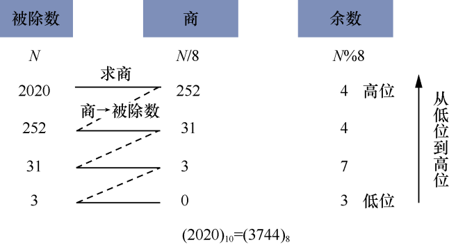
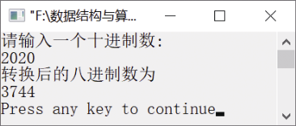

### 2.2.1　将十进制数转换为八进制数


**问题描述**


利用链表将十进制数2020转换为对应的八进制数。


**【分析】**

一般情况下，把十进制数转换为八进制数、二进制数等可采用辗转相除法。将十进制数2020转换为八进制数的过程如图2.10所示。


<center class="my_markdown"><b class="my_markdown">图2.10　将十进制数2020转换为八进制数的过程</b></center>

转换后的八进制数为(3744)<sub class="my_markdown">8</sub>。如图2.10所示，被除数除以8得到商后，记下余数，又将商作为新的被除数继续除以8，直到商为0为止，把得到的余数从低位到高位排列起来就是转换后的八进制数。由此得到十进制数N转换为八进制数的算法如下。

（1）将N除以8，记下其余数。

（2）判断商是否为0，如果为0，结束程序；否则，将商赋给N，转到步骤（1）继续执行。

得到的余数序列的逆序就是所求的八进制数。需要注意的是，这些得到的八进制数是从低位到高位产生的，最先得到的余数是八进制数的最低位，最后得到的余数是八进制数的最高位。得到余数的位序正好与八进制数的位序相反，这恰好可利用栈的后进先出特性，把先得到的余数放入栈保存，最后依次出栈正好就是所求的八进制数。


第2章\实例2-05.c

```c
/********************************************
*实例说明：将十进制数转换为对应的八进制数
*********************************************/
#include<stdio.h>
#include<stdlib.h>
typedef int DataType;
typedef struct node
{
    DataType data;
    struct node *next;
}LStackNode,*LinkStack;
void Coversion(int N)
/*利用链表模拟栈将十进制数转换为八进制数*/
{
    LStackNode *p,*top=NULL;
    /*定义指向节点的指针和栈顶指针top，并初始化链栈为空*/
    do
    {
        p=(LStackNode*)malloc(sizeof(LStackNode));
        /*生成新节点*/
        p->data=N%8;                 /*将余数送入新节点的数据域*/
        p->next=top;                 /*将新节点插入原栈顶节点之前*/
        top=p;                       /*使新插入的节点成为栈顶节点*/
        N=N/8;
    }while(N!=0);
    while(top!=NULL)                 /*如果链栈不空，则从栈顶开始输出栈顶元素*/
    {
        p=top;                       /*p指向栈顶*/
        printf("%d",p->data);        /*输出栈顶元素*/
        top=top->next;               /*栈顶元素出栈*/
        free(p);                     /*释放栈顶节点*/
    }
}
void main()
{
    int n;
    printf("请输入一个十进制数:\n");
    scanf("%d",&n);
    printf("转换后的八进制数为\n");
    Coversion(n);
    printf("\n");
}
```

运行结果如图2.11所示。


<center class="my_markdown"><b class="my_markdown">图2.11　运行结果</b></center>


除了利用链表实现进制转换，如何直接利用栈的基本运算将十进制数转换为八进制数？


利用进制转换的算法思想，直接利用栈的基本运算将十进制数转换为八进制数的算法实现如下。

```c
void Coversion(int N)
/*利用栈的基本操作将十进制数转换为八进制数*/
{
    SeqStack S;                 /*定义一个栈*/
    int x;                      /*x用来保存每一次得到的余数*/
    InitStack(&S);              /*初始化栈*/
    while(N>0)
    {
        x=N%8;                  /*将余数存入x中*/
        PushStack(&x);          /*余数入栈*/
        N=/8;                   /*将得到的商赋值给N，作为新的被除数*/
    }
     while(!StackEmpty(S))    /*如果栈不空，将栈中元素依次出栈*/
    {
        PopStack(&S,&x);
        printf("d",x);         /*输出八进制数*/
    }
}
```


