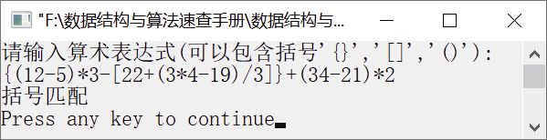

### 2.2.2　检查表达式中的括号是否匹配


**问题描述**


任意给定一个数学表达式如{(12−5)×3−[22+(3×4−19)/3]}+(34−21)×2，试设计一个算法判断表达式的括号是否匹配。


**【什么是括号匹配】**

在计算机中，常见的括号有3种——花括号、方括号和圆括号。“{”和“}”、“[”和“]”、“(”和“)”分别是匹配的括号。括号的嵌套顺序是任意的，即{[]}、[()]和{}等为正确的格式，{()}}和([{}()])]等为不正确的格式。例如，括号序列如图2.12所示。


<center class="my_markdown"><b class="my_markdown">图2.12　括号序列</b></center>

当计算机接收了第1个括号“{”后，它期待着与第8个括号“}”匹配，而等来的是第2个括号“[”。此时，第1个括号的期望就会下降一级，第7个括号“]”成为最紧迫的要求，而出现的是第3个括号是“(”，这样最期望出现的括号就变成了“)”，第2个括号的期望下降一级。在第4个括号“)”出现之后，第3个括号的期望得到满足，这样第2个括号的期望又成了当前最紧迫的要求。但是，第5个括号“(”的出现后，迫切需要第6个括号“)”出现。以此类推，直到第1个括号的期望得到满足，即第8个括号“}”出现之后，所有括号的期望才得到满足，表明这个括号序列是匹配的。

**【分析】**

从上面可以看出，括号匹配的处理过程符合栈的后进先出的特点。因此，解决括号匹配问题可以利用栈来实现。算法思想如下。

（1）设置一个栈，每读入一个括号，如果是左括号，则直接入栈。

（2）如果读入的是右括号，且与当前栈顶的左括号是同类型的，则说明这一对括号序列是匹配的，将栈顶的左括号出栈；否则，不匹配。如果栈已经为空，则说明缺少左括号，该括号序列不匹配。

（3）如果输入序列已经读完，而栈中仍然有等待匹配的左括号，则说明缺少右括号，该括号序列不匹配。

（4）如果读入的是数字字符，则不进行处理，直接读入下一个字符。

（5）当输入序列和栈同时变为空时，说明括号完全匹配。


第2章\实例2-06.c

```c
/********************************************
*实例说明：检查表达式中的括号是否匹配
*********************************************/
#include<stdio.h>
#include<malloc.h>
#include<stdlib.h>
#include "string.h"
/*宏定义和链栈类型定义*/
typedef char DataType;
typedef struct node
{
    DataType data;
    struct node *next;
}LStackNode,*LinkStack;
#include"LinkStack.h"                 /*包含链栈实现文件*/
int Match(DataType e,DataType ch);    /*检验括号是否匹配函数*/
void main()
{
    LinkStack S;
    char *p;
    DataType e;
    DataType ch[60];
    InitStack(&S);                   /*初始化链栈*/
    printf("请输入算术表达式(可以包含括号'{}','[]','()'):\n");
    gets(ch);
    p=ch;                            /*p指向输入的括号表达式*/
    while(*p)                        /*判断p指向的字符是否是字符串结束标记*/
    {
        switch(*p)
        {
            case '(':
            case '[':
            case '{':
                PushStack(S,*p++);      /*如果是左括号，则将括号入栈*/
                break;
            case ')':
            case ']':
            case '}':
                if(StackEmpty(S))       /*如果是右括号且栈已空，则说明缺少左括号*/
                {
                    printf("缺少左括号.\n");
                    return;
                }
                else
                {
                    GetTop(S,&e);
                    /*若栈不空，且读入的是右括号，则取出栈顶的括号*/
                    if(Match(e,*p))
                    /*将栈顶的括号与读入的右括号进行比较*/
                    PopStack(S,&e);
                    /*若栈顶括号与读入的右括号匹配，则将栈顶的括号出栈*/
                    else
                    /*若栈顶括号与读入的括号不匹配，则说明此括号序列不匹配*/
                    {
                        printf("左右括号不匹配.\n");
                        return;
                    }
                }
                default:    /*若是其他字符，则不处理，直接将p指向下一个字符*/
                p++;
        }
    }
    if(StackEmpty(S))
        /*如果字符序列读入完毕，且栈已空，说明括号序列匹配*/
        printf("括号匹配\n");
    else/*如果字符序列读入完毕，且栈不空，说明缺少右括号*/
        printf("缺少右括号\n");            
}
int Match(DataType e,DataType ch)
/*判断左右两个括号是否为同类型的括号*/
{
     if(e=='('&&ch==')')
        return 1;
     else if(e=='['&&ch==']')
        return 1;
     else if(e=='{'&&ch=='}')
        return 1;
     else
        return 0;
}
```

运行结果如图2.13所示。


<center class="my_markdown"><b class="my_markdown">图2.13　运行结果</b></center>

