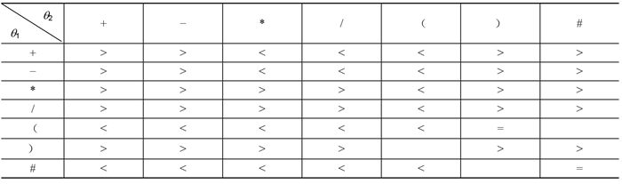
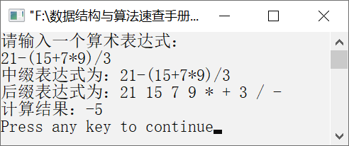

### 2.2.3　求算术表达式的值


**问题描述**


通过键盘输入一个算术表达式，如21−(15+7×9)/3，要求将其转换为后缀表达式，并计算该算术表达式的值。


**【分析】**

表达式求值是高级程序设计语言中编译器设计的一个基本问题。它的实现基于栈的后进先出特性。

一个算术表达式是由操作数（运算对象）、运算符和分界符（括号）组成的有意义的式子。运算符从操作数的个数上可分为单目运算符和双目运算符，从运算类型上可分为算术运算符、关系运算符、逻辑运算符等。在此为了简化问题，我们假设运算符只包含加、减、乘、除双目运算符，分界符只包含左、右两种圆括号。

例如，一个算术表达式为a−(b+c*d)/e，这种算术表达式中的运算符总是出现在两个操作数之间，这种算术表达式称为中缀表达式。计算机编译系统在计算一个算术表达式之前，要将中缀表达式转换为后缀表达式，然后对后缀表达式进行计算。后缀表达式中，算术运算符出现在操作数之后，并且不含括号。

计算机在求解算术表达式的值时分为以下两个步骤。

（1）将中缀表达式转换为后缀表达式。

（2）依据后缀表达式计算算术表达式的值。

#### 1．将中缀表达式转换为后缀表达式

要将一个算术表达式的中缀形式转化为相应的后缀形式，首先要了解算术四则运算的规则。算术四则运算的规则如下。

（1）算术运算的优先级——先乘除，后加减。

（2）有括号先算括号内的，后算括号外的，多层括号由内到外进行计算。

（3）同级别的运算从左到右进行计算。

上面的算术表达式转换为后缀表达式如下。

a　b　c　d　* 　+　 e　/　−

不难看出，转换后的后缀表达式具有以下3个特点。

（1）后缀表达式与中缀表达式的操作数出现的顺序相同，只是运算符的先后顺序改变了。

（2）后缀表达式不出现括号。

（3）后缀表达式的操作符出现在操作数之后。

后缀表达式也叫逆波兰表达式，是波兰逻辑学家简·卢卡西维茨（Jan Lukasiewicz）于1929年提出的表示方法。每个运算符都位于操作数之后，因此称为后缀表达式。

后缀表达式既无括号也无优先级的约束，因此只需要从左到右依次扫描后缀表达式的各个字符，遇到运算符时，直接对运算符前面的两个操作数进行运算即可。

如何将中缀表达式转换为后缀表达式呢？可以设置一个栈，用于存放运算符。依次读入中缀表达式中的每个字符，如果是操作数，则直接输出。如果是运算符，则比较栈顶元素与当前运算符的优先级，然后进行处理，直到整个中缀表达式处理完毕。我们约定“#”作为后缀表达式的结束标志，假设θ<sub class="my_markdown">1</sub>为栈顶运算符，θ<sub>2</sub>为当前扫描的运算符。则中缀表达式转换为后缀表达式的算法描述如下。

（1）初始化栈，并将“#”入栈。

（2）若当前读入的字符是操作数，则将该操作数输出，并读入下一字符。

（3）若当前读入的字符是运算符，则记作θ<sub class="my_markdown">2</sub>，并将θ<sub class="my_markdown">2</sub>与栈顶的运算符θ<sub>1</sub>比较。若θ<sub>1</sub>优先级低于θ<sub class="my_markdown">2</sub>，则将θ<sub class="my_markdown">2</sub>入栈；若θ<sub>1</sub>优先级高于θ<sub class="my_markdown">2</sub>，则将θ<sub>1</sub>出栈并将其作为后缀表达式输出。然后继续比较新的栈顶运算符θ<sub>1</sub>与当前运算符θ<sub class="my_markdown">2</sub>的优先级。若θ<sub>1</sub>的优先级与θ<sub class="my_markdown">2</sub>相等，且θ<sub>1</sub>为“(”，θ<sub class="my_markdown">2</sub>为“)”，则将θ<sub>1</sub>出栈，继续读入下一个字符。

（4）如果θ<sub class="my_markdown">2</sub>的优先级与θ<sub>1</sub>相等，且θ<sub>1</sub>和θ<sub class="my_markdown">2</sub>都为“#”，则将θ<sub>1</sub>出栈，栈为空。完成中缀表达式转换为后缀表达式，算法结束。

运算符的优先关系如表2.1所示。其中，“>”“<”“=”分别表示θ<sub class="my_markdown">1</sub>的优先级大于、小于、等于θ<sub>2</sub>的优先级。

<center class="my_markdown"><b class="my_markdown">表2.1　运算符的优先关系</b></center>


利用上述算法，将中缀表达式a−(b+c*d)/e转换为后缀表达式的输出过程如表2.2所示（为了便于描述，在表达式的末尾加一个结束标记“#”）。

<center class="my_markdown"><b class="my_markdown">表2.2　中缀表达式a−(b+c*d)/e转换为后缀表达式的输出过程</b></center>

| 步骤 | 中缀表达式 | 栈 | 输出后缀表达式 |  | 步骤 | 中缀表达式 | 栈 | 输出后缀表达式 |
| :-----  | :-----  | :-----  | :-----  | :-----  | :-----  | :-----  | :-----  | :-----  | :-----  | :-----  |
| 1 | a−(b+c*d)/e# | # |  |  | 9 | )/e# | #−(+* | abcd |
| 2 | − (b+c*d)/e# | # | a |  | 10 | /e# | #−(+ | abcd* |
| 3 | (b+c*d)/e# | #− | a |  | 11 | /e# | #−( | abcd*+ |
| 4 | b+c*d)/e# | #−( | a |  | 12 | /e# | #− | abcd*+ |
| 5 | +c*d)/e# | #−( | ab |  | 13 | e# | #−/ | abcd*+ |
| 6 | c*d)/e# | #−(+ | ab |  | 14 | # | #−/ | abcd*+e |
| 7 | *d)/e# | #−(+ | abc |  | 15 | # | #− | abcd*+e/ |
| 8 | d)/e# | #−(+* | abc |  | 16 | # | # | abcd*+e/− |

#### 2．后缀表达式的计算

在计算后缀表达式时，需要设置两个栈——operator栈和operand栈。其中，operator栈用于存放运算符，operand栈用于存放操作数和中间运算结果。具体算法思路如下。

依次读入后缀表达式中的每个字符，如果是操作数，则将操作数入operand栈；如果是运算符，则将操作数出栈两次，然后对操作数进行当前操作符的运算，直到整个后缀表达式处理完毕。


第2章\实例2-07.cpp

```c
/********************************************
*实例说明：求算术表达式的值
*********************************************/
#include<stdio.h>
#include<stdlib.h>
#include<string.h>
#include<iostream.h>
typedef char DataType;
#include"LinkStack.h"
#define MAXSIZE 50
/*operand栈定义
typedef struct
{
    float data[MAXSIZE];
    int top;
}OpStack;
/*函数声明*/
void TranslateExpress(char s1[],char s2[]);
float ComputeExpress(char s[]);
void main()
{
    char a[MAXSIZE],b[MAXSIZE];
    float f;
    cout<<"请输入一个算术表达式："<<endl;
    gets(a);
    cout<<"中缀表达式为："<<a;
    TranslateExpress(a,b);
    cout<<endl<<"后缀表达式为："<<b<<endl;
    f=ComputeExpress(b);
    cout<<"计算结果："<<f<<endl;
}
float ComputeExpress(char a[])
/*计算后缀表达式的值*/
{
    OpStack S;                  
    int i=0,value;
    float x1,x2;
    float result;
    S.top=-1;                   
    while(a[i]!='\0')         
    {
        if(a[i]!=' '&&a[i]>='0'&&a[i]<='9')
        /*如果当前字符是数字字符*/
        {
            value=0;
            while(a[i]!=' ')  
            {
                value=10*value+a[i]-'0';
                i++;
            }
            S.top++;
            S.data[S.top]=value;    /*处理之后将数字入栈*/
        }        
        else                        /*如果当前字符是运算符*/
        {
            switch(a[i])     /*将栈中的数字出栈两次，然后用当前的运算符进行运算，再将结果入栈*/
            {        
                case '+':
                    x1=S.data[S.top];
                    S.top--;
                    x2=S.data[S.top];
                    S.top--;
                    result=x1+x2;
                    S.top++;
                    S.data[S.top]=result;
                    break;
                case '-':
                    x1=S.data[S.top];
                    S.top--;
                    x2=S.data[S.top];
                    S.top--;
                    result=x2-x1;
                    S.top++;
                    S.data[S.top]=result;
                    break;
                case '*':
                    x1=S.data[S.top];
                    S.top--;
                    x2=S.data[S.top];
                    S.top--;
                    result=x1*x2;
                    S.top++;
                    S.data[S.top]=result;
                    break;
                case '/':
                    x1=S.data[S.top];
                    S.top--;
                    x2=S.data[S.top];
                    S.top--;
                    result=x2/x1;
                    S.top++;
                    S.data[S.top]=result;
                    break;
            }
            i++;
        }
    }
    if(!S.top!=-1)                /*如果栈不空，则将结果出栈，并返回*/
    {
        result=S.data[S.top];
        S.top--;
        if(S.top==-1)
            return result;
        else
        {
            printf("表达式错误");
            exit(-1);
        }
    }
}
void TranslateExpress(char str[],char exp[])
/*把中缀表达式转换为后缀表达式*/
{
    LinkStack S;                 /*定义一个栈，用于存放运算符*/
    char ch;
    DataType e;
    int i=0,j=0;
    InitStack(&S);
    ch=str[i];
    i++;
    while(ch!='\0')               /*依次扫描中缀表达式中的每个字符*/
    {
        switch(ch)
        {
            case'(':              /*如果当前字符是左括号，则将其入栈*/
                PushStack(S,ch);
                break;
            case')':              /*如果是右括号，则将栈中的运算符出栈，并将其存入数组exp中*/
                while(GetTop(S,&e)&&e!='(')
                {
                    PopStack(S,&e);
                    exp[j]=e;
                    j++;
                    exp[j]=' ';    /*加上空格*/
                    j++;
                }
                PopStack(S,&e);    /*将左括号出栈*/
                break;
            case'+':
            case'-':               /*如果遇到的是“+”和“-”，因为其优先级低于栈顶运算符的优先级，
                                   所以先将栈顶运算符出栈，并将其存入数组exp中，然后将当前运算符入栈*/
                while(!StackEmpty(S)&&GetTop(S,&e)&&e!='(')
                {
                    PopStack(S,&e);
                    exp[j]=e;
                    j++;
                    exp[j]=' ';    /*加上空格*/
                    j++;
                }
                PushStack(S,ch);   /*当前运算符入栈*/
                break;
            case'*':               /*如果遇到的是“*”和“/”,则先将同级运算符出栈，并存入数组
                                   exp中，然后将当前的运算符入栈*/
            case'/':
                while(!StackEmpty(S)&&GetTop(S,&e)&&e=='/'||e=='*')
                {
                    PopStack(S,&e);
                    exp[j]=e;
                    j++;
                    exp[j]=' ';      /*加上空格*/
                    j++;
                }
                PushStack(S,ch);     /*当前运算符入栈*/
                break;
            case' ':                 /*如果遇到空格，忽略*/
                break;
            default:                 /*如果遇到的是操作数，则将操作数直接送入数组exp中，并在其  
                                     后添加一个空格，用来分隔数字字符*/
                while(ch>='0'&&ch<='9')
                {
                    exp[j]=ch;
                    j++;
                    ch=str[i];
                    i++;
                }
                i--;
                exp[j]=' ';
                j++;
        }
        ch=str[i];              /*读入下一个字符，准备处理*/
        i++;
    }
    while(!StackEmpty(S))       /*将栈中所有剩余的运算符出栈，送入数组exp中*/
    {
        PopStack(S,&e);
        exp[j]=e;
        j++;
        exp[j]=' ';             /*加上空格*/
        j++;
    }
    exp[j]='\0';
}
```

运行结果如图2.14所示。


<center class="my_markdown"><b class="my_markdown">图2.14　运行结果</b></center>


**注意：**  在中缀表达式转换为后缀表达式的过程中，每输出一个数字字符时，都需要在其后补一个空格，与其他相邻数字字符隔开。若把一串数字字符放在一起，会无法区分它是一个数字还是两个数字。


这个算法利用了栈的链式存储结构和基本运算来实现。在调试程序时，由于误将以下代码中的语句PopStack(S,&e)错写成PopStack(&S,&e)，因此造成了运行时错误，程序直接崩溃。

```c
while(!StackEmpty(S)&&GetTop(S,&e)&&e!='(')
{
    PopStack(S,&e);
    exp[j]=e;
    j++;
    exp[j]=' ';        /*加上空格*/
    j++;
}
```

这是许多初学C/C++或数据结构的朋友经常遇到的问题。遇到这样的问题时，要找出哪一行出现了错误，就需要用到Visual C++的调试工具。Visual C++的调试工具可以单步跟踪调试，先设置好断点，然后按F10或F11键单步跟踪每一条语句。发现了错误程序就直接停止，这样就找到了错误行，然后仔细检查就可以很容易地纠正错误。

以上几个实例是通过调用链栈的基本运算实现的。当然，也可以通过调用顺序栈的基本运算实现，它们的使用方法和算法思想是完全一样的。如果仅仅是作为这些基本运算的使用者，那么我们只需要考虑如何利用栈的基本运算，而不需要关心这些运算具体是如何实现的。

