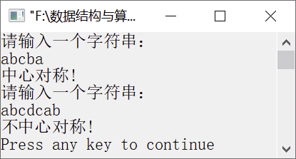

### 2.2.4　判断字符串是否中心对称


**问题描述**


设字符串以单链表形式存储，单链表的表头指针为L，节点结构由data和next两个域组成，其中data域存储字符型元素。请设计算法判断该字符串是否中心对称。例如，abcba中心对称，abcdcab不中心对称。


**【分析】**

这个题目主要考查栈的巧妙使用。可以使用栈的后进先出特性来判断单链表中的元素是否中心对称。将单链表的前一半元素依次入栈，在处理单链表的后一半元素时，当访问单链表的一个元素时，就从栈中弹出一个元素，将两个元素进行比较。若相等，则将单链表中下一个元素与栈中再弹出的元素进行比较，直到单链表中的最后一个元素。这时如果栈为空，则单链表中心对称；否则，单链表不中心对称。


第2章\实例2-08.cpp

```c
/********************************************
*实例说明：判断字符串是否为中心对称
*********************************************/
#include<stdio.h>
#include<stdlib.h>
#include<string.h>
#include<iostream.h>
typedef char DataType;
#include"LinkList.h"
#define MAXSIZE 100
void CreateList(LinkList *L,DataType str[MAXSIZE]);
int SymmetryString(LinkList L);
void main()
{
    DataType a[MAXSIZE],b[MAXSIZE];
    LinkList L;
    int flag1,flag2;
    cout<<"请输入一个字符串："<<endl;
    cin>>a;
    CreateList(&L,a);
    flag1=SymmetryString(L);
    if(flag1==1)
        cout<<"对称中心!"<<endl;
    else
        cout<<"不中心对称!"<<endl;
    cout<<"请输入一个字符串："<<endl;
    cin>>b;
    CreateList(&L,b);
    flag2=SymmetryString(L);
    if(flag2==1)
        cout<<"中心对称!"<<endl;
    else
        cout<<"不中心对称!"<<endl;
}
int SymmetryString(LinkList L)
/*判断字符串是否中心对称*/
{
    char str[MAXSIZE];
    int i=1,n;
    ListNode *p;
    n=ListLength(L);               //n为单链表中节点的个数
    p=L->next;                     //p指向第一个节点
    for(i=0;i<n/2;i++)             //将单链表中前一半元素入栈
       {
          str[i]=p->data;
          p=p->next;
       }
       i--;                       //恢复最后的i值
    if(n%2)                       //若n为奇数，则跳过中心节点
       p=p->next;
       while(p!=NULL && str[i]==p->data)    //将前半部分元素和后半部分元素进行比较
       {
           i--;
           p=p->next;
       }
    if(i==-1)                     //若为空栈，则表明单链表中心对称
           return 1;
    else                          //否则，单链表不中心对称
           return 0;
}
void CreateList(LinkList *L,DataType str[MAXSIZE])
//根据字符数组str创建单链表
{
    int i;
    InitList(L);
    for(i=0;str[i]!='\0';i++)
          InsertList(*L,i+1,str[i]);
}
```

运行结果如图2.15所示。


<center class="my_markdown"><b class="my_markdown">图2.15　运行结果</b></center>

当n为偶数时，单链表中前一半元素和后一半元素个数相等；当n为奇数时，单链表的最中间的元素不用比较，所以需要执行p=p−>next，使p指向下一个节点，然后开始与栈中的元素进行比较。


