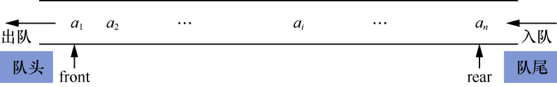
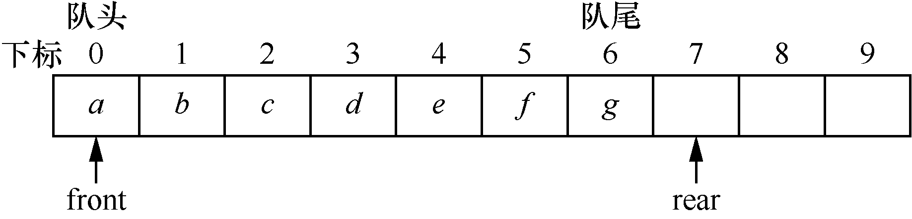
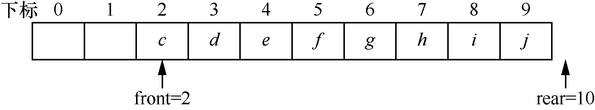
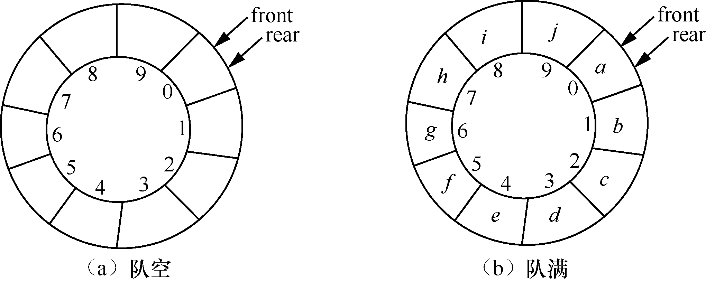
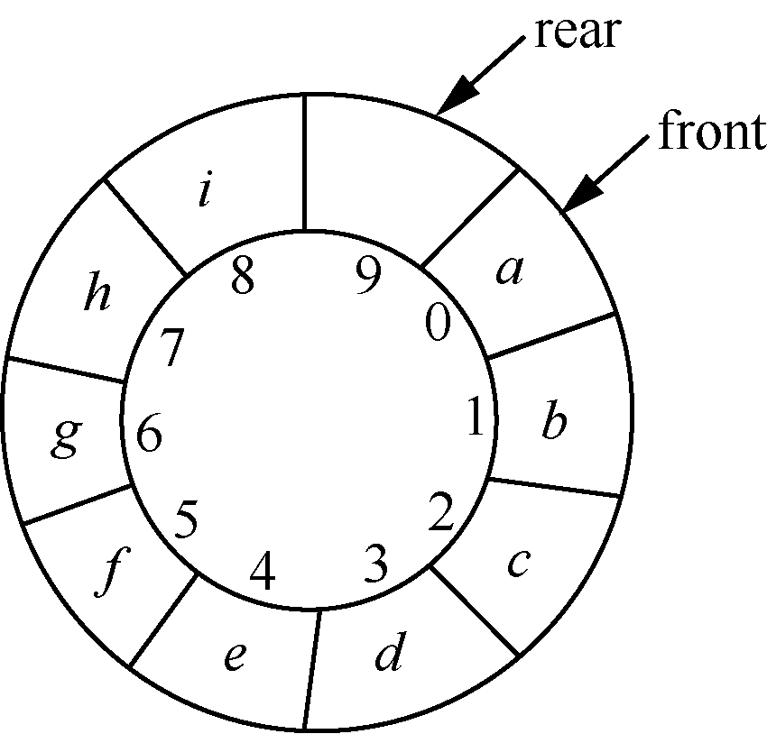

### 3.1　顺序队列及其应用

**【定义】**

**队列** （queue）是一种先进先出（First In First Out，FIFO）的线性表，它只允许在表的一端插入元素，另一端删除元素。其中，允许插入的一端称为队尾（rear），允许删除的一端称为队头（front）。

一个队列为q=(a<sub class="my_markdown">1</sub>, a<sub>2</sub>,…, a<sub class="my_markdown">i</sub>,…, a<sub class="my_markdown">n</sub>)，如图3.1所示，那么a<sub class="my_markdown">1</sub>为队头元素，a<sub class="my_markdown">n</sub>为队尾元素。最先进入队列的元素也会最先出来，只有当最先进入队列的元素都出来之后，后进入队列的元素才能退出。


<center class="my_markdown"><b class="my_markdown">图3.1　队列</b></center>

在日常生活中，人们去银行办理业务需要排队，这就类似于我们提到的队列。每一个新来办理业务的人就需要按照机器自动生成的编号排队等待，只有前面的人办理完毕，才能轮到排在后面的人办理业务。新来的人进入排队状态就相当于入队，前面的人办理完业务离开就相当于出队。

队列有两种存储结构——顺序存储和链式存储。采用顺序存储结构的队列称为顺序队列，采用链式存储结构的队列称为链式队列。

**【顺序队列】**

顺序队列通常采用一维数组存储队列中的元素。另外，增加两个指针，分别指示数组中存放的队头元素和队尾元素。其中，指向队头元素的指针称为队头指针front，指向队尾元素的指针称为队尾指针rear。

队列为空时，队头指针front和队尾指针rear都指向下标为0的存储单元，当元素a、b、c、d、e、f、g依次进入队列后，元素a～g分别存放在下标为0～6的存储单元中，队头指针front指向元素a，队尾指针rear指向元素g的下一位置，如图3.2所示。


<center class="my_markdown"><b class="my_markdown">图3.2　顺序队列</b></center>

**【假溢出】**

按照前面介绍的顺序存储方式，队列容易出现“假溢出”。所谓假溢出，就是经过多次插入和删除操作后，实际上队列还有存储空间，但是又无法向队列中插入元素。

例如，在图3.2所示的队列中删除a和b，然后依次插入h、i和j。当插入j后，就会出现队尾指针rear越出数组的下界而造成假溢出，如图3.3所示。


<center class="my_markdown"><b class="my_markdown">图3.3　删除a和b，插入h、i和j后出现的假溢出</b></center>

**【顺序循环队列】**

当队尾指针rear或队头指针front到达存储空间的最大值时（假定队列的存储空间为QueueSize），让队尾指针或队头指针转化为0，就可以将元素插入队列的空闲存储单元中，从而有效地利用存储空间，消除假溢出。

如图3.3所示，插入元素j之后，将rear变为0，就可以将j插入下标为0的存储单元中，这样顺序队列就构成了一个逻辑上首尾相连的顺序循环队列。

要把用数组表示的顺序队列构成顺序循环队列，只需要一个简单的取余操作。例如，当队尾指针rear=9（假设QueueSize=10）时，若要将新元素入队，则先令rear=(rear+1)%10，这样rear就等于0，利用取余操作就实现了队列的逻辑上的首尾相连，然后将元素存入队列的第0号存储单元。

**【队空和队满】**

在顺序循环队列中，队空和队满时队头指针front和队尾指针rear同时都会指向同一个存储单元，即front==rear，如图3.4（a）与（b）所示。


<center class="my_markdown"><b class="my_markdown">图3.4　顺序循环队列队空和队满状态</b></center>

如何区分队空和队满呢？有两个方法。

（1）增加一个标志位。设标志位为tag，初始时，有tag=0；当入队成功时，有tag=1；出队成功时，有tag=0。队空的判断条件为front==rear&&tag==0，队满的判断条件为front==rear&&tag==1。

（2）少用一个存储单元。队空的判断条件为front==rear，队满的判断条件为front==(rear+1)%QueueSize。队满状态如图 3.5所示。


<center class="my_markdown"><b class="my_markdown">图3.5　队满状态（少用一个存储单元）</b></center>

**【存储结构】**

队列的存储结构的C语言描述如下。

```c
#define  QueueSize  100            /*队列的容量*/
typedef struct Squeue
{
    DataType queue[QueueSize];
    int front,rear;                /*队头指针和队尾指针*/
}SeqQueue;
```

其中，数组queue用来存储队列中的元素，front与rear分别为队头指针和队尾指针，它们的取值范围为0～QueueSize。

**【基本运算】**

顺序循环队列的基本运算如下，以下基本运算保存在文件SeqQueue.h中。

（1）初始化顺序循环队列。

```c
void InitQueue(SeqQueue *SCQ)
/*顺序循环队列的初始化*/
{
    SCQ ->front=SCQ ->rear=0;/*把队头指针和队尾指针同时置为0*/
}
```

（2）判断顺序循环队列是否为空。

```c
int QueueEmpty(SeqQueue SCQ)
/*判断顺序循环队列是否为空*/
{
   if(SCQ.front==SCQ.rear)        /*当顺序循环队列为空时*/
       return 1;                  /*返回1*/
   else                           /*否则*/
       return 0;                  /*返回0*/
}
```

（3）将元素e入队。

```c
int EnQueue(SeqQueue *SCQ,DataType e)
/*将元素e插入顺序循环队列SCQ中*/
{
   if(SCQ->front==(SCQ->rear+1)%QueueSize)
   /*插入新元素之前，判断队尾指针是否达到数组的最大值，即是否会产生假溢出*/
       return 0;
   SCQ->queue[SCQ->rear]=e;           /*在队尾插入元素e*/
   SCQ->rear=(SCQ->rear+1)%QueueSize; /*队尾指针向后移动一个位置*/
   return 1;
}
```

（4）队头元素出队。

```c
int DeQueue(SeqQueue *SCQ,DataType *e)
/*队头元素出队，并将该元素赋给e*/
{
   if(SCQ->front==SCQ->rear)               /*元素出队前，判断队列是否为空*/
       return 0;
   else
   {
       *e=SCQ->queue[SCQ->front];          /*将要出队的元素赋给e*/
       SCQ->front=(SCQ->front+1)%QueueSize;/*将队头指针向后移动一个位置，指向新的队头*/
       return 1;
   }
}
```

（5）取队头元素。

```c
int GetHead(SeqQueue SCQ,DataType *e)
/*取队头元素，并将该元素赋给e，成功返回1，否则返回0*/
{
     if(SCQ.front==SCQ.rear)        /*在取队头元素之前，判断队列是否为空*/
        return 0;
     else
     {
        *e=SCQ.queue[SCQ.front];    /*把队头元素赋给e*/
        return 1;
     }
}
```

（6）清空队列。

```c
void ClearQueue(SeqQueue *SCQ)
/*清空队列*/
{
     SCQ->front=SCQ->rear=0;         /*将队头指针和队尾指针都置为0*/
}
```

