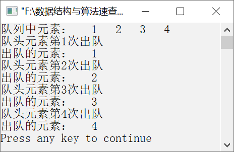

### 3.1.1　将顺序循环队列中的元素分别入队和出队


**问题描述**


要求顺序循环队列的存储空间全部能够得到有效利用，请采用设置标志位tag的方法解决假溢出问题，实现顺序循环队列的元素入队和出队的算法。


**【分析】**

考查顺序循环队列的元素入队和出队的算法思想如下。

设标志位为tag，初始时tag=0，当元素入队成功时，令tag=1；出队成功时，令tag=0。顺序循环队列为空的判断条件为front==rear&&tag==0，顺序循环队列满的判断条件为front==rear&&tag==1。


第3章\实例3-01.cpp

```c
/********************************************
*实例说明：利用标志位tag实现顺序循环队列的元素入队和出队
*********************************************/
#define QUEUESIZE 100        
#include<math.h>
typedefint DataType;           /*将元素的类型设置为整型*/
#define MAXSIZE 100
#include<stdio.h>            
typedef struct Squeue          /*顺序循环队列的类型定义*/
{        
    DataType queue[QUEUESIZE];
    int front,rear;            /*队头指针和队尾指针*/
    int tag;                   /*队列空、满的标志位*/
}SCQueue;
void PrintData(DataType e);
int CheckType(DataType e);
void InitQueue(SCQueue *SCQ)
/*为了将顺序循环队列初始化为空队列，需要把队头指针和队尾指针同时置为0，且标志位置为0*/
{
    SCQ->front=SCQ->rear=0;    /*队头指针和队尾指针都置为0*/
    SCQ->tag=0;                /*标志位置为0*/
}
int QueueEmpty(SCQueue SCQ)
/*判断顺序循环队列是否为空*/
{
    if(SCQ.front==SCQ.rear&&SCQ.tag==0)
           return 1;
    else
           return 0;
}
int EnQueue(SCQueue *SCQ,DataType e)
/*将元素e插入顺序循环队列SCQ中*/
{
    if(SCQ->front==SCQ->rear&&SCQ->tag==1)
    /*在插入新的元素之前，判断是否队尾指针达到数组的最大值，即是否会产生假溢出*/
    {
           printf("顺序循环队列已满，不能入队！");
           return 1;
    }
    else
    {
        SCQ->queue[SCQ->rear]=e;    /*在队尾插入元素e*/
        SCQ->rear=SCQ->rear+1;      /*队尾指针向后移动一个位置，指向新的队尾*/
        SCQ->tag=1;                 /*插入成功*/
        return 1;
    }
}
int DeQueue(SCQueue *SCQ,DataType *e)
/*删除顺序循环队列中的队头元素，并将该元素赋值给e*/
{
    if(QueueEmpty(*SCQ))/*在删除元素之前，判断队列是否为空*/
    {
        printf("顺序循环队列已是空队列，不能再进行出队操作！");
        return 0;
    }
    else
    {
        *e=SCQ->queue[SCQ->front];    /*将出队的元素赋值给e*/
        SCQ->front=SCQ->front+1;      /*队头指针向后移动一个位置，指向新的队头元素*/
        SCQ->tag=0;                   /*出队成功*/
        return 1;
    }
}
void DisplayQueue(SCQueue SCQ)
/*输出顺序循环队列中的元素*/
{
    int i;
    if(QueueEmpty(SCQ))    /*判断顺序循环队列是否为空*/
        return;
    if(SCQ.front<SCQ.rear)
    /*如果队头指针值小于队尾指针值，则把队头指针到队尾指针之间指向的元素依次输出*/
        for(i=SCQ.front;i<SCQ.rear;i++)
            printf("%4d",SCQ.queue[i]);
    else
    /*如果队头指针值大于队尾指针值，则把队尾指针到队头指针之间指向的元素依次输出*/
    for(i=SCQ.front;i<SCQ.rear+QUEUESIZE;i++)
    printf("%4d",SCQ.queue[i%QUEUESIZE]);
    printf("\n");    
}
void main()
{
    SCQueue Q;                    /*定义一个顺序循环队列*/
    int e;                        /*定义一个字符类型变量，用于存放出队的元素*/
    int a[]={1,2,3,4},i;
    InitQueue(&Q);                /*初始化顺序循环队列*/
    /*将数组中的4个元素依次入队*/
    for(i=0;i<sizeof(a)/sizeof(a[0]);i++)
        EnQueue(&Q,a[i]);
    /*将顺序循环队列中的元素显示输出*/
    printf("队列中元素：");
    DisplayQueue(Q);
    /*将顺序循环队列中的队头元素出队*/
    i=0;
    while(!QueueEmpty(Q))
    {
        printf("队头元素第%d次出队\n",++i);
        DeQueue(&Q,&e);
        printf("出队的元素：");
        printf("%d\n",e);
    }
void PrintData(DataType e)
/*元素的输出（调用函数时不需要格式控制符）*/
{
    int n;
    n=CheckType(e);
    switch(n)
    {
        case 1:                //字符型
              printf("%4c\n",e);
              break;
        case 2:                //整型
              printf("%4d\n",e);
              break;
        case 3:                //浮点型
              printf("%8.2f\n",e);
              break;
    }
}
int CheckType(DataType e)
/*判断e是浮点数、整数还是字母字符*/
{
    char str[MAXSIZE];
    int a;
    float b;
    if(fabs(e-(int)e)>1e-6)          
           return 3;
    if(e>='A'&&e<='Z'||e>='a'&&e<='z')  
           return 1;
    else 
           return 2;
}
```

运行结果如图3.6所示。


<center class="my_markdown"><b class="my_markdown">图3.6　运行结果</b></center>


前文中，我们经常使用字符或整数作为测试数据，但还需要对用途不同的数据类型进行重新定义，如typedef int DataType或typedef char DataType。针对不同类型的数据，在输出时需要用不同的格式控制符，如%c或%d，这不利于后期的软件维护，会导致在维护时需要重新对程序进行修改。为了避免这个问题，我们专门利用一个函数PrintData来输出不同类型的数据，输出前还需要对数据类型进行判断，假设这里的数据类型比较简单，本书中只用到整型、字符型和浮点型。


对于经常使用的功能，我们可将其单独写成一个函数。一方面，避免重复开发，方便今后直接调用；另一方面，方便以后的软件维护。

