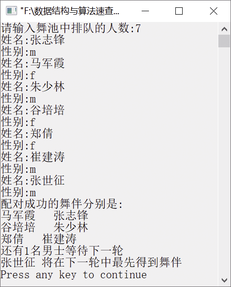

### 3.1.2　舞伴配对


**问题描述**


假设在周末舞会上，男士们和女士们进入舞厅时，各自排成一队。跳舞开始时，依次从男队和女队的开头各出一人配成舞伴。若两队初始人数不相同，则较长的那一队中未配对者等待下一轮。现要求设计一个算法模拟上述舞伴配对问题。


**【分析】**

先入队的男士或女士先出队配成舞伴。因此该问题具体有典型的先进先出特性，可用队列作为算法的数据结构。

在算法实现时，假设男士和女士的记录存放在一个数组中作为输入，然后依次扫描该数组的各元素，并根据性别来决定是进入男队还是女队。当这两个队列构造完成之后，依次将两个队列当前的开头元素出队来配成舞伴，直至某队列变空为止。此时，若某队列仍有等待配对者，则算法输出此队列中等待者的人数及排在队头的等待者的名字，他（或她）将是下一轮开始时第一个可获得舞伴的人。


第3章\实例3-02.cpp

```c
/**************** ****************************
*实例说明：舞伴配对
*********************************************/
#include<stdio.h>
typedef struct
{
    char name[20];
    char sex;               /*性别，'F'或'f'表示女性，'M'或'm'表示男性*/
}Person;
typedef Person DataType;    /*将队列中元素的数据类型定义为Person*/
#include"SeqQueue.h"
void DancePartner(DataType dancer[],int num)
/*结构数组dancer中存放跳舞的男女，num是跳舞的人数*/
{
    int i;
    DataType p;
    SeqQueue Mdancers,Fdancers;
    InitQueue(&Mdancers);          /*男队初始化*/
    InitQueue(&Fdancers);          /*女队初始化*/
    for(i=0;i<num;i++)
    {                              /*依次将跳舞者依其性别入队*/
        p=dancer[i];
        if(p.sex=='F'||p.sex=='f')
            EnQueue(&Fdancers,p);  /*进入女队*/
        else
            EnQueue(&Mdancers,p);  /*进入男队*/
    }
    printf("配对成功的舞伴分别是: \n");
    while(!QueueEmpty(Fdancers)&&!QueueEmpty(Mdancers))
    {
        /*依次输入男女舞伴名*/
        DeQueue(&Fdancers,&p);     /*女士出队*/
        printf("%s   ",p.name);    /*输出出队女士名*/
        DeQueue(&Mdancers,&p);     /*男士出队*/
        printf("%s\n",p.name);     /*输出出队男士名*/
    }
    if(!QueueEmpty(Fdancers))      /*输出女士剩余人数及队头女士的名字*/
    {
        printf("还有%d名女士等待下一轮\n",DancerCount(Fdancers));
        GetHead(Fdancers,&p);      /*取队头元素*/
        printf("%s 将在下一轮中最先得到舞伴 \n",p.name);
    }
    else if(!QueueEmpty(Mdancers)) /*输出男队剩余人数及队头者名字*/
    {
        printf("还有%d名男士等待下一轮\n",DancerCount(Mdancers));
        GetHead(Mdancers,&p);
        printf("%s 将在下一轮中最先得到舞伴\n",p.name);
    }
}
int DancerCount(SeqQueue Q)
/*队列中等待配对的人数*/
{
    return (Q.rear-Q.front+QueueSize)%QueueSize;
}
void main()
{
    int i,n;
    DataType dancer[30];
    printf("请输入舞池中排队的人数:");
    scanf("%d",&n);
    for(i=0;i<n;i++)
    {
        printf("姓名:");
        scanf("%s",dancer[i].name);
        getchar();
        printf("性别:");
        scanf("%c",&dancer[i].sex);
    }
    DancePartner(dancer,n);
}
```

运行结果如图3.7所示。


<center class="my_markdown"><b class="my_markdown">图3.7　运行结果</b></center>

