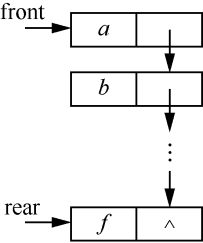
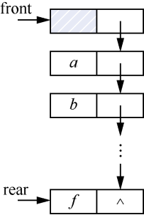
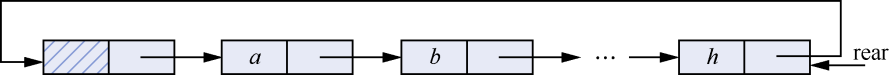
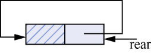
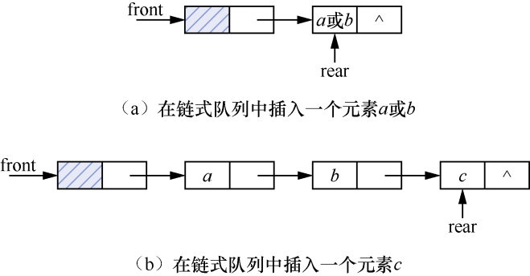
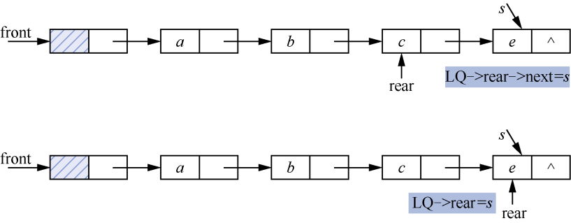
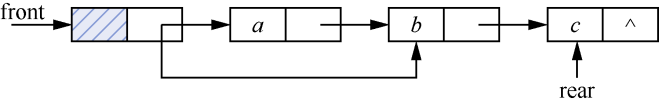

### 3.2　链式队列及其应用

**【定义】**

链式队列通常用链表实现。在链式队列中，分别需要一个指向队头与队尾的指针表示队头和队尾，这两个指针分别称为队头指针和队尾指针。不带头节点的链式队列和带头节点的链式队列分别如图3.9、图3.10所示。


<center class="my_markdown"><b class="my_markdown">图3.9　不带头节点的链式队列</b></center>


<center class="my_markdown"><b class="my_markdown">图3.10　带头节点的链式队列</b></center>

对于带头节点的链式队列，当链式队列为空时，队头指针front和队尾指针rear都指向头节点，如图3.11所示。


<center class="my_markdown"><b class="my_markdown">图3.11　带头节点的空链式队列</b></center>

**【循环链式队列】**

首尾相连的链式队列就构成了链式循环队列。在链式循环队列中，可以只设置队尾指针，而不需设置队头指针，一个只设置队尾指针的链式循环队列如图3.12所示。链式循环队列LQ为空的判断条件为LQ.rear−>next==LQ.rear，如图3.13所示。


<center class="my_markdown"><b class="my_markdown">图3.12　只设置队尾指针的链式循环队列</b></center>


<center class="my_markdown"><b class="my_markdown">图3.13　空链式循环队列</b></center>

**【存储结构】**

链式队列的存储结构的C语言描述如下。

```c
/*节点类型定义*/
typedef struct QNode
{
    DataType data;
    struct QNode* next;
}LQNode,*QueuePtr;
/*队列类型定义*/
typedef struct
{
    QueuePtr front;
    QueuePtr rear;
}LinkQueue;
```

**【基本运算】**

（1）初始化链式队列。

```c
void InitQueue(LinkQueue *LQ)
/*初始化链式队列*/
{
    LQ->front=LQ->rear=(LQNode*)malloc(sizeof(LQNode));
    if(LQ->front==NULL)
        exit(-1);
    LQ->front->next=NULL;    /*把头节点的指针域置为空*/
}
```

（2）判断链式队列是否为空。

```c
int QueueEmpty(LinkQueue LQ)
/*判断链式队列是否为空，为空返回1，否则返回0*/
{
    if(LQ.rear==LQ.front)        /*当链式队列为空时*/
        return 1;                /*返回1*/
    else                         /*否则*/
        return 0;                /*返回0*/
}
```

（3）将元素e入队，在链式队列中插入元素时，只需要移动队尾指针；删除元素时，只需要移动队头指针。例如，在链式队列中插入a、b、c的指针变化情况如图3.14（a）与（b）所示。


<center class="my_markdown"><b class="my_markdown">图3.14　在链式队列中插入元素的指针变化情况</b></center>

算法实现如下。

```c
int EnQueue(LinkQueue *LQ,DataType e)
/*将元素e插入链式队列LQ中，插入成功返回1*/
{
    LQNode *s;
    s=(LQNode*)malloc(sizeof(LQNode));/*为将要入队的元素申请一个节点的空间*/
    if(!s) /*如果申请空间失败，则退出并返回参数-1*/
           exit(-1);    
           s->data=e;            
           s->next=NULL;         
           LQ->rear->next=s;     
           LQ->rear=s;           
           return 1;
}
```

在链式队列中插入元素e，先让链式队列中的最后一个节点的指针域指向待插入的节点，然后将队尾指针指向该节点，如图3.15所示。


<center class="my_markdown"><b class="my_markdown">图3.15　将元素e入队的操作过程</b></center>

（4）将队头元素出队，即删除链式队列中的队头元素。删除队头元素的指针变化情况如图3.16所示。


<center class="my_markdown"><b class="my_markdown">图3.16　指针变化情况</b></center>

算法实现如下。

```c
int DeQueue(LinkQueue *LQ,DataType *e)
/*删除链式队列中的队头元素节点，并将该元素赋给e*/
{
     LQNode *s;
     if(LQ->front==LQ->rear)      /*先判断链式队列是否为空*/
        return 0;
     else
     {
        s=LQ->front->next;        
        *e=s->data;              
        LQ->front->next=s->next;  
        if(LQ->rear==s)          
            LQ->rear=LQ->front;  
        free(s);                 
        return 1;
     }
}
```

（5）取队头元素。

```c
int GetHead(LinkQueue LQ,DataType *e)
/*取链式队列中的队头元素，并将该元素赋给e*/
{
     LQNode *s;
     if(LQ.front==LQ.rear)      /*取队头元素之前，判断链式队列是否为空*/
        return 0;
     else
     {
        s=LQ.front->next;     
        *e=s->data;           
        return 1;
     }
}
```

（6）清空链式队列。

```c
void ClearQueue(LinkQueue *LQ)
/*清空链式队列*/
{
    while(LQ->front!=NULL)
    {
        LQ->rear=LQ->front->next;  
        free(LQ->front);           
        LQ->front=LQ->rear;        
    }
}
```

以上基本运算保存在文件LinkQueue.h中。

