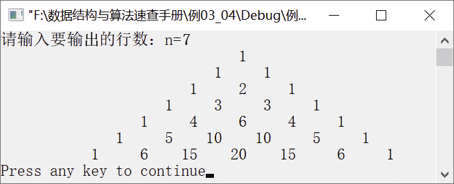

### 3.2.1　队列在杨辉三角中的应用


**问题描述**


输出杨辉三角。杨辉三角是一个由数字排列成的三角形数表，一个8阶的杨辉三角如图3.16所示。


**【分析】**

杨辉三角，又称贾宪三角，是二项式系数在三角形中的一种几何排列。北宋时期的贾宪首先使用“贾宪三角”进行高次开方运算。南宋的杨辉所著的《详解九章算法》一书中，也记录了图3.17中的三角形数表，并说明此表引自贾宪的《释锁算术》。因此，杨辉三角又称贾宪三角。


<center class="my_markdown"><b class="my_markdown">图3.17　8阶的杨辉三角</b></center>

#### 1．杨辉三角具有以下性质

（1）第1行只有一个数。

（2）第i行有i个数。

（3）第i行最左边和最右边的数均为1。

（4）每个数等于上一行的左右两个数之和，即第n行的第i个数等于第n−1行的第i−1个数和第i个数之和。

#### 2．构造队列

杨辉三角的第i行元素是根据第i−1行元素得到的，因此可用队列先保存上一层元素，然后将队列元素依次出队得到下一层的元素。构造杨辉三角分为两个部分——两端元素值为1的部分是已知的，剩下的元素就是要构造的部分。

以第8行元素为例，利用队列来构造杨辉三角（假设Q是顺序循环队列）的过程如下。

（1）在第8行，第一个元素入队，EnQueue(&Q,1)。

（2）第8行的中间6个元素可通过已经入队的第7行元素得到。首先取出第7行的第一个元素并将其出队，DeQueue(&Q,&t)，将该元素存入临时数组（用于输出），temp[k++]=t，t就是上一行的左边那个元素。其次取出右边那个元素，GetHead(Q,&e)，e 为队头元素，但是并不将其出栈，因为下一次操作还要用到它。再次将左边的元素和右边的元素相加，得到本层元素。最后将元素t入队，EnQueue(&Q,t)。

（3）第7行最后一个元素出队，DeQueue (&Q,&t)，就是将上一行的最后一个1出队。

（4）第8行最后一个元素入队，EnQueue(&Q,1)，就是将本行的最后一个1入队。

至此，第8行的所有元素都已经入队。其他行的入队操作类似。

注意，在循环结束后，还有最后一行元素在队列里。在最后一行元素入队之后，要将杨辉三角输出。为了输出杨辉三角中的每一行，需要设置一个临时数组temp[MAXSIZE]来存储每一行的元素，然后在一行结束时输出该行元素。


第3章\实例3-04.c

```c
/********************************************
*实例说明：输出杨辉三角
*********************************************/
#include<stdio.h>
#include<malloc.h>
typedef int DataType;            
#define MAXSIZE 100
#include "LinkQueue.h"
void PrintArray(int a[],int n,int N);
void YangHuiTriangle(int N);
void main()
{
    int n;
    printf("请输入要输出的行数：n=");
    scanf("%d",&n);    
    YangHuiTriangle(n);    
}
void YangHuiTriangle(int N)
/*链式队列实现输出杨辉三角*/
{
    int i,k,n;
    DataType e,t;
    int temp[MAXSIZE];       
    LinkQueue Q;
    k=0;
    InitQueue(&Q);           
    EnQueue(&Q,1);          
    for(n=2;n<=N;n++)
    /*产生第n行元素并入队，同时将第n-1行的元素保存在临时数组中*/
    {
        k=0;
        EnQueue(&Q,1);          /*第n行的第一个元素入队*/
        for(i=1;i<=n-2;i++)
        /*利用队列中第n-1行元素产生第i行的中间n-2个元素并入队*/
        {
            DeQueue(&Q,&t);
            temp[k++]=t;       
            GetHead(Q,&e);     
            t=t+e;             
            EnQueue(&Q,t);
        }
        DeQueue(&Q,&t);
        temp[k++]=t;        
        /*将第n-1行的最后一个元素存入临时数组*/
        PrintArray(temp,k,N);    
        EnQueue(&Q,1);       
    }
    k=0;      
    while(!QueueEmpty(Q)) 
    {
        DeQueue(&Q,&t);
        temp[k++]=t;
        if(QueueEmpty(Q))
            PrintArray(temp,k,N);
    }    
}
void PrintArray(int a[],int n,int N)
/*输出数组中的元素，使其能够以正确的形式输出*/
{
    int i;
    static count=0;                    /*记录输出的行*/
    for(i=0;i<N-count;i++)             /*输出空格*/
        printf("   ");
    count++;
    for(i=0;i<n;i++)                   /*输出数组中的元素*/
        printf("%6d",a[i]);
    printf("\n");
}
```

运行结果如图3.18所示。


<center class="my_markdown"><b class="my_markdown">图3.18　运行结果</b></center>

我们利用链式队列的基本运算实现杨辉三角的输出。当然，也可以使用数组模拟队列实现，有兴趣的读者不妨自己尝试一下。

