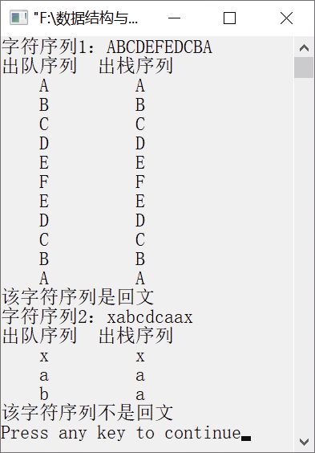
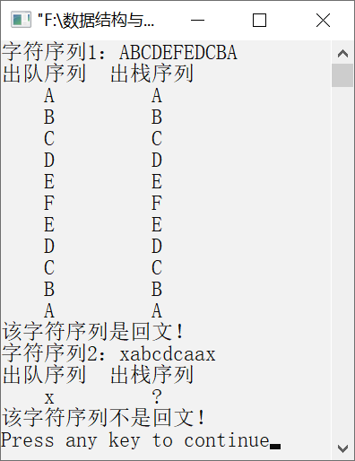

### 3.2.2　判断字符串是否为回文


**问题描述**


实现一个算法，判断任意给定的字符序列是否为回文。所谓回文是指把字符序列的中间字符作为基准，两边字符完全相同，即从两个方向看，都是相同的字符序列。例如，字符序列“ABCDEFEDCBA”为回文，而字符序列“xabcdcaax”不是回文。


**【分析】**

这个题目考查对栈的后进先出思想和队列的先进先出思想的理解，判断是否为回文可通过构造栈和队列来实现。具体做法是先把一个字符序列分别入队和入栈，然后将字符序列出队和出栈。该做法基于字符序列出队的顺序和出栈的顺序刚好相反。同时，比较出队的字符和出栈的字符是否相等。若相等，则继续取出队列和栈中的下一个字符进行比较，直到栈和队列为空，表明该字符序列为回文；若有字符不相等，则该字符序列不是回文。


第3章\实例3-05.c

```c
/********************************************
*实例说明：判断是否为回文
*********************************************/
#include<stdio.h>
#include<stdlib.h>
#include<string.h>
#include<malloc.h>
typedef char DataType;                   /*数据类型为字符类型*/
#include"LinkStack.h"
#include"LinkQueue.h"
void PrintStackQueue(LStackNode *LStack,LinkQueue LQueue);
void main()
{
    DataType str1[]="ABCDEFEDCBA";   
    DataType str2[]="xabcdcaax";     
    int i;
    LinkQueue LQueue1,LQueue2;       
    LStackNode *LStack1,*LStack2;    
    InitQueue(&LQueue1);            
    InitQueue(&LQueue2);             
    InitStack(&LStack1);             
    InitStack(&LStack2);             
    for(i=0;i<strlen(str1);i++)
    {
        EnQueue(&LQueue1,str1[i]);     /*字符序列1入队*/
        PushStack(LStack1,str1[i]);    /*字符序列1入栈*/
    }
    for(i=0;i<strlen(str2);i++)
    {
        EnQueue(&LQueue2,str2[i]);     /*字符序列2入队*/
        PushStack(LStack2,str2[i]);    /*字符序列2入栈*/
    }
    printf("字符序列1：%s\n",str1);
    PrintStackQueue(LStack1,LQueue1);
    printf("字符序列2：%s\n",str2);
    PrintStackQueue(LStack2,LQueue2);
}
void PrintStackQueue(LStackNode *LStack,LinkQueue LQueue)
{
    DataType st,qu;
    printf("出队序列出栈序列\n");
    while(!StackEmpty(LStack))    /*判断链栈1是否为空*/
    {
       DeQueue(&LQueue,&qu);   
       PopStack(LStack,&st);   
       printf("%5c",qu);       
       printf("%10c\n",st);
       if(qu!=st)            
       {
            printf("该字符序列不是回文\n");
            return;
       }
    }
         printf("该字符序列是回文\n");    
}
```

运行结果如图3.19所示。


<center class="my_markdown"><b class="my_markdown">图3.19　运行结果</b></center>

**【常见错误】**

因为需要将字符序列1和字符序列2分别入队、入栈，所以直接按照以下方式实现。

```c
for(i=0;i<strlen(str1);i++)
{
    EnQueue(&LQueue1,str1[i]);    /*依次把字符序列1入队*/
    PushStack(LStack1,str1[i]);   /*依次把字符序列1入栈*/
    EnQueue(&LQueue2,str2[i]);    /*依次把字符序列2入队*/
    PushStack(LStack2,str2[i]);   /*依次把字符序列2入栈*/
}
```

运行结果如图3.20所示。


<center class="my_markdown"><b class="my_markdown">图3.20　运行结果</b></center>

在字符序列2的入栈操作这一行设置断点，在调试过程中将字符序列2入LStack2之后，又多进入了两个字符。问题出在for循环的控制上，即结束条件出现了错误，这是因为字符序列1和字符序列2两个字符序列的长度不等，才会出现以上错误。这就需要分别对字符序列1和字符序列2执行入栈和入队操作。

