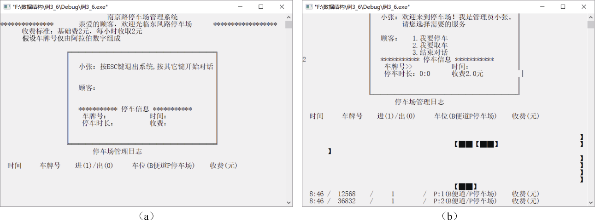

### 3.3　栈和队列的综合应用──停车场管理

设停车场是一个可停放n辆汽车的狭长通道，且只有一个大门可供汽车进出。汽车按到达时间的先后顺序，在停车场内依次由北向南排列（大门在最南端，最先到达的第一辆汽车停放在停车场的最北端）。若停车场内已经停满n辆汽车，那么后来的车辆只能在门外的便道上等候。一旦有车辆离开，则排在便道上的第一辆汽车即可开入停车场。当停车场内某辆汽车要离开时，在它之后进入的车辆必须先退出停车场为它让路，待该辆汽车开出大门外，其他车辆再按原次序进入停车场。每辆停放在停车场的汽车在它离开停车场时必须按它停留的时间长短缴纳费用。试按以上要求编写程序模拟停车场管理过程。

**【分析】**

以栈模拟停车场，以队列模拟停车场外的便道，按照从键盘读入数据的次序进行停车场模拟管理。每一组输入数据包括汽车的“到达”（或“离开”）信息、车牌号及到达（或离开）的时刻3个数据项。若车辆到达，则输出汽车在停车场内或者便道上的停车位置；若车辆离开，则输出汽车在停车场停留的时间和应缴纳的费用（便道上停留的时间不收费）。

输入数据为(‘A’, 1, 5)、(‘A’, 2, 10)、(‘D’, 1, 15)、(‘A’, 3, 20)、(‘A’, 4, 25)、(‘A’, 5, 30)、(‘D’, 2, 35) 、(‘D’, 4, 40)、(‘E’, 0, 0)。其中，A表示到达，D表示离开，E表示输入结束。(‘A’, 1, 5)表示1号牌照汽车在5这个时刻到达，(‘D’, 1, 15)表示1号牌照汽车在15这个时刻离开。

当有汽车准备停车时，先判断栈是否已满。如果栈未满，则将汽车数据入栈；如果栈满，则将汽车数据入队。当有汽车离开时，先依次将栈中的元素出栈，并依次暂存到另一个栈中，等该汽车离开后，再将暂存栈中的元素依次入停车场栈，并将队列中的汽车数据入停车场栈。

一个模拟停车场管理程序的部分实现代码如下。

```c
#include<stdio.h>        /*包含输入输出头文件*/
#include<stdlib.h>       /*包含定义的5种类型、一些宏和通用工具函数*/
#include<time.h>         /*获取系统时间所用函数*/
#include<conio.h>        /*定义了通过控制台进行数据输入和数据输出的函数*/
#include<windows.h>      /*设置光标信息*/
#define MaxSize 10       /*定义的大小，即栈长度*/
#define PRICE 2          /*每车每小时收费值*/
#define BASEPRICE 2      /*基础停车费*/
#define Esc 27           /*退出系统*/
#define Exit 3           /*结束对话*/
#define Stop 1           /*停车*/
#define Drive 2          /*取车*/
int jx=0,jy=32;          /*全局变量日志输出位置*/
typedef struct
{
    int hour;
    int minute;
}Time,*PTime;             /*时间节点*/
typedef struct            /*定义栈元素的类型，即车辆信息节点*/
{
    int num ;             /*车牌号*/
    Time arrtime;         /*到达时刻或离开时刻*/
}CarNode;
typedef struct            /*定义栈,模拟停车场*/
{
    CarNode stack[MaxSize];
    int top;
}SeqStackCar;
typedef struct node       /*定义队列节点的类型*/
{
    int num;              /*车牌号*/
    struct node *next;
}QueueNode;
typedef struct            /*定义队列,模拟便道*/
{
    QueueNode *front,*rear;
}LinkQueueCar;
/*函数声明*/
PTime Get_Time();
CarNode GetCarInfo();
void ClearScreen(int a);
void GotoXY(int x,int y);
void PrintLog(Time t,int n,int io,char ab,int po,double f);
void DispParAnimation(int a,int num,int x0,int y0);
void DisLeavAnimation(int a,int po,int num);
/*初始化栈*/
void InitSeqStack(SeqStackCar *s)
{
    s->top=-1;
}
/*汽车入栈*/
int EnterCar(SeqStackCar *s,CarNode x)   
{
    if(s->top==MaxSize-1)
          return 0;                     
    else
    {
         s->stack[++s->top]=x;           
         return 1;
    }
}
/*栈顶元素出栈*/
CarNode OutCar(SeqStackCar *s)
{
    CarNode x;
    if(s->top<0)
    {
        x.no=0;
        x.arrtime.hour=0;
        x.arrtime.minute=0;
        return x;                      //如果栈空,返回空值
    }
    else
    {
        s->top--;
        return s->stack[s->top+1];      //栈不空,返回栈顶元素
    }
}
/*初始化队列*/
void InitLinkQueue(LinkQueueCar *q)     
{
    q->front=(QueueNode*)malloc(sizeof(QueueNode));  //动态生成一个新节点
    if(q->front!=NULL)
    {
        q->rear=q->front;
        q->front->next=NULL;
        q->front->no=0;                        
    }
}
/*数据入队*/
void EnQueue(LinkQueueCar *q,int e)
{
    QueueNode *p;
    p=(QueueNode*)malloc(sizeof(QueueNode));   
    p->no=e;
    p->next=NULL;
    q->rear->next=p;                           
    q->rear=p;
    q->front->no++;                           
}
/*数据出队*/
int DeQueue(LinkQueueCar *q)
{
    QueueNode *p;
    int n;
    if(q->front==q->rear)                      //队空返回0
        return 0;
    else
    {
        p=q->front->next;
        q->front->next=p->next;
        if(p->next==NULL)
              q->rear=q->front;
        n=p->no;
        free(p);
        q->front->no--;
        return n;                              //返回出队的车辆数据
    }
}
/*********************         车辆到达     ***************************/
//参数：栈，队列，车辆信息
//返回值：空
//功能：对传入的车辆进行入栈，栈满则入队
void ArriveCar(SeqStackCar *s,LinkQueueCar *lq,CarNode e)
{
    int flag;
    flag=EnterCar(s,e);       //入栈
    if (flag==0)              //栈满
    {
        EnQueue(lq,e.no);               //入队
        DispParAnimation(1,lq->front->no,0,23);
        PrintLog(e.arrtime,e.no,1,'B',lq->front->no,0);
        ClearScreen(0);
        printf("您的车停在便道%d号车位上\n",lq->front->no);  //更新对话
    }
    else
    {
        DispParAnimation(0,s->top+1,0,23);
        PrintLog(e.arrtime,e.no,1,'P',s->top+1,0);
        ClearScreen(0);
        printf("您的车停在停车场%d号车位上\n",s->top+1);     //更新对话
    }
    ClearScreen(1);
    printf("按任意键继续");
    getch();
}
/**************************      车辆离开       *************************************/
//参数：栈指针s1，暂存栈指针s2，队列指针p，车辆信息e
//返回值：空
//功能：查找栈中s1指向的节点的e并出栈，栈中没有则查找队列p指向的节点并出队，输出离开时的收费信息
void LeaveCar(SeqStackCar *s1,SeqStackCar *s2,LinkQueueCar *p,CarNode e)
{
    double fee=0;
    int position=s1->top+1;                   //车辆所在车位
    int n,flag=0;
    CarNode y;
    QueueNode *q;
    while((s1->top > -1)&&(flag!=1))          //当栈不空且未找到e
    {
        y=OutCar(s1);
        if(y.no!=e.no)
        {
            n=EnterCar(s2,y);
            position--;
        }
        else
            flag=1;
    }
    if(y.no==e.no)                        //找到e
    {
        GotoXY(33,12);
        printf("%d:%-2d",(e.arrtime.hour-y.arrtime.hour),(e.arrtime.minute-y.arrtime.  
        minute) );
        fee=BASEPRICE+((e.arrtime.hour-y.arrtime.hour)*60+(e.arrtime.minute-y.arrtime  
        .minute))*PRICE;
        GotoXY(45,12);
        printf("%.1f元\n",fee);
        ClearScreen(0);
        printf("确认您的车辆及收费信息");
        ClearScreen(1);
        printf("按任意键继续");
        getch();
        while(s2->top>-1)
        {
            y=OutCar(s2);
            flag=EnterCar(s1,y);
        }
        n=DeQueue(p);
        if(n!=0)
        {
            y.no=n;
            y.arrtime=e.arrtime;
            flag=EnterCar(s1,y);
            DisLeavAnimation(p->front->no+1,position,s1->top+1); //出栈动画,队列成员入栈
            PrintLog(e.arrtime,e.no,0,'P',position,fee);
            PrintLog(y.arrtime,y.no,1,'P',s1->top+1,0);
        }
        else
        {
            DisLeavAnimation(0,position,s1->top+2);
            PrintLog(e.arrtime,e.no,0,'P',position,fee);
        }
    }
    else                               //若栈中无e
    {
        while(s2->top > -1)            //还原栈
        {
            y=OutCar(s2);
            flag=EnterCar(s1,y);
        }
        q=p->front;
        flag=0;
        position=1;
        while(flag==0&&q->next!=NULL)  //若队列不空且未找到e
        if(q->next->no!=e.no)
        {
              q=q->next;
              position++;
        }
        else                           //找到e
        {
              q->next=q->next->next;
              p->front->no--;
              if(q->next==NULL)
              p->rear=p->front;
              GotoXY(33,17);
              printf("0:0");
              GotoXY(48,17);
              printf("0元");
              ClearScreen(0);
              printf("您的车将离开便道");
              ClearScreen(1);
              printf("按任意键继续");
              getch();
              DisLeavAnimation(-1,position,p->front->no+1);     //出队动画
              PrintLog(e.arrtime,e.no,0,'B',position,0);
              flag=1;
         }
         if(flag==0)                                            //未找到e
         {
              ClearScreen(0);
              printf("停车场和便道上均无您的车");
              ClearScreen(1);
              printf("按任意键继续");
              getch();
         }
    }
}
/*获取系统时间*/
PTime Get_Time()
{
    Time *t;
    time_t timer;
    struct tm *tblock;
    t=(Time*)malloc(sizeof(Time));
    timer=time(NULL);
    tblock=localtime(&timer);
    t->minute=tblock->tm_min;
    t->hour=tblock->tm_hour;
    return t;
}
/*将光标移动到(x,y)*/
void GotoXY(int x,int y)
{
    COORD coord;
    coord.X=x;
    coord.Y=y+3;
    SetConsoleCursorPosition(GetStdHandle(STD_OUTPUT_HANDLE),coord);
}
/*画出系统界面*/
void PanitPL()
{
    int i,j,x,y,a[2][4]={{2,0,0,1},{-2,0,0,-1}};      //方向
    GotoXY(5,4);
    x=18,y=2;                                         //起始点
    for(i=0;i<2;i++)
    {
        for(j=0;j<20;j++)
        {
            x+=a[i][0];
            y+=a[i][1];
            GotoXY(x,y);
            printf("═");
        }
        x+=a[i][0];
        y+=a[i][1];
        GotoXY(x,y);
        if(i==0)
             printf("╗");
        else
             printf("╚");
        for(j=0;j<12;j++)
        {
             x+=a[i][2];
             y+=a[i][3];
             GotoXY(x,y);
             printf("║");
        }
        x+=a[i][2];
        y+=a[i][3];
        GotoXY(x,y);
        if(i==0)
             printf("╝");
        else
             printf("╔");
    }
    GotoXY(22,4);
    printf("小张：");
    GotoXY(22,7);
    printf("顾客：");
    GotoXY(22,10);
    printf("*********** 停车信息 ***********");
    GotoXY(23,11);
    printf("车牌号：");
    GotoXY(42,11);
    printf("时间：");
    GotoXY(23,12);
    printf("停车时长：");
    GotoXY(42,12);
    printf("收费：");
}
//输入车辆信息
CarNode GetCarInfo()
{
    PTime T;
    CarNode x;
    ClearScreen(0);
    printf("请输入您的车牌号\n");
    ClearScreen(1);
    printf("在下面输入车辆信息");
    ClearScreen(2);
    scanf("%d",&(x.no));
    T=Get_Time();
    x.arrtime=*T;
    GotoXY(48,11);
    printf("%d:%d",x.arrtime.hour,x.arrtime.minute);
    getch();
    return x;
}
//输出停车场
void PrintStopPlace()
{
    GotoXY(0,16);                
    printf("                          停车场管理日志\n\n");
    printf("  时间车牌号进(1)/出(0)     车位(B便道/P停车场)    收费(元)  ");
}
//输出日志记录
void PrintLog(Time t,int n,int io,char ab,int po,double f)
{
    jy++;
    GotoXY(jx,jy);
    printf("  时间车牌号进(1)/出(0)     车位(B便道/P停车场)    收费(元)");
    if(io==0)
        printf(" /%.1f",f);
    GotoXY(jx,jy);
    printf("                   /     %d        /  %c:%d",io,ab,po);
    GotoXY(jx,jy);
    printf("  %d:%d /  %d",t.hour,t.minute,n);
}
void DispParAnimation(int a,int num,int x0,int y0)
{
    static char *car="【██】";
    int x=0,y=22;
    if(a==0)
    {
       x=(num+6)*6;
       for(;x0<72;x0++)
       {
           GotoXY(x0,y0);
           printf("%s",car);
           Sleep(30);
           GotoXY(x0,y0);
           printf("      ");
       }
       for(;y0<y;y0++)
       {
           GotoXY(x0,y0);
           printf("%s",car);
           Sleep(100);
           GotoXY(x0,y0);
           printf("      ");
       }
       for(;x0>x;x0--)
       {
           GotoXY(x0,y0);
           printf("%s",car);
           Sleep(50);
           GotoXY(x0,y0);
           printf("      ");
       }
       GotoXY(x,y);
       printf("%s",car);
    }
    else
    {
        x=(12-num)*6;
        y=y-3;
        for(;x0<x;x0++)
        {
            GotoXY(x0,y0);
            printf("%s",car);
           Sleep(30);
           GotoXY(x0,y0);
           printf("      ");
        }
        GotoXY(x,y);
        printf("%s",car);
    }
}
void main( )
{
    int i,flag;
    char ch;
    SeqStackCar s1,s2;                            //停车场栈和暂存栈
    LinkQueueCar p;                               //队列
    InitSeqStack(&s1);
    InitSeqStack(&s2);
    InitLinkQueue(&p);
    printf("                              南京路停车场管理系统\n");
    printf("***************     亲爱的顾客，欢迎光临东风路停车场    ******************\n");
    printf("      收费标准：基础费2元，每小时收取2元\n");
    printf("      假设车牌号仅由阿拉伯数字组成");
    PanitPL();
    PrintStopPlace();
    GotoXY(0,-3);    
    ch=0;               //接收按键
    while(1)            //按Esc键退出系统
    {
        for(i=2;i>-1;i--)                        //初始化对话框
              ClearScreen(i);
        printf("按Esc键退出系统,按其他键开始对话");
        ch=getch();
        if(ch==Esc)
        {
             ClearScreen(0);
             break;
        }
        while(1)
        {
            ClearScreen(2);
            GotoXY(28,4);
            printf("欢迎来到停车场！我是管理员小张。");
            GotoXY(28,5);
            printf("请您选择需要的服务        ");
            GotoXY(28,7);    
            printf("   1.我要停车");
            GotoXY(28,8);
            printf("   2.我要取车");
            GotoXY(28,9);
            printf("   3.结束对话");     //输出对话框完成
            scanf("%d",&flag);
            GotoXY(28,11);
            printf(">>");
            if(flag==Exit)
            {
                  printf("结束服务。");
                  break;
            }
            switch(flag)
            {
                case Stop:                                  //停车
                     ArriveCar(&s1,&p,GetCarInfo() );
                     break;
                case Drive:                                 //取车
                     LeaveCar(&s1,&s2,&p,GetCarInfo() );
                     break;
            }
        }
    }
}
```

运行结果如图3.21（a）与（b）所示。


<center class="my_markdown"><b class="my_markdown">图3.21　运行结果</b></center>

本程序不仅涵盖了栈和队列的基本操作实现及知识，还熟练使用了C语言中的一些关于字符屏幕和时间方面的函数，如GotoXY函数、localtime函数等。


