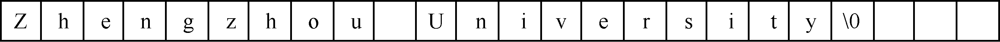
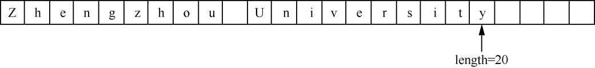

### 4.1　顺序串及其应用


**【定义】**

**串** （string）是由零个或多个字符组成的有限序列，一般记作

S="a<sub class="my_markdown">1</sub>a<sub>2</sub>…a<sub class="my_markdown">n</sub>"

其中，S是串名，用双引号括起来的字符序列是串的值，a<sub class="my_markdown">i</sub>（1
i
n）可以是字母、数字或其他字符，n是串的长度。当n=0时，S为空串（null string）。

串中任意个连续的字符组成的子序列称为该串的子串。相应地，包含子串的串称为主串。通常将字符在串中的序号称为该字符在串中的位置。子串在主串中的位置以子串的第一个字符在主串中的位置来表示。

例如，a、b、c、d是4个串。

```c
a="A Professor of Zhengzhou University of Light Industry"，b="Zhengzhou University   
of Light Industry"，c="University"，d="Professor"
```

它们的长度分别为53、38、10、9，b、c和d均是a的子串，c又是b的子串。b和c在a中位置分别是16和26，c在b中的位置是11，d在a中的位置是3。

只有当两个串的长度相等，且串中各个对应位置的字符均相等，两个串才是相等的。例如，上面的4个串a、b、c、d两两都不相等。


**注意：**  考虑到与C语言表示方法统一，本书提到的串都用双引号标注。但是，双引号并不属于串本身的内容，双引号的作用仅仅是为了将字符型数据与整型、浮点型数据区别开来。


**【特点】**

串有两种存储方式——顺序存储和链式存储。常用的是顺序存储方式，操作起来更方便。

**【顺序串的表示】**

采用顺序存储结构的串称为顺序串，又称定长顺序串。一般采用字符型数组存放顺序串。

在串的顺序存储结构中，确定串的长度有两种方法。一种方法就是在串的末尾加上一个结束标记。在C语言中，定义一个串时，系统会自动在串的末尾添加“\0”作为结束标记。例如，若定义如下字符数组：

```c
char str[]="Zhengzhou University";
```

则串"Zhengzhou University"在内存中的存放形式如图4.1所示。


<center class="my_markdown"><b class="my_markdown">图4.1　"Zhengzhou University"在内存中的存放形式</b></center>

其中，数组名str指示串的起始地址，“\0”表示串的结束。因此，串"Zhengzhou University"的长度为20，不包括结束标记“\0”。但是串长还需要调用strlen函数或统计字符个数才能得到。

另一种方法是增加一个变量length，用来存放串的长度。例如，用length表示串"Zhengzhou University"长度的方法如图4.2所示。


<center class="my_markdown"><b class="my_markdown">图4.2　利用length表示"Zhengzhou University"的长度的方法</b></center>

**【存储结构】**

顺序串的存储结构的C语言描述如下。

```c
#define MAXSIZE 100
typedef struct
{
    char str[MAXSIZE];
    int length;
}SeqString;
```

其中，str是存储串的字符数组名，length为串的长度。

**【基本运算】**

以下串的基本运算保存在文件SeqString.h中。

（1）串的赋值。

```c
void StrAssign(SeqString *S,char cstr[])
/*串的赋值操作*/
{
    int i=0;
    for(i=0;cstr[i]!=’\0’;i++)   /*将常量cstr中的字符赋值给串S*/
        S->str[i]=cstr[i];
        S->length=i;
}
```

（2）判断串是否为空。

```c
int StrEmpty(SeqString S)
/*判断串是否为空*/
{
    if(S.length==0)        /*如果串的长度等于0*/
        return 1;          /*返回1*/
    else                   /*否则*/
        return 0;          /*返回0*/
}
```

（3）求串的长度。

```c
int StrLength(SeqString S)
/*求串的长度*/
{
    return S.length;
}
```

（4）串的复制。

```c
void StrCopy(SeqString *T,SeqString S)
/*串的复制操作*/
{
    int i;
    for(i=0;i<S.length;i++)        /*将串S的字符赋值给串T*/
         T->str[i]=S.str[i];
    T->length=S.length;            /*将串S的长度赋值给串T*/
}
```

（5）比较两个串的大小。

```c
int StrCompare(SeqString S,SeqString T)
/*串的比较操作*/
{
    int i;
    for(i=0;i<S.length&&i<T.length;i++)  
        if(S.str[i]!=T.str[i])           
              return (S.str[i]-T.str[i]);
    return (S.length-T.length);          
}
```

（6）在串S的第pos位置插入串T。若插入成功，返回1；否则，返回0。

串的插入操作的具体实现分为以下3种情况。

+ 若在串S中插入串T后串长不超过能容纳的最长字符数，即(S−>length+T.length)≤MaxLen，则先将串S中第pos个位置之后的字符向后移动len个位置，然后将串T插入串S中即可。
+ 若将串T插入串S后，串长超过能容纳的最长字符数但串T能完全插入串S中，即(S−>length+ T.length)>MaxLen，则将串S中第pos个位置之后的字符往后移len个位置后，串S中的部分字符被舍弃。
+ 若将串T插入串S后，(S−>length+T.length)>MaxLen且串T不能完全插入串S中，则串T中部分字符和串S中第len个位置之后的字符均被舍弃。

算法实现如下。

```c
int StrInsert(SeqString *S,int pos,SeqString T)
/*串的插入*/
{
    int i;
    if(pos<0||pos-1>S->length)    /*插入位置不正确，返回0*/
    {
        printf("插入位置不正确");
        return 0;
    }
    if(S->length+T.length<=MaxLen)
    /*若插入后串长小于或等于MaxLen，串T完整地插入串S中*/
    {
       /*在插入串T前，将串S中第pos个位置之后的字符向后移动len个位置*/
        for(i=S->length+T.length-1;i>=pos+T.length-1;i--)
             S->str[i]=S->str[i-T.length];
        /*将串T插入串S中*/
        for(i=0;i<T.length;i++)
             S->str[pos+i-1]=T.str[i];
        S->length=S->length+T.length;
        return 1;
    }
    /*若串T可以完全插入串S中，但串S中的字符将会被截掉*/
    else if(pos+T.length<=MaxLen)
    {
          for(i=MaxLen-1;i>T.length+pos-1;i--)/*将串S中第pos个位置之后的字符整体移动到数组  
          的最后*/
               S->str[i]=S->str[i-T.length];
          for(i=0;i<T.length;i++)            /*将串T插入串S中*/
               S->str[i+pos-1]=T.str[i];
          S->length=MaxLen;
          return 0;
    }
    /*若串T不能完全插入串S中，串T中会有字符被舍弃*/
    else
    {
        for(i=0;i<MaxLen-pos;i++)/*将串T直接插入串S中，插入之前不需要移动串S中的字符*/
             S->str[i+pos-1]=T.str[i];
        S->length=MaxLen;
        return 0;
    }
}
```

（7）删除串S中第pos个位置开始的len个字符。

```c
int StrDelete(SeqString *S,int pos,int len)
/*在串S中删除第pos个位置开始的len个字符*/
{
    int i;
    if(pos<0||len<0||pos+len-1>S->length)/*如果参数不合法，则返回0*/
    {
        printf("删除位置不正确，参数len不合法");
        return 0;
    }
    else
    {
        for(i=pos+len;i<=S->length-1;i++)/*将串S的第pos个位置以后的len个字符覆盖掉*/
             S->str[i-len]=S->str[i];
        S->length=S->length-len;         /*修改串S的长度*/
        return 1;
    }
}
```

（8）将串S连接在串T的末尾。串的连接操作可分为两种情况：如果连接后串长（T−>length+ S.length）
MaxLen，则直接将串S连接在串T的尾部；如果连接后串长(T−>length+S.length)>MaxLen且串T的长度小于MaxLen，则串S会有字符丢失。算法实现如下。

```c
int StrConcat(SeqString *T,SeqString S)
/*将串S连接在串T的末尾*/
{
    int i,flag;
    /*若连接后的串长小于或等于MaxLen，将串S直接连接在串T末尾*/
    if(T->length+S.length<=MaxLen)
    {
        for(i=T->length;i<T->length+S.length;i++)/*串S直接连接在串T的末尾*/
             T->str[i]=S.str[i-T->length];
        T->length=T->length+S.length;            /*修改串T的长度*/
        flag=1;                                  /*修改标志，表示串S完整连接到串T中*/
    }
/*若连接后串长大于MaxLen，串S部分被连接在串T末尾*/
    else if(T->length<MaxLen)
    {
        for(i=T->length;i<MaxLen;i++)            /*将串S部分连接在串T的末尾*/
            T->str[i]=S.str[i-T->length];
        T->length=MaxLen;                        /*修改串T的长度*/
        flag=0;                                  /*修改标志，表示串S部分被连接在串T中*/
    }
    return flag;
}
```

（9）清空串操作。

```c
void StrClear(SeqString *S)
/*清空串，只需要将串的长度置为0即可*/
{
    S->length=0;
}
```

