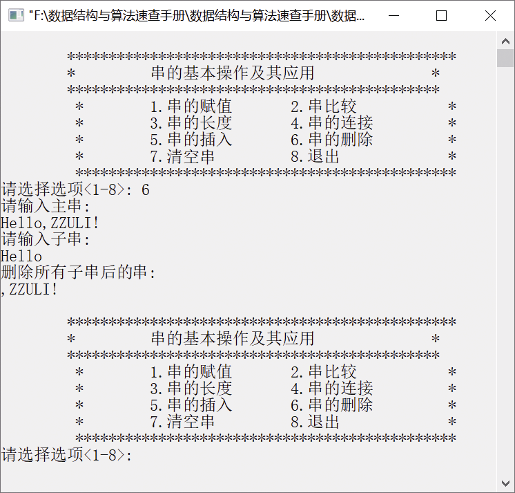

### 4.1.1　利用串的基本运算进行赋值、插入和删除等操作


**问题描述**


利用串的基本运算对串进行赋值、比较、插入、删除、连接等操作。


**【分析】**

主要考查串的赋值、插入、删除等基本运算。


第4章\实例4-01.cpp

```c
/********************************************
*实例说明：利用串的基本运算进行赋值、插入、删除等操作
*********************************************/
#include<stdio.h>
#include<stdlib.h>
#include<string.h>
#include<iostream.h>
#define MAX 255
#include"SeqString.h"
int DelSubString(SeqString *S,int pos,int n);
void DelAllString(SeqString *S1,SeqString *S2);
void StrPrint(SeqString S)
/*串的输出*/
{
    int i=0;
    for(i=0;i<S.length;i++)    
        cout<<S.str[i];
    cout<<endl;
}
void DispPrompt()
{
    printf("\n\t*****************************************");
    printf("\n\t*         串的基本操作及其应用              *");
    printf("\n\t***************************************\n");
    printf("\t *      1.串的赋值       2.串比较         *\n");
    printf("\t *      3.串的长度       4.串的连接 *\n");
    printf("\t *      5.串的插入       6.串的删除       *\n");
    printf("\t *      7.清空串        8.退出    *\n");
    printf("\t**************************************\n");
}
void main()
{
    int i,pos,k;
    char str[MAX];
    SeqString S,T;
    while(1)
    {
        DispPrompt();
        printf("请选择选项<1-8>: ");
        scanf(" %d",&k);
        if(k<0||k>8)
        {
            cout<<"输入有误，请重新输入!";
            cout<<"\n";
            continue;     
        }
        switch(k)
        {
            case 1:
                  cout<<"串的赋值:\n";
                  cout<<"请输入两个串!\n";
                  cout<<"请输入1个串; ";
                  cin>>str;
                  StrAssign(&S,str);
                  cout<<"你输入的串为 "<<endl;
                  StrPrint(S);
                  printf("\n");
                  break;
            case 2:
                  cout<<"串的比较:\n";
                  cout<<"请输入两个串!\n";
                  cout<<"请输入第1个串; ";
                  cin>>str;
                  StrAssign(&S,str);
                  cout<<"请输入第2个串; ";
                  cin>>str;
                  StrAssign(&T,str);
                  i=StrCompare(S,T);
                  if(i==0)
                     cout<<"两个串相等!"<<endl;
                  else if(i<0)    
                     cout<<"第1个串比第2个串短"<<endl;
                  else
                     cout<<"第1个串比第2个串长!"<<endl;
                  break;
            case 3:
                  cout<<"求串的长度:\n";
                  cout<<"请输入串："<<endl;
                  cin>>str;
                  StrAssign(&S,str);
                  i=StrLength(S);//调用函数
                  cout<<"串的长度为"<<i<<endl;
                  break;
            case 4:
                  printf("串连接\n");
                  cout<<"请输入第1个串; ";
                  cin>>str;
                  StrAssign(&S,str);
                  cout<<"请输入第2个串; ";
                  cin>>str;
                  StrAssign(&T,str);
                  i=StrConcat(&S,T);
                  if(i==0)
                     cout<<"连接失败!"<<endl;
                  else
                  {
                     cout<<"连接后的新串为"<<endl;
                     StrPrint(S);
                  }
                 break;
            case 5:
                 cout<<"串插入:\n";
                 cout<<"请输入主串:"<<endl;
                 cin>>str;        
                 StrAssign(&S,str);
                 cout<<"请输入要插入的串:"<<endl;
                 cin>>str;
                 StrAssign(&T,str);
                 cout<<"请输入要插入的位置:"<<endl;
                 cin>>pos;
                 StrInsert(&S,pos,T);
                 cout<<"插入后主串变为"<<endl;
                 StrPrint(S);
                 cout<<endl;
                 break;
            case 6:
                 cout<<"请输入主串:"<<endl;
                 cin>>str;
                 StrAssign(&S,str);
                 cout<<"请输入子串:"<<endl;
                 cin>>str;
                 StrAssign(&T,str);
                 DelAllString(&S,&T);
                 cout<<"删除所有子串后的串:"<<endl;
                 StrPrint(S);
                 break;
            case 7:
                 StrClear(&S);
                 break;
                 case 8:
                 break;
            }
    }
}
int Index(SeqString *S1,SeqString *S2)
{
    int i=0,j,k;
    while(i<S1->length)
    {
        j=0;
        if(S1->str[i]==S2->str[j])
        {
            k=i+1;
            j++;
            while(k<S1->length && j<S2->length && S1->str[k]==S2->str[j])
            {
                k++;
                j++;
            }
            if(j==S2->length)
                break;
            else
                i++;
        }
        else
            i++;
    }
    if(i>=S1->length)
        return -1;
    else
        return i+1;
}
int DelSubString(SeqString *S,int pos,int n)
{
    int i;
    if(pos+n-1>S->length)
        return 0;
    for(i=pos+n-1;i<S->length;i++)
        S->str[i-n]=S->str[i];
    S->length=S->length-n;
    S->str[S->length]='\0';
    return 1;
}
int StrLength(SeqString *S)
{
    return S->length;
}
void DelAllString(SeqString *S1,SeqString *S2)
{
    int n;
    n=Index(S1,S2);
    while(n>=0)
    {
        DelSubString(S1,n,StrLength(S2));
        n=Index(S1,S2);
    }
}
```

运行结果如图4.3所示。


<center class="my_markdown"><b class="my_markdown">图4.3　运行结果</b></center>

