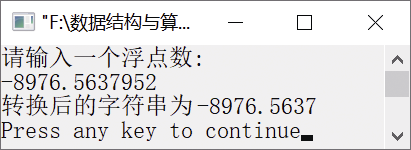

### 4.1.2　将浮点数转换为对应的串


**问题描述**


用C语言将函数void ftoa(double f,char s[])中的浮点数f转换为相应的串，存放在s中。其中，浮点型数最多保留4位小数。例如，1234.67转换为1234.67，−56.789867转换为−56.7898。


**【分析】**

该题是北京航空航天大学某年的考研试题。将浮点数转换为相应的串时可分为两个部分进行转换。先将浮点数的整数部分转换为串，然后将浮点数的小数部分转换为串。转换时需要取出浮点数中的每一位数字，然后加上48，这个数字就转换为字符了。

**【存储结构】**

这里使用的存储结构如下。

```c
typedef struct
{
    DataType stack[StackSize];
    int top[2];
}SSeqStack;
```

其中，top[0]和top[1]分别是指向两个栈顶的指针。


第4章\实例4-02.cpp

```c
/********************************************
*实例说明：将浮点数转换为对应的串
*********************************************/
#include<iostream.h>
#define MAX 255
void ftoa(double f,char s[]);
void main()
{
    double f;
    char s[MAX];
    cout<<"请输入一个浮点数:"<<endl;
    cin>>f;
    ftoa(f,s);
    cout<<"转换后的串为"<<s<<endl;    
}
void ftoa(double f,char s[])
{
    int i,j,len,t,n;
    double sign;
    if((sign=f)<0)
        f=-f;
    n=(int)f;
    i=0;
    do
    {
        s[i++]=n%10+48;
    } while(n/=10);
    if(sign<0)
        s[i++]='-';
    len=i;
    for(i=0,j=len-1;i<len/2;i++,j--)
    {
        t=s[i];
        s[i]=s[j];
        s[j]=t;
    }
    f-=(int)f;
    s[len++]='.';
    for(i=0;i<4;i++)
    {
        f*=10;
        s[len++]=((int)f)%10+48;
    }
    while(s[len-1]=='0')
        len--;
    s[len]='\0';
}
```

运行结果如图4.4所示。


<center class="my_markdown"><b class="my_markdown">图4.4　运行结果</b></center>

