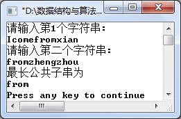

### 4.1.3　求最长公共子串


**问题描述**


求两个串的最长公共子串。例如，若两个串分别为S和T，其中S="Icomefromzhengzhou"，T="YoucozhengTo"，则最长公共子串为"zheng"。

**【分析】**

该题是上海大学考研试题。

用指针i指示串S，用指针j指示串T。对每个i，从i开始依次与串T中的字符向后进行比较，若对应字符相等，则当前公共子串长度增加1。若不相等，则将标志flag置为0，结束当前的比较，将当前得到的公共子串长度保存起来，并记下公共子串的开始位置，然后从串T的当前字符开始与串S的第一个位置的字符进行比较，直到到达串T的最后一个字符为止，这样第一趟比较结束。

接下来从串S的第二个位置起开始与串T的第一个位置的字符进行比较，重复以上过程，直到串T的最后一个字符为止，第二趟比较结束。以此类推，直到到达串S的最后一个字符。


第4章\实例4-03.cpp

```c
/********************************************
*实例说明：求两个串的最长公共子串
*********************************************/
#include<iostream.h>
#include<stdio.h>
#include"SeqString.h"
#define MAX 255
void MaxComStr(SeqString S,SeqString T,int *index,int *length);
void main()
{
    char str1[MAX],str2[MAX];
    int index,length,i;
    SeqString S,T;
    cout<<"请输入第1个串:"<<endl;
    cin>>str1;
    StrAssign(&S,str1);
    cout<<"请输入第二个串:"<<endl;
    cin>>str2;
    StrAssign(&T,str2);
    MaxComStr(S,T,&index,&length);
    cout<<"最长公共子串为"<<endl;
    for(i=index;i<index+length;i++)
        cout<<S.str[i];
    cout<<endl;
}
void MaxComStr(SeqString S,SeqString T,int *index,int *length)
//求串S和串T的最长公共子串
{
    int i,j,k,length1,flag;
    *index=0;
    *length=0;
    i=0;
    while(i<S.length)
    {
        j=0;
        while(j<T.length)
        {
            if(S.str[i]==T.str[j])//如果串S和串T的当前对应字符相等
            {
                k=1;
                length1=1;
                flag=1;
                while(flag)
                {
                   if(i+k<S.length&&j+k<T.length&&S.str[i+k]==T.str[j+k])
                   //如果在串S和串T的长度内，对应字符相等，则指针k后移比较下一个字符
                   {
                        length1=length1+1;//当前公共子串长度加1
                        k++;
                   }
                    else
                        flag=0;//串S和串T对应的字符不等，则将标记置为0
                }
                if(length1>*length)//如果一次比较结束，且当前得到的公共子串长度大于*length，则  
                //保存到*length中
                {
                    *index=i;
                    *length=length1;
                }
                j+=k;//将串T的第j+k个字符与串S的第i个字符比较
            }
            else
                j++;//从串T的下一个字符开始与串S的第i个字符比较
        }
        i++;        //将串S的下一个字符开始与串T进行比较
    }
}
```

运行结果如图4.5所示。


<center class="my_markdown"><b class="my_markdown">图4.5　运行结果</b></center>

