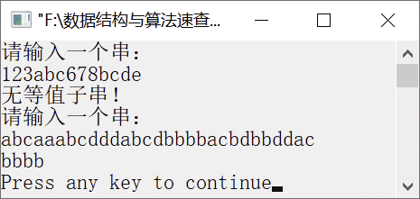

### 4.1.4　 求等值子串


**问题描述**


如果串中的一个子串（其长度大于1）的各个字符均相等，则称之为等值子串。试设计一个算法，输入串S，以“\n”作为结束输入标志，如果串S中不存在等值子串，则输出信息“无等值子串！”；否则，求出一个长度最大的等值子串并输出。例如，若S="123abc678bcde"，则输出“无等值子串！”；若S="abcaaabcdddabcdbbbbacbdbbddac"，则输出"bbbb"。


**【分析】**

该题是华中科技大学某年考研题目。它主要考查串的查找操作，在查找过程中对等值字符进行统计。从串的第一个字符开始与后续字符进行比较，如果相等，则继续将第一个字符与后续字符比较，并记下相等字符的个数；若不相等，保存当前最长等值子串的起始位置和长度，然后把当前字符作为起始位置往后进行比较，直到最后一个字符为止。比较结束后，取出最长等值子串并输出。

西北大学某年的考研题目也曾出现求最长字符平台的问题。一个串中的任意一个子串中，若各字符均相同，则称这个子串为字符平台。


第4章\实例4-04.cpp

```c
/********************************************
*实例说明：判断串中是否存在等值子串
*********************************************/
#include<iostream.h>
#include<iomanip.h>
#include<stdio.h>
#include"SeqString.h"
void InputString(char str[]);
void MaxEqSubStr(SeqString S,SeqString *T);
void SubString(SeqString S,SeqString *T,int s,int length);
void StrPrint(SeqString S);
void main()
{
    char str[MaxLen];
    SeqString S,T;
    cout<<"请输入一个串:"<<endl;
    InputString(str);
    StrAssign(&S,str);
    MaxEqSubStr(S,&T);
    cout<<"请输入一个串:"<<endl;
    InputString(str);
    StrAssign(&S,str);
    MaxEqSubStr(S,&T);
}
void InputString(char str[])
//接收输入的字符
{
    char ch;
    int i=0;
    while((ch=getchar())!='\n')
    {
        str[i++]=ch;
    }
    str[i]='\0';
}
void MaxEqSubStr(SeqString S,SeqString *T)
//求最大等值子串
{
    int i=0,start1=0,start2=0,length1=1,length2=1;//start1、start2存放最大等值子串的起始位置
    while(i<S.length)
    {
        i++;
        if(S.str[i]==S.str[start2])             //若当前字符与起始位置字符相等，则长度加1
            length2++;
        else
        {
            if(length2>length1)   //若当前最大子串长度较大，则保存之
            {
                start1=start2;
                length1=length2;
            }
            start2=i;             //从当前位置重新比较
            length2=1;            //恢复长度到原始状态
        }
    }
    if(length1<2)
        cout<<"无等值子串！"<<endl;
    else
    {
        SubString(S,T,start1,length1);
        StrPrint(*T);
    }
}
void SubString(SeqString S,SeqString *T,int s,int length)
//取出串S中的等值子串到串T中
{
    int j=0,i;
    for(i=s;i<s+length;i++)
          T->str[j++]=S.str[i];
    T->length=length;
}
void StrPrint(SeqString S)
{
    int i;
    for(i=0;i<S.length;i++)
        cout<<S.str[i];
    cout<<endl;
}
```

运行结果如图4.6所示。


<center class="my_markdown"><b class="my_markdown">图4.6　运行结果</b></center>

