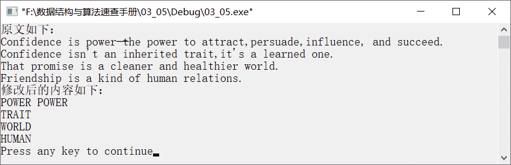

### 4.1.5　将长度为5的单词转换为大写形式


**问题描述**


已知一篇英文文章存放在数组xx中，请将长度为5的单词全部用大写表示，将其他字符删除。处理后的串以行为单位重新存入数组xx中，要求得到的新单词以空格分隔。


第4章\实例4-05.cpp

```c
/********************************************
*实例说明：将长度为5的单词用大写表示，将其他字符删除
*********************************************/
1  #include<stdio.h>
2  #include<string.h>
3  #include<ctype.h>
4  #include<stdlib.h>
5  int MaxLine=4;
6  char xx[][80]={{"Confidence is power─the power to attract,persuade,influence, and succeed."},
7  {"Confidence isn't an inherited trait, it' s a learned one."},
8  {"That promise is a cleaner and healthier world."},{"Friendship is a kind of human   relations."}};
9  void Dispose()
10 {
11      int i,j;
12      char word[21],yy[80],*p;
13      for(i=0;i<MaxLine;i++)
14      {
15            p=xx[i];                        /*p指向第i行串*/
16            j=0;
17            memset(word,'\0',21);           
18            memset(yy,'\0',80);             
19            while(*p)                       
20            {
21                if(isalpha(*p))             /*如果当前字符是英文字母*/
22                {
23                    word[j++]=*p++;         
24                    if(*p)
25                        continue;
26                }
27                if(strlen(word)==5)         /*如果单词的长度是5*/
28                {
29                    for(j=0;j<5;j++)
30                        if(word[j]>='a'&&word[j]<='z')
31                              word[j]=word[j]-32;
32                    strcat(yy,word);        
33                    strcat(yy," ");         
34                }
35                memset(word,'\0',21);       
36                while(*p&&(!isalpha(*p)))   
37                    p++;
38                j=0;
39            }
40            strcpy(xx[i],yy);               /*将处理后的字母存入数组xx */
41        }
42  }
43  void main()
44  {
45       int i;
46       printf("原文如下：\n");
47       for(i=0;i<MaxLine;i++)
48             printf("%s\n",xx[i]);
49       Dispose();
50       printf("修改后的内容如下：\n");
51       for(i=0;i<MaxLine;i++)
52             printf("%s\n",xx[i]);    
53  }
```

**【说明】**

第6～8行将英文文章存入数组xx。

第15行用指针p指向当前要处理的串，即指向当前行的英文单词。

第17行将数组word的内存单元置为空。

第18行将数组yy的内存单元置为空。

第19～39行处理当前行中的每一个字符。

第21～26行将英文字母存入数组word中。

第27～34行如果单词的长度为5，则存入数组yy。

第35行重新将数组word置为空。

第36～37行继续处理剩下的字符。

第40行将当前行长度为5的单词存入数组xx的第i行。

第47～48行输出处理前的文本内容。

第51～52行输出处理后的文本内容。

运行结果如图4.7所示。


<center class="my_markdown"><b class="my_markdown">图4.7　运行结果</b></center>

