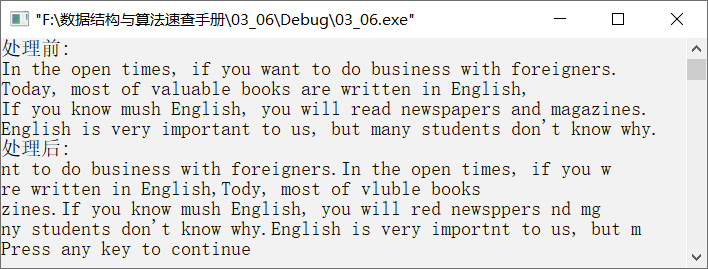

### 4.1.6　将小写字母a左、右两边的串互换


**问题描述**


一篇英文文章存放在数组xx中，请设计一个算法，要求以行为单位将串中的所有小写字母“a”左边的串移动到字母“a”的右边，然后将小写字母“a”删除，余下的串移动到字母“a”的左边。最后将处理后的串重新存入数组xx中。


例如，假设有以下串。

```c
In the open times, if you want to do business with foreigners.
Today, most of valuable books are written inEnglish,
```

则经过处理后的结果如下。

```c
nt to do business with foreigners. In the open times, if you w
re written inEnglish,Today, most of valuable books
```


第4章\实例4-06.cpp

```c
/********************************************
*实例说明：将字母"a"左边的串移动到右边，右边的移动到左边
*********************************************/
1  #include<stdio.h>
2  #include<string.h>
3  char xx[][80]={{"In the open times, if you want to do business
4  with foreigners."},
5  {"Today, most of valuable books are written in English,"},
6  {"If you know mush English, you will read newspapers
7  and magazines."},
8  {"English is very important to us, but many students
9  don't know why."}};
10 int MaxLine=4;
11 void Dispose()
12 {
13      int i;
14      char yy[80],*p;
15      for(i=0;i<MaxLine;i++)
16      {
17            p=strchr(xx[i],'a');                  /*查找字符"a"，并返回地址*/
18            while(p!=NULL)
19            {
20                memset(yy,'\0',80);               /*将数组yy的内容置为空*/
21                memcpy(yy,xx[i],p-xx[i]);         /*将左边的串存入数组yy*/
22                strcpy(xx[i],xx[i]+(p-xx[i])+1);  /*将右边的串存入数组xx*/
23                strcat(xx[i],yy);                 /*将右边的串存入数组xx的最后*/
24                p=strchr(xx[i],'a');              /*继续查找字符"a"*/
25            }
26        }
27  }
28  void main()
29  {
30       int i;
31       printf("处理前:\n");
32       for(i=0;i<MaxLine;i++)
33            puts(xx[i]);
34       Dispose();
35       printf("处理后:\n");
36       for(i=0;i<MaxLine;i++)
37           puts(xx[i]);
38  }
```

**【说明】**

第17行在数组xx中查找第i行中的字符“a”，返回“a”所在的地址。

第20行将数组yy的内容置为空。

第21行字符“a”左边的串存入数组yy。

第22行将字符“a”右边的串存入数组xx，即数组xx存放以后要处理的串。注意，第22行代码中，参数 `xx[i]+(p-xx[i])+1` 中的圆括号不可以省略，即不可以写成以下形式。

```c
strcpy(xx[i],xx[i]+p-xx[i]+1);
```

第23行将数组yy中的串连接到数组xx的末尾，即把“a”右边的串存放在“a”的左边，把“a”左边的串存放在“a”的右边。

第24行继续在数组xx中查找字符“a”。

运行结果如图4.8所示。


<center class="my_markdown"><b class="my_markdown">图4.8　运行结果</b></center>

