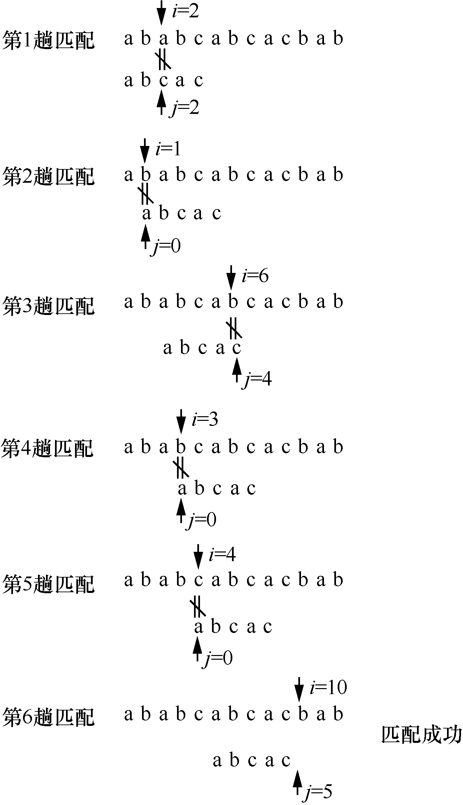
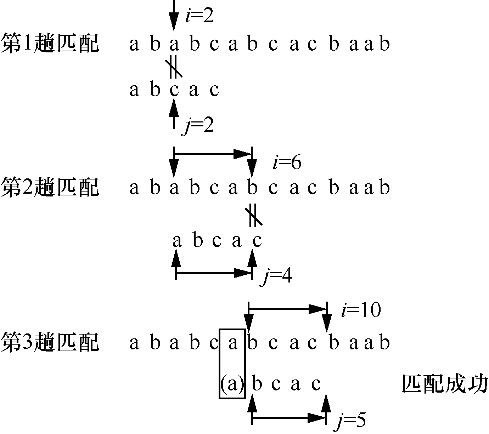
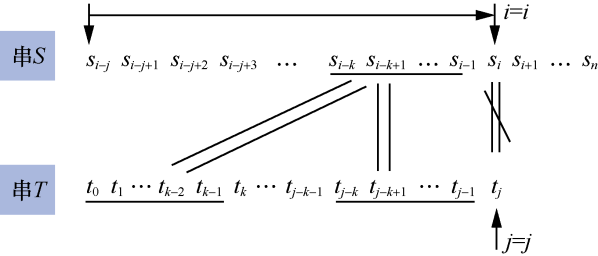
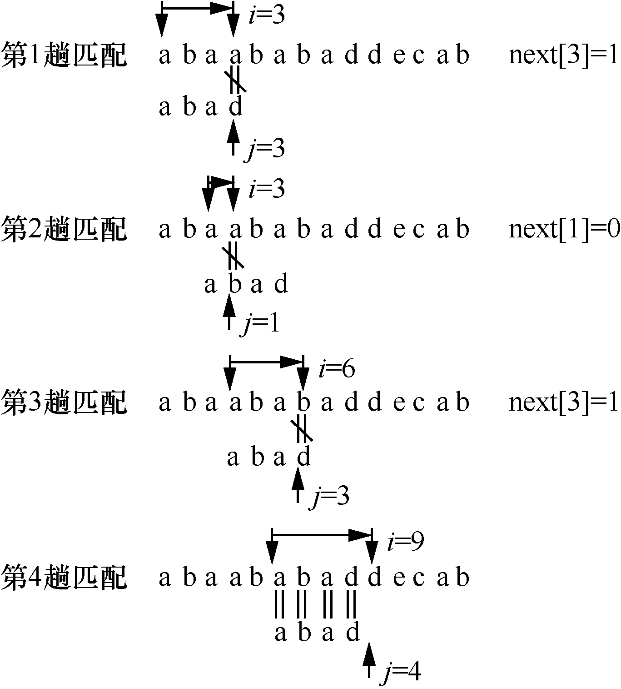

### 4.2　串的模式匹配

串的模式匹配也称为子串的定位操作，即查找子串在主串中出现的位置。它是经常用到的一个算法，也是数据结构中的一个难点。常见的串的模式匹配算法有两种——暴力（brute force）算法和KMP算法。

**【暴力算法】**

子串的定位操作通常称为串的模式匹配，是各种串处理操作中最重要的操作之一。设有主串S和子串T，如果在主串S中找到一个与子串T相等的串，则返回子串T的第一个字符在主串S中的位置。其中，主串S又称为目标串，子串T又称为模式串。

暴力算法的思想是：从主串S="s0s1…sn−1"的第pos个字符开始与模式串T="t0t1…tm−1"的第一个字符比较，如果相等，则继续逐个比较后续字符；否则，从主串的下一个字符开始重新与模式串T的第一个字符比较，以此类推。如果在主串S中存在与模式串T相等的连续字符序列，则匹配成功，函数返回模式串T中第一个字符在主串S中的位置；否则，函数返回−1，表示匹配失败。

假设主串S="ababcabcacbab"，模式串T="abcac"，S的长度n=13，T的长度m=5。用变量i表示主串S中当前正在比较字符的下标，变量j表示模式串T中当前正在比较字符的下标。模式匹配的过程如图4.9所示。

<b class="my_markdown">图4.9　模式匹配的过程</b>

**【KMP算法】**

KMP算法是由D.E. Knuth、J.H. Morris、V.R. Pratt共同提出的，因此称为KMP算法（Knuth-Morris-Pratt算法）。KMP算法在暴力算法的基础上有较大改进，可在O(n+m)时间数量级上完成串的模式匹配，主要消除了主串指针的回退，使算法效率有了大幅度提高。

根据暴力算法，若遇到不相等的字符，需要将模式串整个后移一位，再从头逐个比较。这样做虽然可行，但是效率很低，因为要将主串和模式串的指针都退回到原来的位置，将已经比较过的字符重新比较一遍。

KMP算法的思想是在每一趟匹配过程中出现不等字符时，不需要回退主串的指针，而是利用前面已经得到的“部分匹配”结果，将模式串向右滑动若干个字符后，继续与主串中的当前字符进行比较。

设主串S="ababcabcacbaab"，模式串T="abcac"。KMP算法的匹配过程如图4.10所示。

<b class="my_markdown">图4.10　KMP算法的匹配过程</b>

从图4.10中可以看出，KMP算法的匹配次数由原来的6减少为3。而对于图4.9所示的暴力算法，在第3趟匹配过程中，当i=6、j=4时，主串中的字符与模式串中的字符不相等，又从i=3、j=0开始比较。经过仔细观察，其实i=3、j=0，i=4、j=0，i=5、j=0这3次比较都是没有必要的。从第3趟的部分匹配可得出，S2=T0='a'，S3=T1='b'，S4=T2='c'，S5=T3='a'，S6≠T4。因为S3=T1且T0≠T1，所以S3≠T0，没有必要从i=3、j=0开始比较。又因为S4=T2且T0≠T2，所以S4≠T0，S4与T0也没有必要从i=4、j=0开始比较。又因为S5=T3且T0=T3，S5=T0，所以也没有必要将S5与T0进行比较。

也就是说，根据第3趟的部分匹配可以得出结论，暴力算法的第4趟、第5趟是没有必要的，第6趟也没有必要将主串的第6个字符与模式串的第1个字符比较。

因此，只需要将模式串向右滑动3个字符，从i=6、j=1开始比较。同理，在第1趟匹配过程中，当出现字符不相等时，只需将模式串向右滑动2个字符从i=2、j=0开始比较即可。在整个KMP算法中，主串中的i没有回退。

下面来讨论一般情况。设主串S="s0s1…sn−1"，模式串T="t0t1…tm−1"。在模式匹配过程中，若出现字符不匹配的情况，即当si≠tj（0
i<n，0
j<m）时，有

"si−jsi−j+1…si−1"="tj−ktj−k+1…tj−1" （4-1）

即说明至少在字符“si”之前有一部分字符是相等的。

若模式串（即子串）中存在首尾重叠的真子串，即

"t0t1…tk−1"="tj−ktj−k+1…tj−1" （4-2）

根据式（4-1）和式（4-2），可以得出，

"si−ksi−k+1…si−1"="t0t1…tk−1"

模式串与主串不匹配时，已有的重叠情况如图4.11所示。

<b class="my_markdown">图4.11　模式串与主串不匹配时已有的重叠情况</b>

因此，在匹配的过程中，当主串中的第i个字符与模式串中的第j个字符不等时，仅需将模式串向右滑动，使si与tk对齐，接着进行后续字符的比较。此时，模式串中子串"t0t1…tk−1"必定与主串中的子串"si−ksi−k+1…si−1"相等，如图4.12所示。

<b class="my_markdown">图4.12　根据重叠情况向右滑动子串</b>

**【求next函数值】**

下面就来确定模式串需要滑动的具体位置。令next[j]=k，则next[j]表示当模式串中的第j个字符与主串中的对应的字符不相等时，需要重新与主串比较的模式串字符位置，也就是需要将模式串滑动到第几个字符与主串比较。将模式串中的next函数定义如下。

其中，第1种情况下，next[j]函数是为了方便算法设计而定义的；第2种情况下，如果子串（模式串）中存在首尾重叠的真子串，则next[j]的值就是k，即模式串中最长子串的长度；第3种情况下，如果模式串中不存在首尾重叠的子串，则从子串的第一个字符开始比较。

由此可以得到模式串"abcac"的next函数值如表4.1所示。

<b class="my_markdown">表4.1　模式串"abcac"的next函数值</b>

| j | 0 | 1 | 2 | 3 | 4 |
| :-----  | :-----  | :-----  | :-----  | :-----  | :-----  | :-----  | :-----  |
| 模式串 | a | b | c | a | c |
| next[j] | −1 | 0 | 0 | 0 | 1 |

KMP算法的模式匹配过程如下。

如果模式串T中存在真子串"t0t1…tk−1"="tj−ktj−k+1…tj−1"，那么当模式串T的tj与主串S的si不相等时，则按照next[j]=k将模式串向右滑动，将主串中的si与模式串的tk开始比较。如果si=tk，则主串与模式串的i和j各自增1，继续比较下一个字符；如果si≠tk，则按照next[next[j]]将模式串继续向右滑动，将主串中的si与模式串中的第next[next[j]]个字符进行比较；如果仍然不相等，则按照以上方法，将模式串继续向右滑动，直到next[j]= −1为止。这时，模式串不再向右滑动，从si+1开始与t0进行比较。

利用next函数的模式匹配过程如图4.13所示。

<b class="my_markdown">图4.13　利用next函数的模式匹配过程</b>

KMP模式匹配算法是建立在模式串的next函数值已知的基础上的。下面来讨论如何求模式串的next函数值。

从上面的分析可以看出，模式串的next函数值的取值与主串无关，仅与模式串相关。根据模式串的next函数定义，next函数值可用递推的方法得到。

设next[j]=k，表示在模式串T中存在以下关系。

"t0t1…tk−1"="tj−ktj−k+1…tj−1"

其中，0<k<j，k为满足等式的最大值，即不可能存在k′>k满足以上等式。计算next[j+1]的值需要考虑以下两种情况。

（1）若tj=tk，则表示在模式串T中满足以下关系，并且不可能存在k′>k满足以上等式。

"t0t1…tk"="tj−ktj−k+1…tj"

因此有

next[j+1]=k+1，即next[j+1]=next[j]+1

（2）若tj≠tk，则表示在模式串T中满足以下关系。

"t0t1…tk"≠"tj−ktj−k+1…tj"

此时，已经有"t0t1…tk−1"="tj−ktj−k+1…tj−1"，但是tj≠tk。把模式串T向右滑动到k′=next[k]（0<k<j），如果有tj=tk′，则表示模式串中有"t0t1…tk' "="tj−k'tj−k'+1…tj"，因此得到

next[j+1]=k′+1，即next[j+1]=next[k]+1

如果tj≠tk′，则将模式串继续向右滑动到第next[k′]个字符与tj比较。如果仍不相等，则将模式串继续向右滑动到下标为next[next[k′ ]]的字符与tj比较。以此类推，直到tj和模式串中某个字符相等或不存在任何k′（1<k′<j）满足"t0t1…tk′ "="tj−k′ tj−k′ +1…tj"，则有

next[j+1]=0

以上讨论是根据next函数的定义得到next函数值的方法。例如，模式串T="abcdabcdabe"的next函数值如表4.2所示。

<b class="my_markdown">表4.2　模式串T="abcdabcdabe"的next函数值</b>

| j | 0 | 1 | 2 | 3 | 4 | 5 | 6 | 7 | 8 | 9 |
| :-----  | :-----  | :-----  | :-----  | :-----  | :-----  | :-----  | :-----  | :-----  | :-----  | :-----  | :-----  | :-----  |
| 模式串 | c | b | c | a | a | c | b | c | b | c |
| next[j] | −1 | 0 | 0 | 1 | 0 | 0 | 1 | 2 | 3 | 2 |

例如，在已经得到前3个字符的next函数值的基础上，求next[3]。因为next[2]=1且t2=t0，所以next[3]=next[2]+1=2。接着求next[4]，因为t2=t0，但"t2t3"≠"t0t1"，所以需要将t3与下标为next[1]=0的字符即t0比较。因为t0≠t3，所以next[4]=1。

