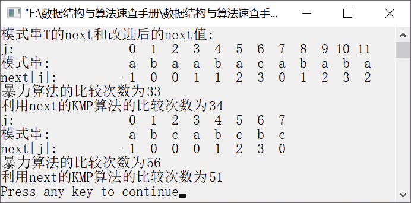

### 模式匹配


**问题描述**


设计算法比较暴力算法与KMP算法的效率。例如主串S="cabaadcabaababaabacabababab"，模式串T="abaabacababa"，统计暴力算法与KMP算法在匹配过程中的比较次数，并输出模式串的next函数值。


**【分析】**

通过主串的模式匹配比较暴力算法与KMP算法的效率。暴力算法也是常用的算法之一，毕竟它不需要计算next函数值。在模式串与主串的许多部分匹配的情况下，KMP算法的优越性才会显示出来。


第4章\实例4-07.cpp

```c
/********************************************
*实例说明：串的模式匹配
*********************************************/
#include<stdio.h>
#include<stdlib.h>
#include<string.h>
#include"SeqString.h"
#include<iostream.h>
#include<iomanip.h>
int B_FIndex(SeqString S,int pos,SeqString T,int *count);
int KMP_Index(SeqString S,int pos,SeqString T,int next[],int *count);
void GetNext(SeqString T,int next[]);
void PrintArray(SeqString T,int next[],int length);
void main()
{
    SeqString S,T;
    int count1=0,count2=0,find;
    int next[40];
    StrAssign(&S,"bcdamnbacabaabaabacababafabacabababab");        /*为主串S赋值*/
    StrAssign(&T,"abaabacababa");       /*给模式串T赋值*/
    GetNext(T,next);                    /*求next函数值*/
    cout<<"模式串T的next和改进后的next值:"<<endl;
    PrintArray(T,next,StrLength(T));    /*输出模式串T的next值*/
    find=B_FIndex(S,1,T,&count1);       /*暴力模式的串匹配*/
    if(find>0)
        cout<<"暴力算法的比较次数为"<<count1<<endl;
    find=KMP_Index(S,1,T,next,&count2);
    if(find>0)
        cout<<"利用next的KMP算法的比较次数为"<<count2<<endl;
    StrAssign(&S,"bcdabcacbdaacabcabaacaabcabcabcbccbcabccbdcabcb");/*为主串S赋值*/
    StrAssign(&T,"abcabcbc");           /*给模式串T赋值*/
    GetNext(T,next);                    /*求next函数值*/
    PrintArray(T,next,StrLength(T));    /*输出模式串T的next值*/
    find=B_FIndex(S,1,T,&count1);       /*暴力模式的串匹配*/
    if(find>0)
        cout<<"暴力算法的比较次数为"<<count1<<endl;
    find=KMP_Index(S,1,T,next,&count2);
    if(find>0)
        cout<<"利用next的KMP算法的比较次数为"<<count2<<endl;
}
void PrintArray(SeqString T,int next[],int length)
/*模式串T的next值输出函数*/
{
    int j;
    cout<<"j:\t\t";
    for(j=0;j<length;j++)
        cout<<setw(3)<<j;
    cout<<endl;
    cout<<"模式串:\t\t";
    for(j=0;j<length;j++)
        cout<<setw(3)<<T.str[j];
    cout<<endl;
    cout<<"next[j]:\t";
    for(j=0;j<length;j++)
        cout<<setw(3)<<next[j];
    cout<<endl;
}
int B_FIndex(SeqString S,int pos,SeqString T,int *count)
/*在主串S中的第pos个位置开始查找模式串T*/
{
    int i,j;
    i=pos-1;
    j=0;
    *count=0;    /*count保存主串与模式串的比较次数*/
    while(i<S.length&&j<T.length)
    {
        if(S.str[i]==T.str[j])
        /*若主串S和模式串T中对应位置字符相等，则继续比较下一个字符*/
        {
            i++;
            j++;
        }
        else /*若当前对应位置的字符不相等，则从主串S的下一个字符开始，与模式串T的第0个字符开始比较*/
        {
            i=i-j+1;
            j=0;
        }
        (*count)++;
    }
    if(j>=T.length)/*如果在主串S中找到模式串T，则返回模式串T在主串S的位置*/
        return i-j+1;
    else
        return -1;
}
int KMP_Index(SeqString S,int pos,SeqString T,int next[],int *count)
/*KMP模式匹配算法。利用模式串T的next函数在主串S中的第pos个位置开始查找模式串T，如果找到返回模式串在主串的位置；否则，返回-1*/
{
    int i,j;
    i=pos-1;
    j=0;
    *count=0;    /*count保存主串与模式串的比较次数*/
    while(i<S.length&&j<T.length)
    {
        if(j==-1||S.str[i]==T.str[j])/*如果j=-1或当前字符相等，则继续比较后面的字符*/
        {
         i++;
         j++;
        }
      else             /*如果当前字符不相等，则将模式串向右移动*/
         j=next[j];
        (*count)++;
    }
    if(j>=T.length)    /*若匹配成功，返回模式串在主串中的位置；否则，返回-1*/
       return i-T.length+1;
    else
       return -1;
}
void GetNext(SeqString T,int next[])
/*求模式串T的next函数值并存入next数组*/
{
    int j,k;
    j=0;
    k=-1;
    next[0]=-1;
    while(j<T.length)
    {
       if(k==-1||T.str[j]==T.str[k])/*若k=-1或当前字符相等，则继续比较后面的字符并将函数值存入
       next数组*/
       {
          j++;
          k++;
          next[j]=k;
       }
       else        /*若当前字符不相等，则将模式串向右移动继续比较*/
          k=next[k];
    }
}
```

运行结果如图4.14所示。


<center class="my_markdown"><b class="my_markdown">图4.14　运行结果</b></center>


下面是模式匹配算法的一个应用，也是对模式匹配算法的一个简单变形。


```c
int Pattern_index(SeqString *subs，SeqString *s)
{
    int i，j，k;
    for(i=0;s->str[i];i++)
       for(j=i,k=0;s->str[j]==subs->str[k]|| subs->str[k]=='?';j++,k++)
          if(subs->str[k+1]=='\0')
       return i+1;
    return -1;
}
```

上面的算法中，Pattern_Index()是一个实现串通配符匹配的函数，其中的通配符只有“?”，它可以和任意字符匹配成功。该算法与模式匹配算法的唯一区别是第二个for循环中多了一个条件——subs−>str[k]=='?'。例如，Pattern_Index("?re"，"you are my friend")返回的结果是5。

以上关于串的算法实现都是用数组实现的，当然，也可以采用链式结构存储串。西北大学、清华大学、华中科技大学等院校在考研复试时也曾出现过假定串采用链式结构存储的考题。例如，设主串s、模式串t分别以单链表方式存储，t和s的每个字符都用节点表示，假定存储结构如下。

```c
typedef struct Node
{
    char data;
    Struct Node *next;
}ListNode,*LinkList;
```

求模式串t在主串s中第一次出现时的指针位置。请读者尝试实现该算法。


