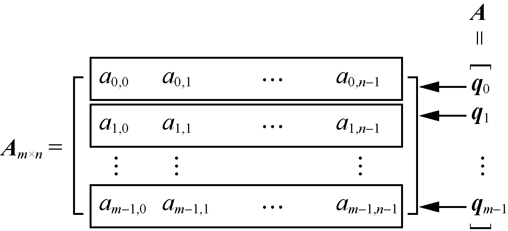
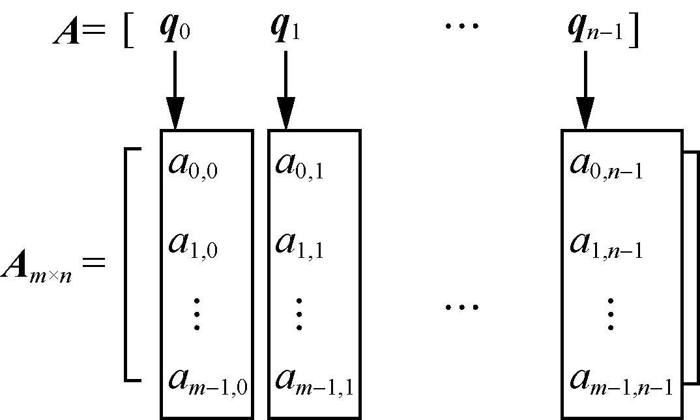

### 5.1　一维数组及其应用

**【定义】**

**数组** （array）是由类型相同的元素构成的有序集合，每个元素称为一个数组元素，数组中的元素依次存储在n个连续内存单元中。数组中的元素可以是单个不可分的基本数据类型的元素，也可以是可继续再分的向量或其他结构，但这些元素都属于同一种类型，因此数组可看作一般线性表的推广。例如，一维数组可看作线性表，二维数组可看作“元素为一维数组（线性表）”的线性表。

若数组A中每个元素qi是简单的基本数据类型的元素，这种情况下，A就是一个一维数组。若每个元素qi表示一个行向量，qi=[ai,0 ai,1 … ai,n−1]，则**A**就是一个二维数组，如图5.1所示。若每个元素qj是一个列向量，qj=[a0,j a1,j … am−1,j]T，则**A**也是一个二维数组，如图5.2所示。

<b class="my_markdown">图5.1　每个元素看作行向量的二维数组</b>

<b class="my_markdown">图5.2　每个元素看作列向量的二维数组</b>

因此，二维数组可看作线性表的线性表。同理，一个n维数组也可以看作一个线性表，其中线性表中的每个元素都是n−1维的数组。

**【顺序存储】**

对于一个数组，一旦确定了维数和各维的长度，则该数组的元素个数就是确定的。一般不对数据进行插入和删除操作，数组不涉及元素的移动操作。

数组是多维的结构，而计算机的存储器是一维（线性）结构。如果要将一个多维的结构存放在一个一维的存储单元里，就需要先将多维的数组转换成一维的线性序列，才能将其存放在存储器中。

数组的存储方式有两种。一种是以行序为主序的存储方式，另一种是以列序为主序的存储方式。二维数组A以行序为主序的存储顺序为a0,0,a0,1,…,a0,<em>n</em>−1,a1,0,a1,1,…,a1,<em>n</em>−1,…,am−1,0,am−1,1,…,am−1,n−1，以列序为主序的存储顺序为a0,0,a1,0,…,am−1,0,a0,1,a1,1,…,am−1,1,…,a0,<em>n</em>−1,a1,<em>n</em>−1,…,am−1,n−1。

根据数组中元素的连续存储特性，只要给定数组的下标（起始地址），就很容易得到任何一个元素的存储地址。设每个元素占d个存储单元，则二维数组A中的任何一个元素aij的存储地址可以由以下公式确定。

Loc(i,j)=Loc(0,0)+(in+j) d

其中，Loc(i, j)表示元素aij的存储地址，Loc(0,0)表示元素a00的存储地址，即二维数组的起始地址（也称为基地址）。

推广到更一般的情况，可以得到n维数组中元素的存储地址与数组的下标之间的关系。

Loc(j1, j2,…, jn)=Loc(0,0,…,0)+(b1b2…bn−1 j0+b2b3…bn−1 j1+…+bn−1 jn−2+jn−1) d

其中，bi（1
i
n−1）是第i维的长度，ji是数组的第i维下标。

