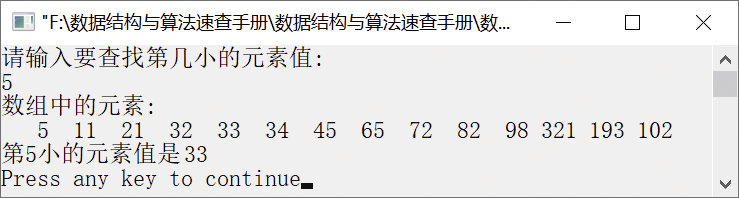

### 5.1.1　查找第k小元素


**问题描述**


在数组a的前n个元素中找出第k（1
k
n）小的元素。例如，数组（98,33,21,102,45,5,32, 11,65,82,193,321,34,72）中第5小的元素是33。


**【分析】**

该题是上海大学某年的考研试题。要查找第k小元素，并不需要完全对数组中的元素进行排序，可利用快速排序算法思想，只对部分元素进行排序就可找到第k小元素。

一趟排序结束后，若i=k，则说明找到了第k小元素，算法结束。若i<k，则说明第k小元素介于下标i+1到high；若i>k，则说明第k小元素介于下标low到i−1。最后返回第k小元素a[k]。


第5章\实例5-01.cpp

```c
/********************************************
*实例说明：查找数组中前n个数的第k小元素
*********************************************/
#include<iostream.h>
#include<iomanip.h>
#define MAX 100
int Search_K_Min(int a[],int n,int k);
void PrintArray(int a[],int n);
void main()
{
    int a[]={98,33,21,102,45,5,32,11,65,82,193,321,34,72};
    int n,k,x;
    n=sizeof(a)/sizeof(a[0]);
    cout<<"请输入要查找第几小的元素值:"<<endl;
    cin>>k;
    x=Search_K_Min(a,n,k);
    cout<<"数组中的元素:"<<endl;
    PrintArray(a,n);
    cout<<"第"<<k<<"小的元素值是";
    cout<<x<<endl;
}
int Search_K_Min(int a[],int n,int k)
//利用快速排序思想在数组a中查找第k小元素
{
    int low,high,i,j,t;
    k--;
    low=0;
    high=n-1;
    do
    {
        i=low;
        j=high;
        t=a[low];           //将a[low]作为枢轴元素（即基准元素），其他元素需要与该元素比较
        do
        {
            while(i<j && t<a[j])
            //若当前元素大于枢轴元素t，则将j向左移动比较下一个元素
                j--;
            if(i<j)        //若当前元素小于或等于枢轴t，则将当前元素存入a[i]
                a[i++]=a[j];
            while(i<j && t>=a[i])
            //若当前元素小于或等于枢轴元素t，则将i向右移动比较下一个元素
                i++;
            if(i<j)        //若当前元素大于枢轴t，则将当前元素存入a[j]
                a[j--]=a[i];
        } while(i<j);
        a[i]=t;           
        if(i==k)          
            break;
        if(i<k)            
            low=i+1;
        else               
            high=i-1;
    } while(i!=k);
    return a[k];           //返回找到的第k小元素
}
void PrintArray(int a[],int n)
//输出数组a中的元素
{
    int i;
    for(i=0;i<n;i++)
        cout<<setw(4)<<a[i];
    cout<<endl;
}
```

运行结果如图5.3所示。


<center class="my_markdown"><b class="my_markdown">图5.3　运行结果</b></center>

