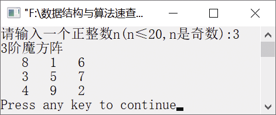

### 5.2.1　输出魔方阵


**问题描述**


河图是一个3阶魔方阵的例子。魔方阵又称“纵横图 ”，是指组成元素为自然数1, 2, …, n<sup class="my_markdown">2</sup>的n阶方阵 ，其中每个元素值都不相等，且每行、每列以及主、副对角线上元素之和都相等。

例如，3阶魔方阵如图5.5所示。


<center class="my_markdown"><b class="my_markdown">图5.5　3阶魔方阵</b></center>

**【分析】**

构造魔方阵的方法如下。

（1）将1放在第一行的中间一列。

（2）从2到n×n，依次按规则存放，每一个元素存放的行号比前一个元素的行号小1，列号大1。例如，6在5的上一行的后一列。

（3）如果上一个元素的行号为1，则下一个元素的行号为n。例如，8在第1行，9在最后一行，且列号加1。

（4）当上一个元素的列号为n时，下一个元素的列号应为1，行号减1。例如，2在最后一列，3在第1列，行号减1。

（5）如果按上面规则确定的位置上已有元素，或上一个元素在第1行、第n列时，则把下一个元素放在上一个元素的下面。例如，按上面的规定，4应该放在第1行、第2列，但该位置已经被占据，所以4就放在3的下面。


第5章\实例5-03.cpp

```c
/********************************************
*实例说明：输出魔方阵
*********************************************/
1  #include<stdio.h>
2  #define N 20
3  void main()
4  {
5      int a[N][N],n,i,j,k;
6      /*输入矩阵的阶*/
7      while(1)
8      {
9          printf("请输入一个正整数n(n≤20,n是奇数):");
10         scanf("%d",&n);            
11         if(n!=0&&n<=20&&n%2!=0)         
12         {
13             printf("%d阶魔方阵\n",n);
14             break;
15         }
16      }
17      /*初始化二维数组*/
18      for(i=0;i<n;i++)    
19          for(j=0;j<n;j++)
20              a[i][j]=0;
21      /*构造魔方阵*/
22          i=0;                 
23          j=n/2;                     
24          a[i][j]=1;             /*1放在第1行中间一列*/
25          k=2;
26          while(k<=n*n)
27          {
28              i=i-1;            /*行号减1*/
29              j=j+1;            /*列号增1*/
30              /*如果上一个元素位于第1行第n列，则下一个元素应在上一个元素的下面*/
31              if(i<0&&j>n-1)    
32              {
33                  i=i+2;        
34                  j=j-1;     
35              }
36              else
37              {
38              /*如果上一个元素位于第1行，则下一个元素应位于最后一行*/
39                  if(i<0)                            
40                      i=n-1;    
41              /*如果上一个元素位于第n列，则下一个元素应位于第1列*/
42                  if(j>n-1)        
43                      j=0;
44              }
45              if(a[i][j]==0)    /*当前的元素保存到数组中*/
46                  a[i][j]=k;
47              else    /*如果已经有元素存在，则放在上一个元素的下面*/
48              {
49                  i=i+2;         
50                  j=j-1;     
51                  a[i][j]=k;     
52              }
53              k++;            /*k加1，准备存放下一个元素*/
54          }
55          /*输出魔方阵*/
56          for(i=0;i<n;i++)    
57          {
58              for(j=0;j<n;j++)    
59                  printf("%4d",a[i][j]);
60              printf("\n");    
61          }
62  }
```

运行结果如图5.6所示。


<center class="my_markdown"><b class="my_markdown">图5.6　运行结果</b></center>

**【说明】**

第7～16行输入一个小于或等于20且为奇数的正整数。

第18～20行初始化数组a。

第22～24行在第1行中间一列放置一个1。

第28～29行先让行号减1，列号加1。

第31～35行中，如果上一个元素位于第1行第n列，则将下一个元素放在上一个元素的下面。

第39～40行中，如果上一个元素在第1行，则下一个元素在最后一行。

第42～43行中，如果上一个元素在第n列，则下一个元素在第1列。

第45～46行将当前的元素保存到数组中。

第47～52行中，如果相应的位置已经有元素存在，则将当前的元素放在上一个元素的下面。

第56～61行输出魔方阵。

