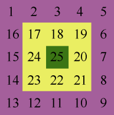
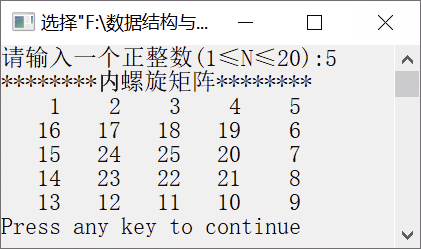

### 5.2.2　输出内螺旋矩阵


**问题描述**


输出内螺旋矩阵。例如，一个5×5内螺旋矩阵如图5.7所示。



<center class="my_markdown"><b class="my_markdown">图5.7　5×5内螺旋矩阵</b></center>

**【分析】**

通过观察，发现一个n×n内螺旋矩阵可以分为(n+1)/2圈，可以使用循环控制圈数。每圈中的元素可以分为上、右、下、左4个方向，在内层循环中可以用4个循环控制每圈中的4个方向的元素输出。其中，4个方向有如下规则。

+ 上：行号不变，列号依次加1。
+ 右：行号依次加1，列号不变。
+ 下：行号不变，列号依次减1。
+ 左：行号依次减1，列号不变。


第5章\实例5-04.cpp

```c
/********************************************
*实例说明：输出内螺旋矩阵
*********************************************/
1  #include<stdio.h>
2  #define N 20
3  void main()
4  {
5      int i,j,n,k=1,a[N][N];
6      printf("请输入一个正整数(1≤N≤20):");
7      scanf("%d",&n);
8      printf("********内螺旋矩阵********\n");
9      for(i=0;i<=n/2;i++)            /*控制圈数*/
10     {
11         for(j=i;j<n-i;j++)         /*生成上方元素*/
12             a[i][j]=k++;
13         for(j=i+1;j<n-i;j++)       /*生成右方元素*/
14             a[j][n-i-1]=k++;
15         for(j=n-i-2;j>i;j--)       /*生成下方元素*/
16             a[n-i-1][j]=k++;
17         for(j=n-i-1;j>i;j--)       /*生成左方元素*/
18             a[j][i]=k++;
19     }
20     for(i=0;i<n;i++)
21     {
22         for(j=0;j<n;j++)
23             printf("%5d",a[i][j]);
24         printf("\n");
25     }
26  }
```

运行结果如图5.8所示。


<center class="my_markdown"><b class="my_markdown">图5.8　运行结果</b></center>

**【说明】**

第9行中，外层for循环控制矩阵的圈数。

第11～12行输出上方的元素，行号不变，列号依次加1。

第13～14行输出右方的元素，行号加1，列号保持不变。

第15～16行输出下方的元素，行号不变，列号依次减1。

第17～18行输出左方的元素，行号依次减1，列号保持不变。

第20～25行输出内螺旋矩阵中的元素。

