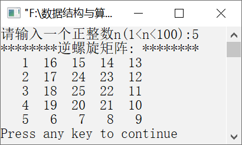

### 5.2.3　输出逆螺旋矩阵


**问题描述**


输出逆螺旋矩阵。例如，一个5×5逆螺旋矩阵如图5.9所示。


<center class="my_markdown"><b class="my_markdown">图5.9　5×5逆螺旋矩阵</b></center>

**【分析】**

与内螺旋矩阵类似，n×n逆螺旋矩阵也可以分为(n+1)/2圈，每一圈分为4个方向输出。其中，4个方向有如下规则。

+ 左：行号依次加1，列号保持不变。
+ 下：行号保持不变，列号依次加1。
+ 右：行号依次减1，列号保持不变。
+ 上：行号保持不变，列号依次减1。


第5章\实例5-05.cpp

```c
/********************************************
*实例说明：输出逆螺旋矩阵
*********************************************/
1  #include<stdio.h>
2  #define N 100
3  void CreateArray(int a[N][N],int n);
4  void OutPut(int s[N][N],int n);
5  void main()
6  {
7      int n,a[N][N];
8      printf("请输入一个正整数n(1<n<100):");
9      scanf("%d",&n);             /*输入逆螺旋矩阵阶数*/
10     CreateArray(a,n);           /*调用数组函数*/
11     printf("********逆螺旋矩阵: ********\n");
12     OutPut(a,n);                /*调用输出函数*/
13 }
14 void CreateArray(int a[N][N],int n)
15 /*创建逆螺旋矩阵*/
16 {
17     int p,i,j,k,m;
18     m=(n+1)/2;                    /*求逆螺旋矩阵圈数*/
19     p=1;
20     for(k=0;k<m;k++)              /*用循环控制产生的圈数*/
21     {
22         for(i=k;i<n-k;i++)
23             a[i][k]=p++;          /*生成左方元素*/
24         for(j=k+1;j<n-k;j++)
25             a[n-k-1][j]=p++;      /*生成下方元素*/
26         for(i=n-k-2;i>=k;i--)
27             a[i][n-k-1]=p++;      /*生成右方元素*/
28         for(j=n-k-2;j>k;j--)
29             a[k][j]=p++;          /*生成上方元素*/
30     }
31 }
32 void OutPut(int s[N][N],int n)
33 /*定义输出函数*/
34 {
35     int i,j;
36     for(i=0;i<n;i++)
37     {
38         for(j=0;j<n;j++)
39             printf("%4d",s[i][j]);
40         printf("\n");
41     }
42 }
```

运行结果如图5.10所示。


<center class="my_markdown"><b class="my_markdown">图5.10　运行结果</b></center>

**【说明】**

第18行求逆螺旋矩阵的圈数。

第20行求外层for循环控制逆螺旋矩阵的圈数。

第22～23行生成左方的元素，行号依次加1，列号保持不变。

第24～25行生成下方的元素，行号保持不变，列号依次加1。

第26～27行生成右方的元素，行号依次减1，列号保持不变。

第28～29行生成上方的元素，行号保持不变，列号依次减1。

