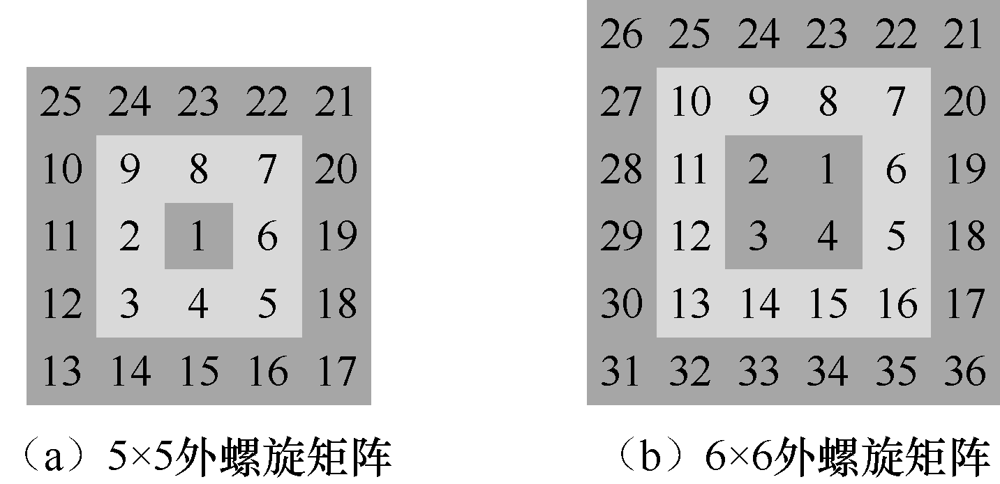
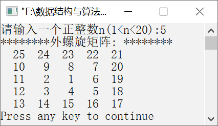

### 5.2.4　输出外螺旋矩阵


**问题描述**


输出外螺旋矩阵。例如，5×5和6×6外螺旋矩阵如图5.11（a）与（b）所示。



<center class="my_markdown"><b class="my_markdown">图5.11　5×5和6×6外螺旋矩阵</b></center>

**【分析】**

外螺旋矩阵实际上是由外到内数值逐一减小的内螺旋矩阵，对于奇数阶的外螺旋矩阵来说，起始顶点为a<sub class="my_markdown">11</sub>。


第5章\实例5-06.c

```c
/********************************************
*实例说明：输出外螺旋矩阵
*********************************************/
1  #include<stdio.h>
2  #define N 20
3  void CreateArray(int a[N][N],int n);
4  void OutPut(int a[N][N],int n);
5  void main()
6  {
7      int n,a[N][N];
8      printf("请输入一个正整数n(1<n<20):");
9      scanf("%d",&n);            /*输入外螺旋矩阵的阶数*/
10     CreateArray(a,n);          /*调用创建外螺旋矩阵的函数*/
11     printf("********外螺旋矩阵: ********\n");
12     OutPut(a,n);               /*调用输出函数*/
13 }
14 void CreateArray(int a[N][N],int n)
15 /*创建外螺旋矩阵*/
16 {
17     int p,i,j,k;
18     p=n*n;
19     for(k=1;k<=n/2;k++)        /*控制圈数*/
20     {
21         for(j=k;j<=n-k;j++)
22             a[k][j]=p--;               /*生成上方元素*/
23         for(i=k;i<=n-k;i++)
24             a[i][n-k+1]=p--;           /*生成右方元素*/
25         for(j=n-k+1;j>k;j--)
26             a[n-k+1][j]=p--;           /*生成下方元素*/
27         for(i=n-k+1;i>k;i--)
28             a[i][k]=p--;               /*生成左方元素*/
29     }
30     if(n%2!=0)
31         a[n/2+1][n/2+1]=1;
32 }
33 void OutPut(int a[N][N],int n)
34 /*定义输出函数*/
35 {
36     int i,j;
37     for(i=1;i<=n;i++)
38     {
39         for(j=1;j<=n;j++)
40             printf("%4d",a[i][j]);
41         printf("\n");
42     }
43 }
```

运行结果如图5.12所示。


<center class="my_markdown"><b class="my_markdown">图5.12　运行结果</b></center>

**【说明】**

第19行控制外螺旋矩阵的圈数。

第21～22行生成上方的元素，行号不变，列号依次加1。

第23～24行生成右方的元素，行号依次加1，列号不变。

第25～26行生成下方的元素，行号不变，列号依次减1。

第27～28行生成左方的元素，行号依次减1，列号不变。

第30～31行将最后一个元素存放到最中间。

第37～42行输出外螺旋矩阵元素。

