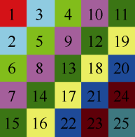
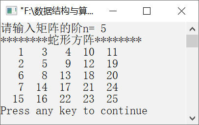

### 5.2.5　输出蛇形方阵


**问题描述**


输出蛇形方阵，将自然数1, 2, …, n<sup class="my_markdown">2</sup>按照蛇形方式依次存入n ×n矩阵中。例如，n=5时的蛇形方阵如图5.13所示。



<center class="my_markdown"><b class="my_markdown">图5.13　5×5蛇形方阵</b></center>

**【分析】**

这是南京航空航天大学和上海大学某年的考研试题。从a<sub class="my_markdown">11</sub>开始到a<sub class="my_markdown">nn</sub>为止，依次填入自然数，交替为每一斜行从左上元素到右下元素或从右下元素到左上元素填数。通过观察，发现蛇形方阵有以下特点。

（1）对于奇数的斜行来说，下一个元素的行号比上一个元素的行号大1，列号小1。

（2）对于偶数的斜行来说，下一个元素的行号比上一个元素的行号小1，列号大1。

（3）对于前n个斜行来说，奇数斜行中的元素从蛇形方阵的第1行开始计数，偶数斜行中的元素从蛇形方阵第1列开始计数。

（4）对于大于n的斜行来说，奇数斜行的元素从蛇形方阵的第n列开始计数，偶数斜行的元素从蛇形方阵的第n行开始计数。


第5章\实例5-07.cpp

```c
/********************************************
*实例说明：输出蛇形方阵
*********************************************/
1  #include<stdio.h>
2  #define N 20
3  void main()
4  {
5      int i,j,a[N][N],n,k;
6      printf("请输入矩阵的阶n= ");
7      scanf("%d",&n);
8      k=1;
9      /*输出上三角（前n个斜行）*/
10      for(i=1;i<=n;i++)
11          for(j=1;j<=i;j++)
12          {
13              if(i%2==0)
14                  a[i+1-j][j]=k;
15              else
16                  a[j][i+1-j]=k;
17              k++;
18          }
19          /*输出下三角（后n-1个斜行）*/
20          for(i=n+1;i<2*n;i++)
21              for(j=1;j<=2*n-i;j++)
22              {
23                  if(i%2==0)
24                      a[n+1-j][i-n+j]=k;
25                  else
26                      a[i-n+j][n+1-j]=k;
27                  k++;
28              }
29              printf("********蛇形方阵********\n");
30              for(i=1;i<=n;i++)
31              {
32                  for(j=1;j<=n;j++)
33                      printf("%4d",a[i][j]);
34                  printf("\n");
35              }
36  }
```

运行结果如图5.14所示。


<center class="my_markdown"><b class="my_markdown">图5.14　运行结果</b></center>

**【说明】**

第10～18行输出前n个斜行的元素。

第13～14行中，如果斜行是偶数斜行，那么元素的列下标正好等于蛇形方阵中元素的列下标，行下标依次减1。

第15～16行中，如果斜行是奇数斜行，那么元素的行下标正好等于蛇形方阵中元素的列下标，列下标依次加1。

第20～28行输出后（n−1）个斜行的元素。

第23～24行中，如果斜行是偶数斜行，那么元素的行下标依次减1，列下标依次加1。

第25～26行中，如果斜行是奇数斜行，那么元素的行下标依次加1，列下标依次减1。

第30～35行输出蛇形方阵。

