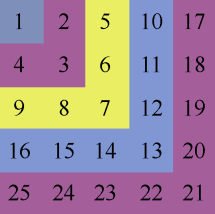
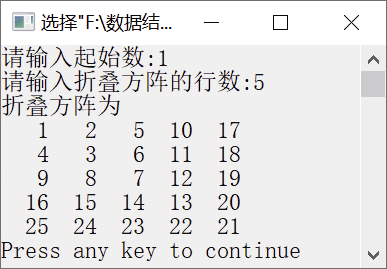

### 5.2.6　输出折叠方阵


**问题描述**


折叠方阵就是按指定的折叠方向排列的正整数方阵。例如，一个5×5折叠方阵如图5.15所示。起始数位于方阵的左上角，然后每一层从上到下，接着从右往左依次递增。



<center class="my_markdown"><b class="my_markdown">图5.15　5×5折叠方阵</b></center>

**【分析】**

若n=5，则输出折叠方阵的层数是5。输出每一层时分为两个步骤：从上到下，列数不变，行数递增；从右往左，行数不变，列数递减。假设将输出的折叠方阵数据存放在二维数组a中，从上往下输出时，对于对角线上的数据，即行号x<层数i，使行号x加1，有 `x++` ；从右往左输出时，对于对角线以下的数据，即行号x≥层数i，有列号 `y--` 。


第5章\实例5-08.cpp

```c
/********************************************
*实例说明：输出折叠方阵
*********************************************/
#include<stdio.h>
#define N 50
void main()
{
    int a[N][N],n,i,x,y,k;
    printf("请输入起始数:");
    scanf("%d",&k);
    printf("请输入折叠方阵的行数:");
    scanf("%d",&n);
    a[0][0]=k;
    for(i=1;i<n;i++)
    {
        x=0;
        y=i;
        k++;
        a[x][y]=k;
        while(x<i)
            a[++x][y]=++k;
        while(y>=1)
            a[x][--y]=++k;
    }
    printf("折叠方阵为\n");
    for(x=0;x<n;x++)
    {
        for(y=0;y<n;y++)
            printf("%4d",a[x][y]);
        printf("\n");
    }
}
```

运行结果如图5.16所示。


<center class="my_markdown"><b class="my_markdown">图5.16　运行结果</b></center>

