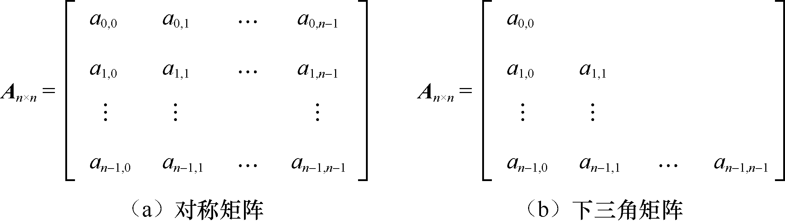
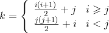
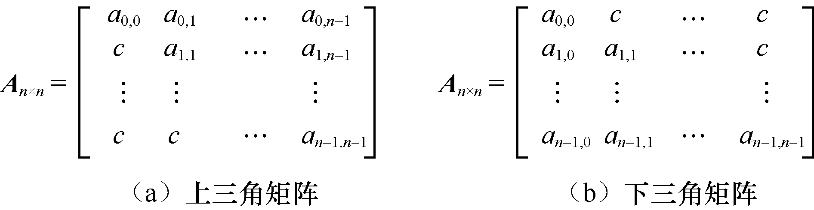
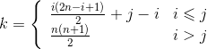
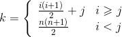
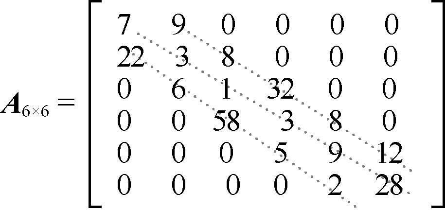
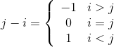

### 5.3　特殊矩阵的压缩存储及其应用

**【压缩存储】**

有些高阶矩阵中，非零的元素非常少。若使用二维数组存储元素，将造成存储空间的浪费，因此可只存储部分元素，从而提高存储空间的利用率。通常的做法是为多个相同值的元素只分配一个存储单元，对值为0的元素不分配存储单元。这种存储方式称为矩阵的压缩存储。我们把非零元素非常少（远小于行数×列数）或元素分布呈一定规律的矩阵称为特殊矩阵。对称矩阵、三角矩阵和对角矩阵都属于特殊矩阵。

【 **对称矩阵】**

如果一个n阶的矩阵**A**中的元素满足以下性质，则称这种矩阵为n阶对称矩阵。

Aij=Aji （0
i，jn−1）

对于对称矩阵，每一对对称元素的值都相同，我们只需要为每一对对称元素分配一个存储单元即可，这样就可以将n2个元素存储在n(n+1)/2个存储单元里。n阶的对称矩阵和下三角矩阵如图5.17（a）与（b）所示。

<b class="my_markdown">图5.17　n阶对称矩阵和下三角矩阵</b>

假设用一维数组s存储对称矩阵**A**的上三角或下三角元素，则一维数组s的下标k与n阶对称矩阵**A**的元素aij之间的对应关系如下。

当i≥j时，矩阵**A**以下三角形式存储，
为矩阵**A**中的元素的线性排序编号；当i<j时，矩阵**A**以上三角形式存储，为矩阵**A**中的元素的线性排序编号。任意给定一组下标(i,j)，就可以确定矩阵**A**在一维数组s中的存储位置。我们将s称为n阶对称矩阵**A**的压缩存储。

【 **三角矩阵】**

三角矩阵可分为两种——上三角矩阵和下三角矩阵。其中，下三角元素均为常数c或0的n阶矩阵称为上三角矩阵，上三角元素均为常数c或0的n阶矩阵称为下三角矩阵。n×n的上三角矩阵和下三角矩阵如图5.18（a）与（b）所示。

<b class="my_markdown">图5.18　n×n的上三角矩阵和下三角矩阵</b>

上三角矩阵的压缩原则是只存储上三角的元素，不存储下三角的0元素（或只用一个存储单元存储下三角的非零元素）。下三角矩阵的存储原则与此类似。如果用一维数组来存储三角矩阵，则需要存储n (n+1)/2+1个元素。一维数组的下标k与矩阵的下标(i,j)的对应关系如下。

对于上三角矩阵，

对于下三角矩阵，

其中，第
个位置存放的是常数c或者0元素。上述公式可根据等差数列推导得出。

**【对角矩阵】**

对角矩阵（也叫带状矩阵）是另一类特殊的矩阵。所谓对角矩阵，就是所有的非零元素都集中在以主对角线为中心的带状区域内（对角线的个数为奇数）。也就是说，除了主对角线和主对角线上、下若干条对角线上的元素外，其他元素的值为0。一个3对角矩阵如图5.19所示。

<b class="my_markdown">图5.19　3对角矩阵</b>

通过观察，我们发现以上对角矩阵具有以下特点。

当i=0, j=0、1时，即第一行有两个非零元素；当0<i<n−1, j=i−1、i、i+1时，即第2行到第n−1行之间有3个非零元素；当i=n−1, j=n−2、n−1时，即最后一行有两个非零元素。除此以外，其他元素为0。

除了第1行和最后1行的非零元素为两个之外，其余各行非零元素为3个。因此，若用一维数组存储这些非零元素，则需要2+3(n−2)+2=3n−2个存储单元。

下面来确定一维数组的下标k与矩阵中的元素下标(i, j)之间的关系。先确定下标为(i, j)的元素与第1个元素在一维数组中的关系，Loc(i, j)表示aij在一维数组中的地址，Loc(0,0)表示第1个元素在一维数组中的地址。

Loc(i, j)=Loc(0,0)+前（i−1）行的非零元素个数+第i行的非零元素个数。其中，前（i−1）行（行号从0开始编号）的非零元素个数为3i−1，第i行的非零元素个数为j−i+1。其中，

因此，Loc(i, j)=Loc(0,0)+3i−1+j−i+1=Loc(0,0)+2i+j，则Loc(i, j)= Loc(0,0)+2i+j。

