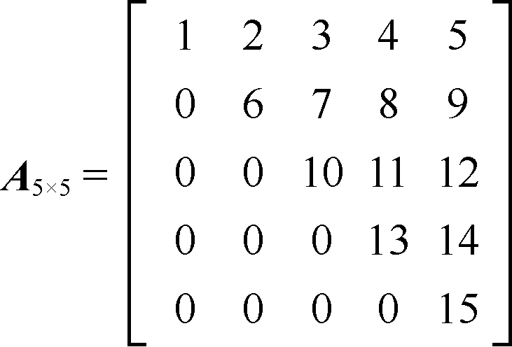
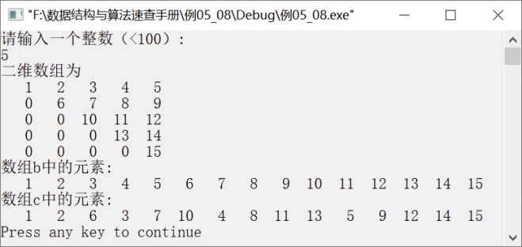

### 上三角矩阵的压缩存储


**问题描述**


实现一个算法，将一个以行为主序压缩存储的一维数组转换为以列为主序压缩存储的一维数组。例如，设有一个n×n的上三角矩阵A的上三角元素已按行为主序压缩存储在数组b中，请设计一个算法将b中元素按列为主序压缩存储在数组c中。当n=5，上三角矩阵A如图5.20所示。


<center class="my_markdown"><b class="my_markdown">图5.20　5×5上三角矩阵A</b></center>

其中，b=(1,2,3,4,5,6,7,8,9,10,11,12,13,14,15)，c= (1,2,6,3,7,10,4,8,11,13,5,9,12,14,15)。


**【分析】**

本题是软件设计师考试题目和上海交通大学考研题目，主要考查学生对特殊矩阵的压缩存储中数组下标的灵活使用程度。用i和j分别表示上三角矩阵中元素的行、列下标，用k表示压缩矩阵中元素的下标。最重要的是找出以行为主序和以列为主序的数组下标的对应关系（初始时i=0，j=0，k=0），即，

c[j (j+1)/2+i]=b[k]

其中，j(j+1)/2+i是根据等差数列得出的。根据这个对应关系，直接把b中的元素赋给c中对应位置的元素即可。但是读出c中一列即b中的一行（1、2、3、4、5）元素之后，还要改变行下标i和列下标j；开始读6、7、8元素时，列下标j需要从1开始，行下标也需要增加1。以此类推，可以得出以下修改行下标和列下标的方法。

当一行还没有结束时， j增加1；否则，i增加1并修改下一行的元素个数及i、j的值，直到k=n(n+1)/2为止。


第5章\实例5-09.cpp

```c
/********************************************
*实例说明：将一个以行为主序压缩存储的一维数组转换为以列为主序压缩存储的一维数组
*********************************************/
#include<iostream.h>
#include<iomanip.h>
#define MAX 200
void CreateArray(int a[][MAX],int n);
void PrintArray(int a[MAX][MAX],int n);
void Trans(int b[],int c[],int n);
int PriorRow(int a[][MAX],int n,int b[]);
void main()
{
    int a[MAX][MAX],b[MAX],c[MAX],n,m,i;
    cout<<"请输入一个整数（<100）:"<<endl;
    cin>>n;
    CreateArray(a,n);
    cout<<"二维数组为"<<endl;
    PrintArray(a,n);    
    m=PriorRow(a,n,b);
    cout<<"数组b中的元素:"<<endl;
    for(i=0;i<m;i++)
        cout<<setw(4)<<b[i];
    cout<<endl;
    Trans(b,c,n);
    cout<<"数组c中的元素:"<<endl;
    for(i=0;i<m;i++)
        cout<<setw(4)<<c[i];
    cout<<endl;
}
int PriorRow(int a[MAX][MAX],int n,int b[])
//以行为主序压缩存储上三角矩阵到b中
{
    int i,j,k=0;
    for(i=0;i<n;i++)
        for(j=i;j<n;j++)
            b[k++]=a[i][j];
    return k;
}
void CreateArray(int a[][MAX],int n)
//创建一个上三角矩阵的二维数组
{
    int i,j,m;
    m=1;
    for(i=0;i<n;i++)
    {
        for(j=0;j<i;j++)
            a[i][j]=0;
        for(j=i;j<n;j++)
            a[i][j]=m++;
    }
}
void PrintArray(int a[MAX][MAX],int n)
//输出矩阵
{
    int i,j;
    for(i=0;i<n;i++)
    {
        for(j=0;j<n;j++)
            cout<<setw(4)<<a[i][j];
        cout<<endl;
    }
}
void Trans(int b[],int c[],int n)
/*将b中元素以列为主序压缩存储到c中*/
{
    int step=n,count=0,i=0,j=0,k;
    for(k=0;k<n*(n+1)/2;k++)
    {
        count++;                  /*记录一行是否读完*/
        c[j*(j+1)/2+i]=b[k]; 
        if(count==step)     
        {
            step--;
            count=0;        
            i++;            
            j=n-step;       
        }
        else
            j++;            
    }
}
```

运行结果如图5.21所示。


<center class="my_markdown"><b class="my_markdown">图5.21　运行结果</b></center>

