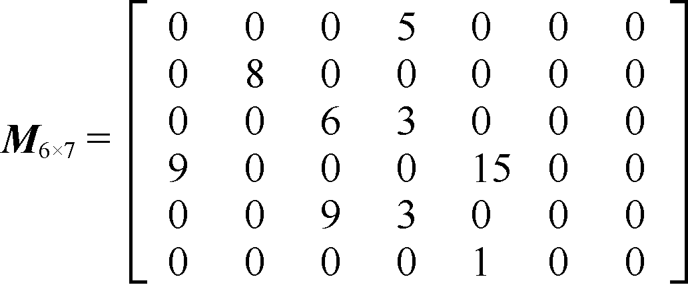
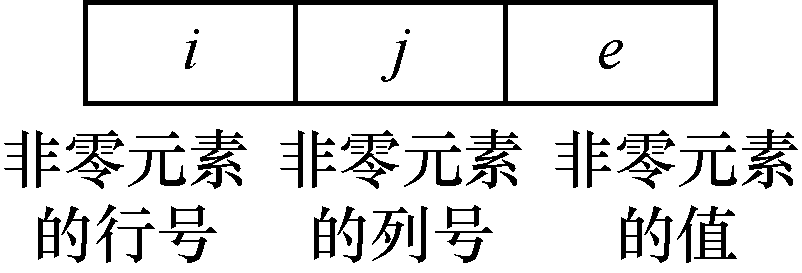
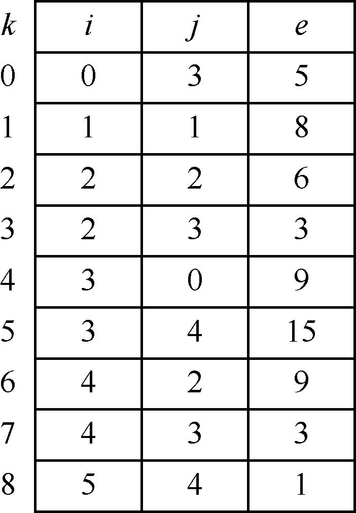
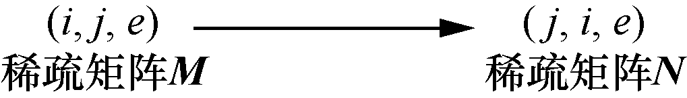
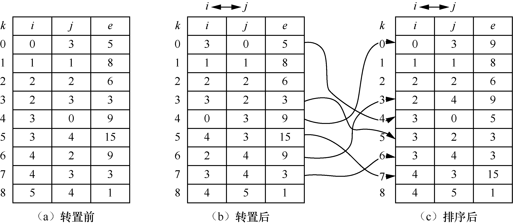
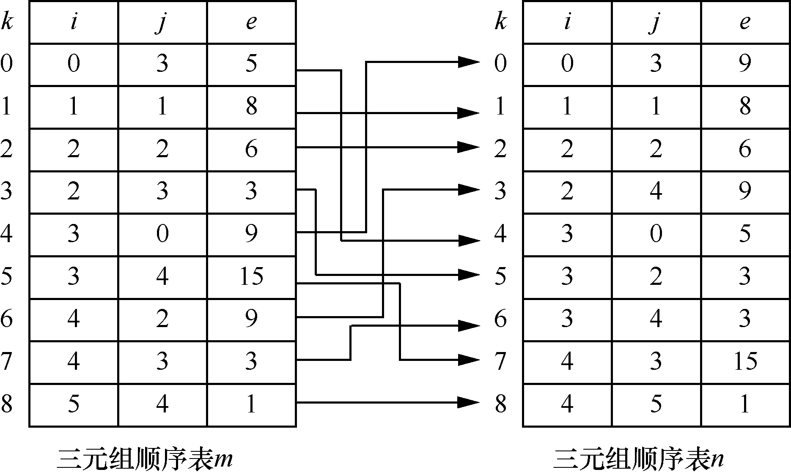

### 5.4　稀疏矩阵的压缩存储及其应用

**【定义】**

假设在m×n矩阵中，有t个元素不为0。令
，为矩阵的稀疏因子，如果，则称矩阵为稀疏矩阵。若矩阵中大多数元素值为0，只有很少的非零元素，那么这样的矩阵就是稀疏矩阵。

例如，图5.22所示为一个6×7稀疏矩阵。


<center class="my_markdown"><b class="my_markdown">图5.22　6×7稀疏矩阵</b></center>

**【三元组表示】**

为了节省内存单元，我们需要对稀疏矩阵进行压缩存储。在进行压缩存储的过程中，我们可以只存储稀疏矩阵的非零元素，为了表示非零元素在稀疏矩阵中的位置，还需存储非零元素的行号和列号(i, j)。这样通过存储非零元素的行号、列号和元素值就可以将稀疏矩阵压缩存储，我们把这种存储方式称为稀疏矩阵的稀疏矩阵的三元组表示。稀疏矩阵的三元组节点结构如图5.23所示。


<center class="my_markdown"><b class="my_markdown">图5.23　稀疏矩阵的三元组节点结构</b></center>

图5.22所示的9个非零元素的三元组表示如下。

((0,3,5),(1,1,8),(2,2,6),(2,3,3),(3,0,9),(3,4,15),(4,2,9),(4,3,3),(5,4,1))

将这些三元组按照行序为主序存储在一维数组中，如图5.24所示，我们将这种采用顺序存储结构的三元组称为三元组顺序表，其中k表示一维数组的下标。


<center class="my_markdown"><b class="my_markdown">图5.24　稀疏矩阵的三元组存储结构</b></center>

用C语言描述三元组顺序表的类型。

```c
#define MAXSIZE 100
typedef struct                    /*三元组类型定义*/
{
    int i;                        /*非零元素的行号*/
    int j;                        /*非零元素的列号*/
    DataType e;
}Triple;
typedef struct                   
{
    Triple data[MAXSIZE];
    int m;                        /*稀疏矩阵的行数*/
    int n;                        /*稀疏矩阵的列数*/
    int len;                      /*稀疏矩阵中非零元素的个数*/
}TriSeqMatrix;
```

**【稀疏矩阵的转置】**

稀疏矩阵（三元组表示）的基本运算包括创建稀疏矩阵的创建、稀疏矩阵的销毁、稀疏矩阵的转置、稀疏矩阵的复制和输出等，这些基本运算都保存在文件TriSeqMatrix.h中。

稀疏矩阵的转置就是要将稀疏矩阵中元素由原来的存放位置(i, j)变为(j, i)，也就是将元素的行列互换。例如，图5.22所示的6×7稀疏矩阵，经过转置后变为7×6的稀疏矩阵，并且稀疏矩阵的元素也要以主对角线为准进行交换。

将稀疏矩阵进行转置进行方法：将稀疏矩阵**M**的三元组表示中的行号和列号互换就可以得到转置后的稀疏矩阵**N**，如图5.25所示。行、列号互换后，为了保证转置后的稀疏矩阵仍按照行为主序排列，还需要将行、列号重新进行排序。转置前后和排序后的稀疏矩阵的三元组顺序表表示如图5.26（a）～（c）所示。


<center class="my_markdown"><b class="my_markdown">图5.25　稀疏矩阵转置</b></center>


<center class="my_markdown"><b class="my_markdown">图5.26　稀疏矩阵转置和排序后的三元组顺序表表示</b></center>

另外，还有一种方法可以避免这种排序，那就是以列为主序进行转置，转置后的三元组顺序表刚好是以行为主序优先存放的。

算法思想：扫描三元组顺序表m，第1趟扫描m，找到j=0的元素，将行号和列号互换后存入三元组顺序表n中；第2趟扫描m，找到j=1的元素，将行号和列号互换后存入三元组顺序表n中；以此类推，直到所有元素都存放到n中。最终得到的三元组顺序表n如图5.27所示。


<center class="my_markdown"><b class="my_markdown">图5.27　最终得到的三元组顺序表n</b></center>

稀疏矩阵的转置算法实现如下。

```c
void TransposeMatrix(TriSeqMatrix M,TriSeqMatrix *N)
/*稀疏矩阵的转置*/
{
    int i,k,col;
    N->m=M.n;
    N->n=M.m;
    N->len=M.len;
    if(N->len)
    {
        k=0;
        for(col=0;col<M.n;col++)    /*按照列号扫描三元组顺序表*/
            for(i=0;i<M.len;i++)
                if(M.data[i].j==col)
                /*若元素列号是当前列，则进行转置*/
                {
                    N->data[k].i=M.data[i].j;
                    N->data[k].j=M.data[i].i;
                    N->data[k].e=M.data[i].e;
                    k++;
                }
    }
}
```

通过分析该转置算法，发现其时间复杂度主要是在for语句的两层循环上，因此算法的时间复杂度是O(nlen)。当非零元素的个数len与m×n同数量级时，算法的时间复杂度就变为O(mn<sup class="my_markdown">2</sup>)了。如果稀疏矩阵仍然采用二维数组存放，则转置算法如下。

```c
for(col=0;col<M.n;++col)    
    for(row=0;row<M.len;row++)
        N[col][row]=M[row][col];
```

以上算法的时间复杂度为O(nm)。由此可以看出，采用三元组顺序表存储稀疏矩阵虽然节省了存储空间，但时间复杂度增加了。在算法设计过程中，时间复杂度和空间复杂度就是两个此消彼长的量，降低了时间复杂度，就势必要以牺牲空间复杂度为代价，反之亦然。算法设计就是对时间复杂度和空间复杂度的一种折中考虑。为了降低时间复杂度，可考虑用稀疏矩阵的快速转置算法，这里不再介绍，具体请参考《零基础学数据结构》（第2版，机械工业出版社）。

