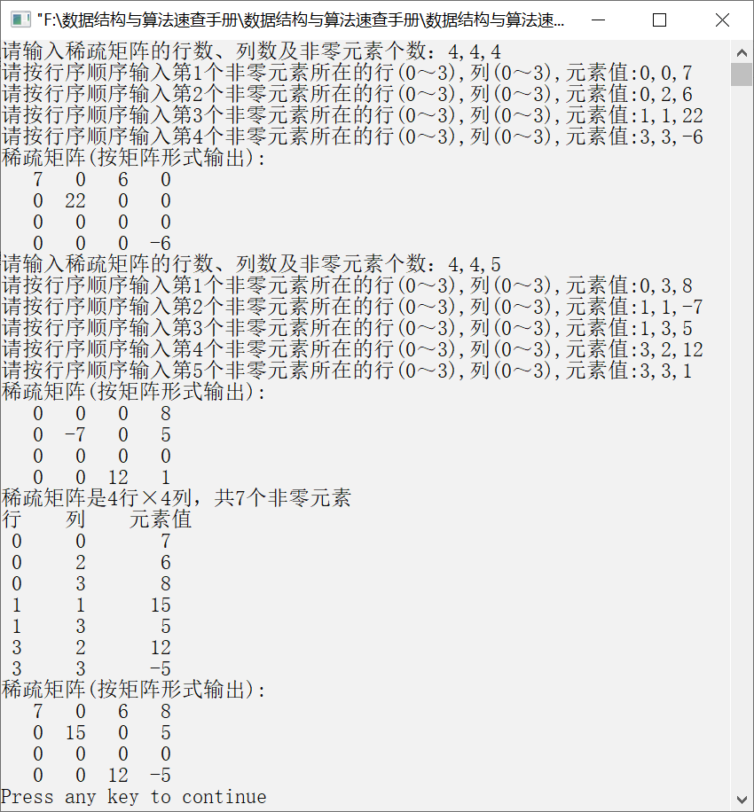

### 稀疏矩阵的相加


**问题描述**


设有两个4×4的稀疏矩阵**A**和**B**，相加得到稀疏矩阵**C**，如图5.28所示。请实现算法，要求利用三元组表示法实现两个稀疏矩阵的相加，并用矩阵形式输出结果。


<center class="my_markdown"><b class="my_markdown">图5.28　两个稀疏矩阵的相加</b></center>

**【分析】**

先比较两个稀疏矩阵**A**和**B**的行号，如果行号相等，则比较列号；如果行号与列号都相等，则将对应的元素值相加，并将行号m与列号n都加1再比较下一个元素；如果行号相等，列号不相等，则将列号较小的稀疏矩阵的元素值赋给稀疏矩阵**C**，并将列号较小的元素继续与下一个元素比较；如果行号与列号都不相等，则将行号较小的稀疏矩阵的元素值赋给**C**，并将行号小的元素与下一个元素比较。

将两个稀疏矩阵中的对应元素相加，需要考虑以下3种情况。

（1）**A**中的元素非零且**B**中的元素非零，但是结果可能为0，若结果为0，则不保存该元素；若结果不为0，则将结果保存到**C**中。

（2）**A**中的下标为(i,j)的位置存在非零元素A<sub class="my_markdown">ij</sub>，而**B**中不存在非零元素，则只需要将该元素值赋给**C**。

（3）**B**中的下标为(i,j)的位置存在非零元素B<sub class="my_markdown">ij</sub>，而**A**中不存在非零元素，则只需要将该元素值赋给**C**。

为了将结果以矩阵形式输出，可以先将一个二维数组的全部元素初始化为0，然后确定每一个非零元素的行号和列号，将该非零元素存入对应位置，最后输出该二维数组。


第5章\实例5-10.cpp

```c
/********************************************
*实例说明：将两个稀疏矩阵相加并以矩阵形式输出结果
*********************************************/
#include<stdlib.h>
#include<stdio.h>
#include<malloc.h>
#include<iostream.h>
#include<iomanip.h>
typedef int DataType;
#include"TriSeqMatrix.h"
int AddMatrix(TriSeqMatrix A,TriSeqMatrix B,TriSeqMatrix *C);
void PrintMatrix(TriSeqMatrix M);
void PrintMatrix2(TriSeqMatrix M);
int CompareElement(int a,int b);
void main()
{
    TriSeqMatrix M,N,Q;
    CreateMatrix(&M);
    PrintMatrix2(M);
    CreateMatrix(&N);
    PrintMatrix2(N);
    AddMatrix(M,N,&Q);
    PrintMatrix(Q);
    PrintMatrix2(Q);    
}
int CreateMatrix(TriSeqMatrix *M)
/*创建稀疏矩阵*/
{ 
    int i,m,n;
    DataType e;
    int flag;
    printf("请输入稀疏矩阵的行数、列数及非零元素个数：");
    scanf("%d,%d,%d",&M->m,&M->n,&M->len);
    if(M->len>MaxSize)
        return 0;
    for(i=0;i<M->len;i++)
    {
        do
        {
            printf("请按行为主序输入第%d个非零元素所在的行(0～%d),列(0～%d),元素值:",i+1,M->m-1, M->n-1);
            scanf("%d,%d,%d",&m,&n,&e);
            flag=0;                         /*初始化标志位*/
            if(m<0||m>M->m||n<0||n>M->n)    /*如果行号或列号正确，标志位为1*/
                flag=1;                     /*如果输入的顺序正确，标志位为1*/
        if(i>0&&m<M->data[i-1].i||m==M->data[i-1].i&&n<=M->data[i-1].j)
                flag=1;
        }while(flag);
        M->data[i].i=m;
        M->data[i].j=n;
        M->data[i].e=e;
    }
    return 1;
}
void PrintMatrix(TriSeqMatrix M)
/*输出稀疏矩阵*/
{
    int i;
    cout<<"稀疏矩阵是"<<M.m<<"行×"<<M.n<<"列，共"<<M.len<<"个非零元素"<<endl;
    cout<<"行    列    元素值"<<endl;
    for(i=0;i<M.len;i++)
        cout<<setw(2)<<M.data[i].i<<setw(6)<<M.data[i].j
            <<setw(8)<<M.data[i].e<<endl;
}
void PrintMatrix2(TriSeqMatrix M)
/*按矩阵形式输出稀疏矩阵*/
{
    int k,i,j;
    DataType a[MaxSize][MaxSize];
    for(i=0;i<M.m;i++)        //初始化数组a，将全部元素置为0
        for(j=0;j<M.n;j++)
            a[i][j]=0;
    for(k=0;k<M.len;k++)      //将非零元素存入数组a
    {
        if(M.data[k].e!=0)
        {
           i=M.data[k].i;
           j=M.data[k].j;
           a[i][j]=M.data[k].e;
        }
    }
    cout<<"稀疏矩阵(按矩阵形式输出):"<<endl;
    for(i=0;i<M.m;i++)        //按矩阵形式输出数组a中的元素
    {
        for(j=0;j<M.n;j++)
            cout<<setw(4)<<a[i][j];
        cout<<endl;
    }
}
int AddMatrix(TriSeqMatrix A,TriSeqMatrix B,TriSeqMatrix *C)
/*将两个稀疏矩阵A和B对应的元素值相加，得到另一个稀疏矩阵C*/
{
    int m=0,n=0,k=-1;
    if(A.m!=B.m||A.n!=B.n)
    /*如果两个稀疏矩阵的行数与列数不相等，则不能够进行相加运算*/
        return 0;
    C->m=A.m;
    C->n=A.n;
    while(m<A.len&&n<B.len)
    {
        switch(CompareElement(A.data[m].i,B.data[n].i))
        /*比较两个稀疏矩阵对应元素的行号*/
        {
           case -1:
               C->data[++k]=A.data[m++];/*将稀疏矩阵中行号小的元素赋值给稀疏矩阵C*/
               break;
           case  0:/*如果稀疏矩阵A和B的行号相等，则比较列号*/
               switch(CompareElement(A.data[m].j,B.data[n].j))
               {
                  case -1:    /*如果稀疏矩阵A的列号小于稀疏矩阵B的列号，则将稀疏矩阵A的元素
                              赋值给稀疏矩阵C*/
                      C->data[++k]=A.data[m++];
                   break;
               case  0:/*如果稀疏矩阵A和稀疏矩阵B的行号、列号均相等，则将两元素相加，存入稀疏矩阵C*/
                   C->data[++k]=A.data[m++];
                   C->data[k].e+=B.data[n++].e;
                   if(C->data[k].e==0)
                   /*若两个元素的和为0，则不保存*/
                    k--;
                break;
            case  1:/*如果稀疏矩阵A的列号大于稀疏矩阵B的列号，则将稀疏矩阵B的元素赋值给稀疏矩阵C*/
                  C->data[++k]=B.data[n++];
              }
              break;
          case  1:/*如果稀疏矩阵A的行号大于稀疏矩阵B的行号，则将稀疏矩阵B的元素赋值给稀疏矩阵C*/
              C->data[++k]=B.data[n++];
        }
    }
    while(m<A.len)
    /*如果稀疏矩阵A的元素还没处理完毕，则将稀疏矩阵A中的元素赋值给稀疏矩阵C*/
        C->data[++k]=A.data[m++];
    while(n<B.len)
    /*如果稀疏矩阵B的元素还没处理完毕，则将稀疏矩阵B中的元素赋值给稀疏矩阵C*/
        C->data[++k]=B.data[n++];
        C->len=k+1;                /*修改非零元素的个数*/
        if(k>MaxSize)            
        return 0;
    return 1;
}
int CompareElement(int a,int b)
/*比较两个稀疏矩阵的元素值大小。若前者小于后者，返回-1；若相等，返回0；若前者大于后者，返回1*/
{
    if(a<b)
        return -1;
    if(a==b)
        return 0;
    return 1;
}
```

运行结果如图5.29所示。


<center class="my_markdown"><b class="my_markdown">图5.29　运行结果</b></center>


