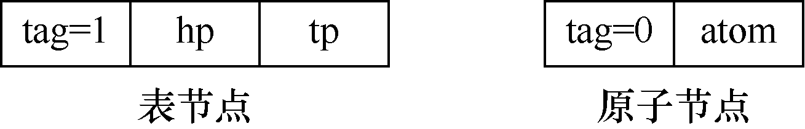
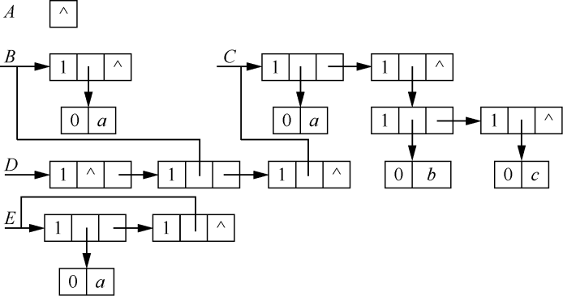

### 6.1　头尾链表表示的广义表及其应用

**【定义】**

广义表简称表（list），是由n个元素a<sub class="my_markdown">1</sub>,a<sub>2</sub>,a<sub>3</sub>,…,a<sub class="my_markdown">n</sub>组成的有限序列。当n=0时广义表称为空表。在一个非空的广义表中，其元素a<sub class="my_markdown">i</sub>可以是某一确定类型的对象（这种元素称为单元素或原子），也可以是由单元素或原子构成的表（这种元素称为子表或表元素）。

显然，广义表的定义是递归的。广义表记作GL=(a<sub class="my_markdown">1</sub>,a<sub>2</sub>,a<sub>3</sub>,…,a<sub class="my_markdown">n</sub>)。其中，GL是广义表的名字，n是广义表的长度。

在广义表GL中，a<sub class="my_markdown">1</sub>称为广义表GL的表头（head），其余元素组成的表(a<sub>2</sub>,a<sub>3</sub>,…,a<sub class="my_markdown">n</sub>)称为表尾（tail）。例如以下广义表。

（1）A=()，A是长度为0的空表。

（2）B=(a)，B是一个长度为1且元素为原子的广义表（其实就是一般的线性表）。

（3）C=(a,(b,c))，C是长度为2的广义表。其中，第1个元素是原子a，第2个元素是一个子表(b,c)。

（4）D=(A,B,C)，D是一个长度为3的广义表，这3个元素都是子表，第1个元素是一个空表A。

（5）E=(a,E)，E是一个长度为2的递归广义表，相当于E=(a,(a,(a,(a,(a,…)))。

任何一个非空广义表的表头可以是一个原子，也可以是一个广义表，但表尾一定是一个广义表。例如以下表头和表尾。

Head(A)=()，Tail(A)=()；Head(C)=A，Tail(C)=((B,C))；Head(D)=A，Tail(D)=(B,C)。

其中，Head(A)表示取广义表A的第一个元素，Tail(A)表示取广义表A的最后一个元素。

习惯上，广义表的名字用大写字母表示，原子用小写字母表示。

**【性质】**

广义表有如下性质。

（1）有次序性。广义表中的元素有固定的次序。从某种程度上来说，广义表是线性排列的，可以把广义表看成线性表的一种推广；同时，它具有层次结构，可以把它看成树的一种推广。

（2）有长度。广义表的长度定义为最外层括号中包含的元素的个数。表中的元素个数是有限的，也可以是空表。

（3）有深度。广义表的深度定义为括号的最大重数，空表的深度为1。

（4）可递归。

（5）可共享。即子表可被多个广义表共享。

**【存储结构】**

由于广义表中的元素可以是原子，也可以是广义表，因此难以用顺序存储结构表示广义表。广义表中有两种元素——原子和子表。因此需要两种结构的节点：一种是原子节点，用来表示原子；一种是表节点，用来表示表元素。一般用链式方式表示广义表，有两种存储结构——头尾链表存储结构和扩展线性链表存储结构。

其中，头尾链表存储结构由两种节点构成，分别是表节点和原子节点。表节点包含3个域——标志域、指向表头的指针域和指向表尾的指针域。原子节点包含两个域——标志域和值域。表节点和原子节点的存储结构如图6.1所示。


<center class="my_markdown"><b class="my_markdown">图6.1　表节点和原子节点的存储结构</b></center>

其中，tag=1表示是子表，hp和tp分别指向表头节点与表尾节点；tag=0表示原子，atom用于存储原子的值。

用头尾链表存储结构表示广义表A=()，B=(a)，C=(a,(b,c))，D=(A,B,C)，E=(a,E)，如图6.2所示。


<center class="my_markdown"><b class="my_markdown">图6.2　广义表的头尾链表存储结构</b></center>

广义表的头尾链表存储结构的类型描述如下。

```c
typedef enum{ATOM,LIST}ElemTag;
//ATOM=0表示原子，LIST=1表示子表
struct GLNode
{
    ElemTag tag;                      //标志位tag用于区分是原子还是子表
    union
    {
        AtomType atom;                //AtomType是用户自定义类型，atom是原子节点的值域
        struct
        {
            struct GLNode *hp,*tp;    //hp指向表头，tp指向表尾
        }ptr;
    };
};
typedef struct GLNode *GList,GLNode;
```

