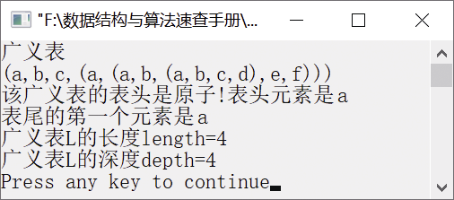

### 创建广义表并求其长度和深度


**问题描述**


实现一个算法，使用头尾链表存储结构创建广义表，并求该广义表的开头元素、末尾的第一个元素、长度和深度。


**【分析】**

该问题主要考查对广义表的头尾链表存储结构的表示及基本操作。因为广义表是递归定义的，所以可以使用递归的方法创建广义表，求广义表的开头元素、末尾元素、长度和深度。


第6章\实例6-01.cpp

```c
/********************************************
*实例说明：创建广义表并求其长度和深度
*********************************************/
#include<stdio.h>
#include<malloc.h>
#include<stdlib.h>
#include<string.h>
#include<iostream.h>
typedef char AtomType;
typedef enum{ATOM,LIST}ElemTag;     /*ATOM=0表示原子，LIST=1表示子表*/
struct GLNode
{
    ElemTag tag;                    /*标志位tag用于区分元素是原子还是子表*/
    union
    {
        AtomType atom;              /*AtomType为用户自己义类型，atom是原子节点的值域*/
        struct
        {
            struct GLNode *hp,*tp;  /*hp指向表头，tp指向表尾*/
        }ptr;
    };
};
typedef struct GLNode *GList,GLNode;
#include"SeqString.h"
void CreateList(GList *L,SeqString S);
void DistributeString(SeqString *Str,SeqString *HeadStr);
void PrintGList2(GList L );
void StrPrint(SeqString S);
int SubString(SeqString *Sub,SeqString S,int pos,int len);
int GListLength(GList L);
int GListDepth(GList L);
GLNode* GetHead(GList L);
GLNode* GeTail(GList L);
void main()
{
    GList L;
    SeqString S;
    int depth,length;
    //将字符串赋值给S
    StrAssign(&S,"(a,b,c,(a,(a,b,(a,b,c,d),e,f)))");
    CreateList(&L,S);             //由串创建广义表L
    cout<<"广义表"<<endl;
    PrintGList2(L);               //输出广义表
    cout<<endl;
    cout<<"表头元素是"<<GetHead(L)->atom<<endl;
    cout<<"表尾的第一个元素是"<<GeTail(L)->atom<<endl;
    length=GListLength(L);        //求广义表的长度
    cout<<"广义表L的长度length="<<length<<endl;
    depth=GListDepth(L);          //求广义表的深度
    cout<<"广义表L的深度depth="<<depth<<endl;
}
void CreateList(GList *L,SeqString S)
//采用头尾链表存储结构创建广义表
{
    SeqString Sub,HeadSub,Empty;
    GList p,q;
    StrAssign(&Empty,"()");
    if(!StrCompare(S,Empty))/*如果输入的串是空串，则创建一个空的广义表*/
        *L=NULL;
    else
    {
        if(!(*L=(GList)malloc(sizeof(GLNode))))/*为广义表生成一个节点*/
            exit(-1);
        if(StrLength(S)==1)
        {
            (*L)->tag=ATOM;
            (*L)->atom=S.str[0];
        }
        else        /*如果是子表*/
        {
            (*L)->tag=LIST;
            p=*L;
            SubString(&Sub,S,2,StrLength(S)-2);
            /*删除S最外层的括号，然后赋值给Sub*/
            do
            {
                DistributeString(&Sub,&HeadSub);
                /*将Sub分离出表头和表尾分别赋值给HeadSub与Sub*/
                CreateList(&(p->ptr.hp),HeadSub);
                /*递归调用生成广义表*/
                q=p;
                if(!StrEmpty(Sub))
                /*如果表尾不空，则生成节点p，并将表尾指针指向p*/
                {
                    if(!(p=(GLNode *)malloc(sizeof(GLNode))))
                        exit(-1);
                    p->tag=LIST;
                    q->ptr.tp=p;
                }
            }while(!StrEmpty(Sub));
            q->ptr.tp=NULL;
        }
    }
}
void DistributeString(SeqString *Str,SeqString *HeadStr)
/*将Str分离成两个部分，HeadStr为第一个逗号之前的子串，Str为逗号后的子串*/
{
    int len,i,k;
    SeqString Ch,Ch1,Ch2,Ch3;
    len=StrLength(*Str);              /*len为Str的长度*/
    StrAssign(&Ch1,",");
    StrAssign(&Ch2,"(");
    StrAssign(&Ch3,")");
    SubString(&Ch,*Str,1,1);          /*Ch保存Str的第一个字符*/
    for(i=1,k=0;i<=len&&StrCompare(Ch,Ch1)||k!=0;i++)
    /*搜索Str最外层的第一个括号*/
    {
        SubString(&Ch,*Str,i,1);      /*取出Str的第一个字符*/
        if(!StrCompare(Ch,Ch2))       /*如果第一个字符是"("，则令k加1*/
            k++;
        else if(!StrCompare(Ch,Ch3))  /*如果当前字符是")"，则令k减1*/
            k--;
    }
    if(i<=len)                         /*Str中存在","，它是第i-1个字符*/
    {
        SubString(HeadStr,*Str,1,i-2); /*HeadStr保存Str中","前的字符*/
        SubString(Str,*Str,i,len-i+1); /*Str保存Str中","后的字符*/
    }
    else                               /*Str中不存在","*/
    {
        StrCopy(HeadStr,*Str);         /*将Str的内容复制到HeadStr中*/
        StrClear(Str);                 /*清空Str*/
    }
}
void PrintGList2(GList L )
//输出广义表
{
    GLNode *p;
    if(!L)
        cout<<"()";
    else
    {
        if(L->tag==ATOM)
            cout<<L->atom;
        else
        {
            p=NULL;
            cout<<'(';
            p=L;
            while(p)
            {
                PrintGList2(p->ptr.hp);
                p=p->ptr.tp;
                if(p)
                    cout<<',';
            }
            cout<<')';
        }
    }
}
void StrPrint(SeqString S)
//输出S中的字符
{
    int i;
    for(i=0;i<S.length;i++)
    {
        printf("%c",S.str[i]);
    }
    printf("\n");
}
int SubString(SeqString *Sub,SeqString S,int pos,int len)
//将S中第pos个字符开始的len个字符赋给Sub
{
    int i;
    if(pos<0||len<0||pos+len-1>S.length)
    {
        printf("参数pos和len不合法");
        return 0;
    }
    else
    {
        for(i=0;i<len;i++)
            Sub->str[i]=S.str[i+pos-1];
        Sub->length=len;
        return 1;
    }
}
GLNode* GetHead(GList L)
{
    GLNode *p;
    if(!L)                            /*如果广义表为空表，则返回1*/
    {
        printf("该广义表是空表!");
        return NULL;
    }
    p=L->ptr.hp;                      /*将广义表的表头指针赋值给p*/
    if(!p)
        printf("该广义表的表头是空表!");
    else if(p->tag==LIST)
        printf("该广义表的表头是非空的子表!");
    else
        printf("该广义表的表头是原子!");
    return p;
}
GLNode* GeTail(GList L)
{
    if(!L)                            /*如果广义表为空表，则返回1*/
    {
        printf("该广义表是空表！");
        return NULL;
    }
    return L->ptr.tp;                 /*如果广义表不是空表，则返回指向表尾节点的指针*/
}
int GListLength(GList L)
//求广义表的长度
{
    int length=0;
    while(L)                          /*如果广义表非空，则将p指向表尾节点，统计表的长度*/
    {
        L=L->ptr.tp;
        length++;
    }
    return length;
}
int GListDepth(GList L)
//求广义表的深度
{
    int max,depth;
    GLNode *p;
    if(!L)                           /*如果广义表非空，则返回1*/
        return 1;
    if(L->tag==ATOM)                 /*如果广义表是原子，则返回0*/
        return 0;
    for(max=0,p=L;p;p=p->ptr.tp)     /*逐层处理广义表*/
    {
        depth=GListDepth(p->ptr.hp);
        if(max<depth)
            max=depth;
    }
    return max+1;
}
```

运行结果如图6.3所示。


<center class="my_markdown"><b class="my_markdown">图6.3　运行结果</b></center>

